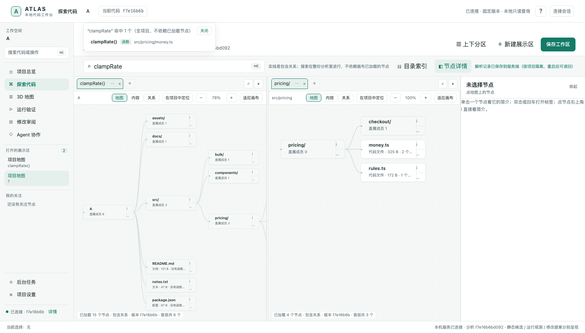
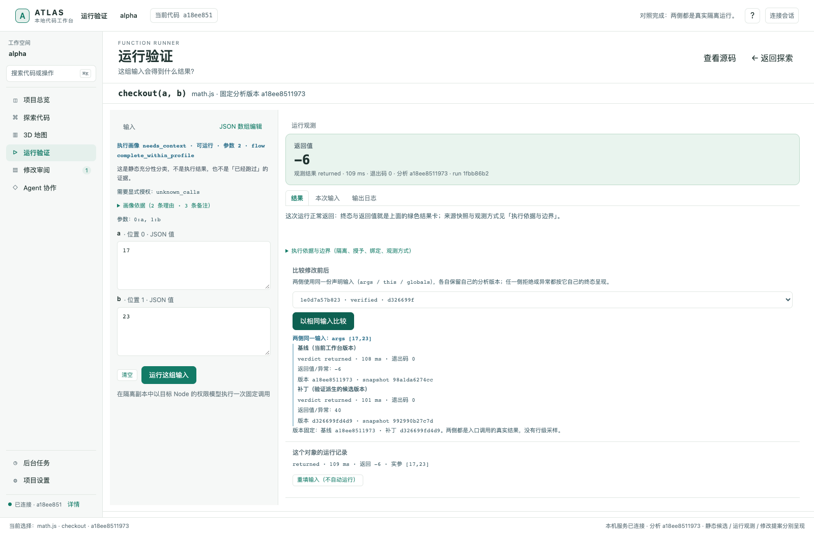

# Atlas

**给开发者和 Codex 等编程 Agent 使用的本地代码工作台：看懂项目、验证行为、审阅修改。**

接手陌生项目时，用地图和调用关系找到要看的代码；让 AI 修改之后，用源码差异、测试和实际运行结果检查它是否符合预期。人通过浏览器操作，Agent 通过 CLI 或本地 API 使用同一份代码版本和验证记录。

## 能做什么

| 你想做的事 | 在 Atlas 中怎么做 |
|---|---|
| 找到要修改的代码 | 搜索文件和函数，展开项目地图，在多个区域并排阅读节点与源码 |
| 理解函数 | 看调用者、被调用者、算法摘要和代码注释；保存自己的解析与批注 |
| 确认运行结果 | 填写参数，在隔离副本中运行，查看返回值、异常和日志 |
| 检查一份修改 | 阅读 diff，验证补丁、运行配置的测试，用同一输入比较修改前后 |
| 采用或撤销修改 | 确认目标项目与文件后应用补丁，需要时撤销；写入检查源码是否已变化 |
| 与编程 Agent 协作 | 交接选定代码与意见，让 Agent 查询上下文、提交提案、读取验证结果 |

例如，Agent 修改了价格计算函数，你可以先检查调用方，再分别输入负数、零和正数比较修改前后的结果，最后决定采用还是返工。

### 项目地图与多区域阅读



### 同一输入，比较修改前后



*以上为开发过程中的真实界面截图，使用测试项目；不同截图来自不同开发版本，不代表所有功能均已完成验收。*

## 先运行起来

在仓库根目录执行。需要 **Rust/Cargo、Node.js 24+、npm、Python 3**。

```sh
npm ci --prefix workers/typescript --ignore-scripts --no-audit --no-fund
cargo build --workspace --locked
bash scripts/demo.sh
```

打开终端打印的本地地址，选择一个函数，查看源码与关系，再进入“运行验证”。`Ctrl-C` 停止服务。Python 只用于启动脚本，Atlas 服务本身由 Rust 运行。

打开自己的项目：

```sh
bash scripts/demo.sh /absolute/path/to/your/project
```

这个源码试用入口默认只读。可以查询和运行受支持的函数；应用补丁需要启用服务写能力并授权目标项目，具体配置见 [CLI / HTTP 接口](docs/HOST_API.md)。

<details>
<summary>在 macOS 上生成可复制的本机分发包</summary>

安装上面的 worker 依赖后执行：

```sh
bash scripts/dist.sh
```

输出位于 `dist/atlas-local-darwin-<架构>/`。将整个目录复制到目标位置，进入该目录后运行：

```sh
./start.sh /absolute/path/to/your/project
```

接收分发包的人需要 Node.js，无需 Cargo、Python 或 Atlas 源码。使用 Node.js 24+，启动器会检查受控运行所需的权限能力。此入口启用指定项目的写能力，实际应用或撤销由用户操作触发。

在页面“项目设置”中配置测试命令，之后的补丁验证会执行它。未配置时，验证结果会明确显示没有运行测试。

已验证的分发环境为 **macOS Intel（darwin-x64）+ Node 26**；其他平台与架构仍需验证。`dist/` 是本地构建产物，不随源码提交。

</details>

## 给编程 Agent 使用

Atlas 提供 CLI 和本地 HTTP API。Agent 可以查找函数、读取源码与关系、提交补丁并读取验证结果；开发者在工作台审阅同一份提案。

从 [Agent 接入说明](docs/AGENT_ONBOARDING.md) 开始。服务启动后，`GET /api/contract` 提供实际接口清单，连接需要本机会话令牌。MCP 接入已列入设计，当前请使用 CLI / HTTP。

本地解析不执行项目，也不调用模型。将源码交给外部 Agent 或模型由用户决定；无需模型也能使用本地分析、运行与审阅。

## 当前状态与方向

Atlas 目前是**开发预览版**。项目地图、运行和补丁审阅已有实现，仍在完善交互与完整交付验收。具体范围见 [当前交接](docs/HANDOFF.md)。

Atlas 面向多语言项目，**当前语义分析与受控函数运行首先支持 JavaScript / TypeScript**。其他语言的文件可见性不代表已具备语义分析或运行支持。

当前使用时需要了解：动态调用可能无法确定，并非所有函数都能独立运行；静态调用图不是实际执行路线；完整调用轨迹与行级覆盖尚未提供。测试结果只覆盖实际执行的用例。

接下来重点是把需求、验收场景、前后验证和 Review 连成完整任务，并沿现有架构扩展深层与跨文件分析、更多语言、真实轨迹和 Agent 接入。

[统一设计](docs/PRODUCT_DESIGN.md) · [Mermaid 功能图谱](docs/design/product-blueprint/README.md) · [工程架构](docs/ARCHITECTURE.md) · [开发任务书](docs/DAILY_DEVELOPMENT_WORK_ORDER.md)
