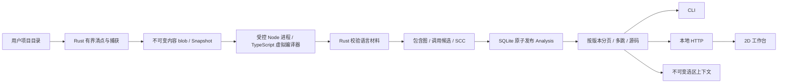

# Atlas 独立架构：当前基础与完整演进

版本：Foundation 0.1，2026-09-08。本文规定本仓库当前工程边界；`specs/` 保留完整产品目标。实现状态、自动化结果、真实环境资格、默认开启配置必须分别描述。

## 1. 产品与宿主边界

Atlas 拥有项目清点、快照、语言分析、图事实、查询、运行证据、选区和可视化工作台。Modus、CLI、外部 Agent、浏览器都是消费者。分析链路无需模型；模型可以解释有界证据、提出场景与变更，但不能把自己猜测的关系写成静态或运行事实。

代码解析 100% 本地运行是明确约束。它不等于所有语言、所有动态行为均可被静态分析完全确定。成熟实现必须通过范围声明、未知原因、覆盖分母和真实执行证据扩大可靠能力，不能用 LLM 补齐图中的未知并冒充解析结果。

当前本仓库具有自己的 Git、Cargo workspace、npm lock、CLI、HTTP、Web 和测试；不导入 Modus 代码。原 Modus 内 Atlas 暂时保留，不共享数据库、不重签旧证据、不自动迁移会话。

## 2. 已实现的链路

三个 crate 都有实际职责；未实现的大型子系统尚未建空壳。当前 Web 服务固定到启动时的一个 Analysis，不存在隐含“最新项目”切换。

## 3. 已实现的数据合同

Rust 类型来源为 `crates/atlas-contract/src/lib.rs`，序列化格式为 JSON。当前协议处于独立工程预发布阶段，不宣称与旧 Modus worker v1 兼容。若未来公开 SDK，应增加机器 schema、golden 与兼容性矩阵，并发布清晰版本。

| 对象 | 身份与内容 | 约束 |
|---|---|---|
| Blob | SHA-256(精确文件字节) | 原子不覆盖；重复内容验证；损坏拒绝读取 |
| Snapshot | 对清空 id 后的确定性序列化清单求 SHA-256 | 包含目录/链接/排除结果、捕获 blob、规则 profile、预算；不是仅按代码文件哈希 |
| LanguageFacts | snapshot_id + producer + parsed_files + symbols/calls/imports/diagnostics | 完整输入文件确认；foreign ID、所有函数与调用源码跨度验证 |
| Analysis | Snapshot + 引擎版本 + producer + 全部排序图事实/覆盖/限制的内容身份 | 单事务发布元数据、节点、边；既有版本不原地更新 |
| Entity | 类型/相对路径/UTF-8 字节范围 | 必须连同 analysis_id 使用；字节位置不是跨修改的永恒函数身份 |
| Page | analysis_id、查询条件、精确 total、items、next_cursor | 游标归属于版本+查询类型+过滤器+页大小；total 不用当前页长度替代 |
| Reachability | root、方向、节点/边、unresolved、frontier、truncated | 只表达词法候选的传递可达性；有界并保留未展开边界 |
| SelectionContext | analysis、entity、固定源码窗口、候选子图、限制与内容 hash | 仅本地冻结/导出；不自动披露；不是宿主 ACK/mailbox 或代码修改指令 |

Cursor 的摘要用于识别查询归属，**不是鉴权签名**。当前 HTTP 鉴权另由会话令牌、Host/Origin 边界负责。

## 4. 清点、捕获与事务

扫描使用目录能力相对访问，不将任意源路径拼入后续环境中的绝对读取。记录 symlink 及目标摘要，常态不跟随链接；外部内容不进入快照。Unix 捕获使用 nonblocking/nofollow 选项，并检查 inode/device、长度和时间变化。不可将这些检查称为抵抗所有恶意并发修改的文件系统事务。初次项目目录选择和本地事实库目录属于调用者授权的本机边界。

每层 `.gitignore` 以该目录为基准处理，子层规则可覆盖父层；已忽略目录不向下遍历，子孙数量明确未知。`.git`、`node_modules`、`target` 与事实库存储边界默认排除。链接路径仍记录为链接。非 UTF-8 路径及 Unix 中包含反斜杠的文件名目前显式拒绝，不将两种路径静默折叠成同一身份。

默认预算为 20,000 个清单项、每文件 2 MiB、累计捕获 64 MiB；扫描阶段有整体 deadline（CLI `--scan-deadline-seconds`，默认 300、上限 3600），超限拒绝并发布零快照。超大文件留下清单项，累计/条目预算超限不发布不完整 Snapshot。已写但未引用的 blob 可留下，尚未实现 GC。捕获的非 UTF-8 源文件保留字节并报告跳过原因。

不可变 blob 使用同目录随机临时文件与不覆盖发布，内容同步后入库。Snapshot 发布前验证身份及 blob；Analysis 在 SQLite 事务内发布全部行。数据库有 WAL 和有界 busy timeout。当前未实现目录 fsync 的断电耐久保证、数据库迁移与回收策略，不把逻辑原子发布称为完整灾难恢复。

**增量复用（W07）**：两个键分工不同。**运行键** = `H(版本包, 快照 id)`，而快照 id 本身就是 `digest(整个 Snapshot)`（含 schema、scan_profile、limits 与每个条目及其 blob 哈希），所以运行键相同即等价于"同样的字节 + 同样的版本"，已发布的分析可以直接返回。**文件键** = `H(版本包, 路径, 自身内容 hash, 依赖闭包摘要)`，闭包摘要在导入图的 **SCC 凝聚**上自底向上折叠——互相导入的文件作为一个单位失效，而不是一个无法排序的环；失效因此不需要额外的传播扫描，文件键恰好在自身或其传递依赖改变时变化。版本包由 producer 与六个契约/算法版本常量拼成，任一升级都会失效缓存。撤回是结构性的：分析始终从当前文件集合装配，从不合并旧结果，`withdrawn` 只是把差值报出来。**承重断言**是增量运行必须发布与全量运行逐字节相同的 analysis id（analysis id 就是内容的摘要，任何错误复用都会改变它）。**已知边界**：局部改动仍需重新派生全部函数，因为 Rust 侧派生是全程序 SCC 不动点，单函数求解依赖跨文件被调方摘要——按文件缓存派生结果在算法上不成立，不是尚未优化。

**作业所有权（W06）**：`jobs` 表把一次索引登记为持久身份——(owner, project, request_key) 三元组定义请求，`id` 只是句柄，三元组是唯一权威，因此迁移或导入留下的异形 id 仍可寻址。已完成请求重放原 analysis 而不重跑；失败与取消可重试。租约随心跳续期，租约停止续期即进程死亡的证据，`job reap` 据此把过期 running 判为 `lease_expired` 并释放租约。认领、心跳与终态都要求 `state='running'` 且持有者匹配，所以被接管后的迟到结果会被拒绝而不是覆盖。作业写入与 schema 创建共用同一套 SQLite busy 重试纪律（`retry_on_busy`），因为作业存储正是两个进程被期望相撞的地方；仅靠 busy timeout 不够，SQLite 对某些锁状态会立即返回 SQLITE_BUSY 而不咨询 busy handler。

作业也可以被**排队**而不是只能即刻执行：`enqueue` 只登记请求，runner 参数随行存储，因此排队请求描述自己怎么运行，而不是取决于哪个 worker 捡到它；`job work` 按优先级降序、同级按入队时间最旧优先认领。租约过期的 `running` 会被工人**续跑**而不是等人工介入——崩溃不该让队列停摆，而重跑在这里是安全的，因为发布幂等且不可变。`reap` 是"放弃这次运行"，`claim_next` 是"换个人接着跑"，两种意图分开。排队中的作业可取消；运行中的不可被旁观者取消，因为它属于租约持有者。数据库迁移目前只处理**纯增量加列**变更，且依赖新列的索引必须在迁移之后创建（索引先于加列执行会让旧库直接开不了）；改列类型、拆表等非增量变更仍无迁移与回滚方案。**仍缺**：owner 是未经认证的调用者声明，作业 API 尚未暴露到 HTTP；无守护进程与并行 worker 池，无重试退避与公平性策略；断电耐久未资格验证。

## 5. 语言分析能力与边界

Node worker 加载 Atlas 固定的 TypeScript 编译器。编译器 host 只读 Rust 提供的快照内容，标准库关闭、无 emit、无用户 tsconfig、无插件、无运行 import。项目依赖只能在被捕获源中解析，不在主机磁盘上偷偷寻找。`package.json` 可以作为虚拟模块解析材料，不执行其中脚本。

当前提取：有函数体的声明、方法、箭头、匿名与嵌套函数；函数容器；调用表达式与构造调用点；ES import 模块候选；语法诊断；部分动态特征。每文件一次 UTF-16 到 UTF-8 映射，避免每个语法节点重复编码导致平方成本。

直接标识符调用可以利用 compiler symbol/alias 找到唯一声明作为候选；参数遮蔽不会按同名字符串绑定。无显式模块语法的重复脚本函数名保留歧义。已检测到写入的函数绑定、语法错误/dynamic 文件的目标、属性调用、构造、可选调用、外部依赖均不声称确定目标。

**未实现**：完整语义诊断/类型检查、所有 CommonJS/re-export 关系清点、动态 import、闭包环境/函数执行时间、this/继承/堆别名完整模型、反射、框架依赖注入、跨语言联系、完整堆/闭包上下文敏感摘要与捕获 origin 重代入。候选关系不能证明目标会被执行或只可能执行它。纯源码解析也不会告诉用户某次复制"实际复制了哪些字节"。

**Flow IR 与局部求解（0.2 新增，声明 profile 内）**：worker 将每个函数体降级为 `atlas.flow-ir.v1`（`js-structured-control.v1` profile）的结构化语句/表达式、Scope/Binding 与显式 unknown；Rust 校验锚点/引用/预算后构建基本块 CFG——`Completion(kind,value)` 驱动共享 finally dispatch、catch 不重入、短路/条件/`??`/switch 均为显式分支边，循环回边经迭代 Kosaraju 标记。局部抽象解释（`atlas-local-absint`）在有界格（常量 8/目标 64/来源 8/堆 32）上求 def-use、初始化状态（含 TDZ）、值来源与 JS 语义常量折叠；预算中断报告 `partial_budget` 与 frontier，不产生否定性证明。派生事实与 analysis id 以 `flow_digest` 绑定，旧分析不变。未声明构造（for-of/in、解构、async/await、逻辑赋值等）为显式 unknown，不是静默跳过，也不能把本 profile 内的普通赋值/参数/条件 unknown 化。

Rust 对 worker 版本、已确认文件集合、实体锚点、容器、调用归属、图引用作校验。覆盖报告包含已遇到源文件、真正送入语言解析的源文件、清单状态与未知调用分母。解析报告成功不代表代码可运行或业务正确。

数值转字符串使用固定版本 `ryu-js 1.0.3` 的本地 Rust 转换，遵循最短可往返十进制与指数阈值规则；不能用 f64 的精确整数展开代替 JavaScript `String(number)`。测试中的 Node 只执行受控 fixture，产品索引不执行用户代码。

有界标量上下文：在符号摘要之上，每个 callee 最多对 8 个调用点的完整标量实参单独求解。上下文键绑定 callee、caller、调用操作与规范化实参；实参变化后重新调度。对象、捕获与符号参数使用原符号摘要，不将 caller 的局部分配点/参数编号当作 callee 身份。初始、SCC 与上下文求解共享总 transfer 预算；不收敛或预算耗尽会降级所有受影响的结果，`flow.frontier` 和预算计数随不可变事实发布。

worker stdin ≤160 MiB、stdout ≤32 MiB、stderr ≤64 KiB，V8 old-space 为 512 MiB。调用有 1–600 秒配置期限；失败或超时杀死并回收直接 worker，部分输出不发布 Analysis。该机制用于受信任的 Atlas worker，不是任意用户代码 runner，不提供完整进程树/OS 沙箱承诺，也不是总体 RSS 硬上限。CLI 的整体 deadline 覆盖扫描、worker、Rust 分析和 SQLite 发布锁等待。扫描阶段自己的 deadline 同样覆盖快照发布。SIGINT/SIGTERM listener 保持到流水线结束；同步扫描/求解在 blocking 线程执行，控制对象在有界检查点检查取消。SQLite 写锁按短周期等待，最终 commit 与取消接受使用同一个门：先接受取消则回滚，先完成 commit 则保留成功的不可变版本。协作取消不承诺中断正在进行的单次操作系统 I/O 或磁盘提交，不使用硬退出伪装子进程已回收。当前仍无持久作业队列、owner 租约或进程崩溃重启恢复。

## 6. 图算法与查询

包含关系独立于调用候选。所有已识别调用点有记录：有候选 target，或 target=null 和原因。Rust 采用迭代 Kosaraju 计算候选图 SCC，避免源码深度转成 Rust 递归栈；O(V+E) 图工作量，Map 构建另含排序成本。SCC 仅表示静态候选循环，不证明运行时递归。

查询使用 SQLite 按 analysis/source/target 索引，BFS 跨任意层候选关系。页大小 1–500；子图节点 1–500、扫描边预算 1–2,000，超预算时保留 frontier。返回的确定端点边必须连到本次返回节点。反向查询无法列举所有未知调用者，semantics 明确说明。已到预算但尚有待检查节点时，truncated 可以保守为 true。

源码窗口最大 65,536 字节，CLI/HTTP 默认 16,000，退到合法 UTF-8 边界。读取固定 blob 并校验 hash，不读取当前工作目录文件。Context 默认 40 个节点、120 条扫描边和 16,000 字节源码；这是分项预算，不是假称总上下文已经严格限制为 16k token。

当前是全量重新分析，无复用 CFG/摘要、watcher、依赖失效传播或大项目分区调度。页数上限也不是字节预算：HTTP 另外限制单响应 2 MiB、同时查询 8 个，超限拒绝；构建响应前的进程内分配仍需下一阶段细化。不能以有分页就声称大型 monorepo 成熟。

## 7. 工作台与宿主接口

实际接口：CLI `index/report/nodes/edges/reach/source/context/flows/flow/serve` 与 `job submit/status/list/reap`；HTTP GET `report/nodes/edges/reach/source/flow/flows`，POST `context`。均由引擎查询同一分析版本。HTTP 不开放索引任意路径、写代码、执行程序或访问生产数据库。

服务绑定 loopback；需要 Bearer token 与正确 Host，可带 Origin 时必须匹配本服务；无任意 CORS，静态页有 CSP。令牌每个服务实例独立，保存在该实例独占的本地会话文件，正常退出清理。没有远程/多租户认证。秘密上下文不能因为在本机就自动发给 LLM。

当前 2D 按文件组合函数行，目录是平面框。对象/关系显式分页；画布为可读性限制为 12 个含函数文件、每文件 20 个函数，并显示投影边界。选中函数发起真实 source/reach 查询，保留高亮并静默其他对象。过期选择响应以递增请求版本丢弃。大项目的空间索引、交互布局和正式层级 LOD 尚未实现。

函数详情面板中的**绑定状态矩阵**把每个块×绑定的状态投影成表。三个视觉通道互相独立，因此没有事实会被另一个掩盖：填充表示值的种类（常量/确定值/已知来源/显式未知），角标表示该值仍含未知分量，描边表示读取时可能未初始化；「该块无绑定记录」是与「值为未知」不同的标记。这是投影，不是新的分析。

`/city3d` 是同一份分析的第二种投影：目录为地块、文件为柱、函数为层、调用候选为地面管道。它与 2D 工作台读取同一个固定 Analysis，并复用同一套 `asset()` 边界（CSP、Host/Origin、会话令牌），由手写 WebGL2 渲染，无第三方依赖。未解析调用按事实画成矮桩而非丢弃，未分析的文件（忽略/超限/不可读）单独标识，覆盖与截断始终显示。两者都只是静态事实的投影，不是执行观察。

用户的最终 3D 约定不变：目录是平面方形分隔框，文件为按对象数量表达体量的玻璃柱，函数为内部层，管道连接实际对应对象，运行激活后保留路径，其余区域变灰。2D/3D 必须消费同一事实与 Selection/Run；不各自猜一张图。当前页面只渲染静态关系，没有模拟运行数据的假动画。

## 8. 接下来构建的实际子系统

以下为设计要求。"语言中立流 IR"与"本地数据流"在 0.2 已有 JS/TS 声明 profile 内的首个纵向切片（见第 5 节），其余能力与下表完整方向仍是目标，不添加空方法冒充可调用能力。

| 子系统 | 完整能力与算法方向 | 与当前基础的接缝 |
|---|---|---|
| 语言中立流 IR（0.2：JS/TS profile 切片已接通） | CFG block、typed edges、作用域/变量、求值顺序、异常 completion；更多语言与构建变体按版本扩展 | LanguageFacts.flow 版本化载体已落地，不把当前 calls 当作 CFG |
| 本地数据流（0.2：局部 def-use/来源/常量/循环不动点已接通） | 完整 points-to/alias、字段敏感堆、widen/narrow、效果模型 | facts 表 + flow/values 查询已建立；堆/别名精度与跨过程摘要仍是目标 |
| 跨过程 | SCC 调度摘要固定点、参数→返回/副作用、递归稳定条件、上下文敏感预算 | 不复用“多跳 BFS 完成”冒充摘要求解 |
| 执行画像与测试 | pure/contextual/entry-only/unsupported 分类、fixtures、依赖切片、mock 和真依赖来源、RunSpec、Effect journal | 只在新的受控 Runner 中执行，经权限与执行环境合同 |
| 场景与真实 Trace | 用户业务步骤→入口/动作/断言；执行、source map、事件排序/因果链；未覆盖支路与丢失事件显式 | Observation 与 Static/Intent 分库或强类型隔离，不能凭颜色等价 |
| 选区与 Agent Bridge | 稳定选区/标注、版本、最小披露、请求队列、租约/ACK、可恢复状态、宿主能力协商 | 当前导出 Context 是前置材料，不是双向对话集成 |
| AI Coding | 意图占位→提议→补丁→隔离工作区验证→重新解析→图 diff→应用/撤销；冲突和旧版本拒绝 | 模型输出无法直接写事实；先更新源码再派生 Actual |
| 长期作业与大项目 | owner/项目/版本隔离、取消/截止/终态、增量失效、并发 worker、预算调度、磁盘事实/索引 | 新建正式服务作业 API；当前单次 CLI 非持久作业系统 |
| 生产诊断（候选） | 只读遥测导入、部署/source version、trace/log/metric 关联、缺失证据与归因置信范围 | 先开发/测试资格，不能默认获得生产执行或写数据库权限 |

每个扩展都先给源代码样本、预期事实、反例和资格范围，再给 UI。完整 AL/ET/GE/MT/HI/DV 在导入规格中保留，不能以本次较小切片取代原定验收。

## 9. 实现选择依据

Rust 管理身份、事务、查询、资源与派生算法；语言材料先复用成熟编译器的语法/符号能力，而不自行发明 JS parser。这是边界选择，不承诺 worker 永远只用 Node，也不强制其他语言通过 TypeScript。

所选基础 API 已核查 [cap-std Dir](https://docs.rs/cap-std/latest/cap_std/fs/struct.Dir.html)、[TypeScript Compiler API](https://github.com/microsoft/TypeScript/wiki/Using-the-Compiler-API)、[Axum 文档](https://docs.rs/axum/latest/axum/)。工具可替换；身份、版本、来源、未知、终止、权限和如实验证应保持。目录相邻本身不等于解耦，独立构建与不跨宿主数据库的实际证据才证明当前边界。
