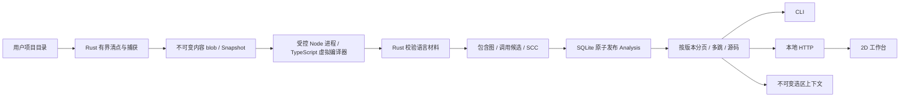

# Atlas 独立架构：当前基础与完整演进

版本：Foundation 0.1，2026-09-08。本文规定本仓库当前工程边界；`specs/` 保留完整产品目标。实现状态、自动化结果、真实环境资格、默认开启配置必须分别描述。

## 1. 产品与宿主边界

Atlas 拥有项目清点、快照、语言分析、图事实、查询、运行证据、选区和可视化工作台。Modus、CLI、外部 Agent、浏览器都是消费者。分析链路无需模型；模型可以解释有界证据、提出场景与变更，但不能把自己猜测的关系写成静态或运行事实。

代码解析 100% 本地运行是明确约束。它不等于所有语言、所有动态行为均可被静态分析完全确定。成熟实现必须通过范围声明、未知原因、覆盖分母和真实执行证据扩大可靠能力，不能用 LLM 补齐图中的未知并冒充解析结果。

当前本仓库具有自己的 Git、Cargo workspace、npm lock、CLI、HTTP、Web 和测试；不导入 Modus 代码。原 Modus 内 Atlas 暂时保留，不共享数据库、不重签旧证据、不自动迁移会话。

## 2. 已实现的链路

三个 crate 都有实际职责；未实现的大型子系统尚未建空壳。当前 Web 服务固定到启动时的一个 Analysis，不存在隐含“最新项目”切换。

## 3. 已实现的数据合同

Rust 类型来源为 `crates/atlas-contract/src/lib.rs`，序列化格式为 JSON。当前协议处于独立工程预发布阶段，不宣称与旧 Modus worker v1 兼容。若未来公开 SDK，应增加机器 schema、golden 与兼容性矩阵，并发布清晰版本。

| 对象 | 身份与内容 | 约束 |
|---|---|---|
| Blob | SHA-256(精确文件字节) | 原子不覆盖；重复内容验证；损坏拒绝读取 |
| Snapshot | 对清空 id 后的确定性序列化清单求 SHA-256 | 包含目录/链接/排除结果、捕获 blob、规则 profile、预算；不是仅按代码文件哈希 |
| LanguageFacts | snapshot_id + producer + parsed_files + symbols/calls/imports/diagnostics | 完整输入文件确认；foreign ID、所有函数与调用源码跨度验证 |
| Analysis | Snapshot + 引擎版本 + producer + 全部排序图事实/覆盖/限制的内容身份 | 单事务发布元数据、节点、边；既有版本不原地更新 |
| Entity | 类型/相对路径/UTF-8 字节范围 | 必须连同 analysis_id 使用；字节位置不是跨修改的永恒函数身份 |
| Page | analysis_id、查询条件、精确 total、items、next_cursor | 游标归属于版本+查询类型+过滤器+页大小；total 不用当前页长度替代 |
| Reachability | root、方向、节点/边、unresolved、frontier、truncated | 只表达词法候选的传递可达性；有界并保留未展开边界 |
| SelectionContext | analysis、entity、固定源码窗口、候选子图、限制与内容 hash | 仅本地冻结/导出；不自动披露；不是宿主 ACK/mailbox 或代码修改指令 |

Cursor 的摘要用于识别查询归属，**不是鉴权签名**。当前 HTTP 鉴权另由会话令牌、Host/Origin 边界负责。

## 4. 清点、捕获与事务

扫描使用目录能力相对访问，不将任意源路径拼入后续环境中的绝对读取。记录 symlink 及目标摘要，常态不跟随链接；外部内容不进入快照。Unix 捕获使用 nonblocking/nofollow 选项，并检查 inode/device、长度和时间变化。不可将这些检查称为抵抗所有恶意并发修改的文件系统事务。初次项目目录选择和本地事实库目录属于调用者授权的本机边界。

每层 `.gitignore` 以该目录为基准处理，子层规则可覆盖父层；已忽略目录不向下遍历，子孙数量明确未知。`.git`、`node_modules`、`target` 与事实库存储边界默认排除。链接路径仍记录为链接。非 UTF-8 路径及 Unix 中包含反斜杠的文件名目前显式拒绝，不将两种路径静默折叠成同一身份。

默认预算为 20,000 个清单项、每文件 2 MiB、累计捕获 64 MiB；扫描阶段有整体 deadline（CLI `--scan-deadline-seconds`，默认 300、上限 3600），超限拒绝并发布零快照。超大文件留下清单项，累计/条目预算超限不发布不完整 Snapshot。已写但未引用的 blob 可留下，尚未实现 GC。捕获的非 UTF-8 源文件保留字节并报告跳过原因。

不可变 blob 使用同目录随机临时文件与不覆盖发布，内容同步后入库。Snapshot 发布前验证身份及 blob；Analysis 在 SQLite 事务内发布全部行。数据库有 WAL 和有界 busy timeout。当前未实现目录 fsync 的断电耐久保证、数据库迁移与回收策略，不把逻辑原子发布称为完整灾难恢复。

**增量复用（W07）**：两个键分工不同。**运行键** = `H(版本包, 快照 id)`，而快照 id 本身就是 `digest(整个 Snapshot)`（含 schema、scan_profile、limits 与每个条目及其 blob 哈希），所以运行键相同即等价于"同样的字节 + 同样的版本"，已发布的分析可以直接返回。**文件键** = `H(版本包, 路径, 自身内容 hash, 依赖闭包摘要)`，闭包摘要在导入图的 **SCC 凝聚**上自底向上折叠——互相导入的文件作为一个单位失效，而不是一个无法排序的环；失效因此不需要额外的传播扫描，文件键恰好在自身或其传递依赖改变时变化。版本包由 producer 与六个契约/算法版本常量拼成，任一升级都会失效缓存。撤回是结构性的：分析始终从当前文件集合装配，从不合并旧结果，`withdrawn` 只是把差值报出来。**承重断言**是增量运行必须发布与全量运行逐字节相同的 analysis id（analysis id 就是内容的摘要，任何错误复用都会改变它）。**已知边界**：局部改动仍需重新派生全部函数，因为 Rust 侧派生是全程序 SCC 不动点，单函数求解依赖跨文件被调方摘要——按文件缓存派生结果在算法上不成立，不是尚未优化。

**作业所有权（W06）**：`jobs` 表把一次索引登记为持久身份——(owner, project, request_key) 三元组定义请求，`id` 只是句柄，三元组是唯一权威，因此迁移或导入留下的异形 id 仍可寻址。已完成请求重放原 analysis 而不重跑；失败与取消可重试。租约随心跳续期，租约停止续期即进程死亡的证据，`job reap` 据此把过期 running 判为 `lease_expired` 并释放租约。认领、心跳与终态都要求 `state='running'` 且持有者匹配，所以被接管后的迟到结果会被拒绝而不是覆盖。**有界并行**：`job work --parallel N`（1–4，默认 1）让一个进程同时跑 N 个作业。每个槽位用**自己的** holder id 领取（`<pid>-<uuid>-slotN`）：租约标识"谁在跑"，两个槽位共用一个会让"谁在跑这个"变成假话，也会让一个槽位的心跳替另一个续租。上限是**策略**而不是测量结果：`--parallel 0/5/99` 一律 `job_parallelism_out_of_range`，`--once --parallel 2` 是两种不同请求混在一起，直接 `job_once_with_parallelism` 拒绝。输出里给出 `parallelism` 与实际使用的 `holders`——槽位是否真的分开领取，看这个而不是猜。单个槽位任务崩溃不会静默：租约过期后由 `job reap` 收回，失败作为 `job_slot_task_failed` 报出。store 的写者是串行的（见上），所以并发槽位是在数据库上排队，而不是互相破坏。

作业写入与 schema 创建共用同一套 SQLite busy 重试纪律（`retry_on_busy`），因为作业存储正是两个进程被期望相撞的地方；仅靠 busy timeout 不够，SQLite 对某些锁状态会立即返回 SQLITE_BUSY 而不咨询 busy handler，而 busy handler 又会睡在 SQLite 内部、让 Ctrl-C 无法到达。同一请求键从两个进程并发提交只会产生一个作业，另一个读回它（`already_queued`）。

作业也可以被**排队**而不是只能即刻执行：`enqueue` 只登记请求，runner 参数随行存储，因此排队请求描述自己怎么运行，而不是取决于哪个 worker 捡到它；`job work` 按优先级降序、同级按入队时间最旧优先认领。租约过期的 `running` 会被工人**续跑**而不是等人工介入——崩溃不该让队列停摆，而重跑在这里是安全的，因为发布幂等且不可变。`reap` 是"放弃这次运行"，`claim_next` 是"换个人接着跑"，两种意图分开。排队中的作业可取消；运行中的不可被旁观者取消，因为它属于租约持有者。数据库迁移目前只处理**纯增量加列**变更，且依赖新列的索引必须在迁移之后创建（索引先于加列执行会让旧库直接开不了）；改列类型、拆表等非增量变更仍无迁移与回滚方案。**仍缺**：owner 是未经认证的调用者声明，作业 API 尚未暴露到 HTTP；无守护进程与并行 worker 池，无重试退避与公平性策略；断电耐久未资格验证。

## 5. 语言分析能力与边界

Node worker 加载 Atlas 固定的 TypeScript 编译器。编译器 host 只读 Rust 提供的快照内容，标准库关闭、无 emit、无用户 tsconfig、无插件、无运行 import。项目依赖只能在被捕获源中解析，不在主机磁盘上偷偷寻找。`package.json` 可以作为虚拟模块解析材料，不执行其中脚本。

当前提取：有函数体的声明、方法、箭头、匿名与嵌套函数；函数容器；调用表达式与构造调用点；ES import 模块候选；语法诊断；部分动态特征。每文件一次 UTF-16 到 UTF-8 映射，避免每个语法节点重复编码导致平方成本。

直接标识符调用可以利用 compiler symbol/alias 找到唯一声明作为候选；参数遮蔽不会按同名字符串绑定。无显式模块语法的重复脚本函数名保留歧义。已检测到写入的函数绑定、语法错误/dynamic 文件的目标、属性调用、构造、可选调用、外部依赖均不声称确定目标。

**未实现**：完整语义诊断/类型检查、所有 CommonJS/re-export 关系清点、动态 import、闭包环境/函数执行时间、this/继承/堆别名完整模型、反射、框架依赖注入、跨语言联系、完整堆/闭包上下文敏感摘要与捕获 origin 重代入。候选关系不能证明目标会被执行或只可能执行它。纯源码解析也不会告诉用户某次复制"实际复制了哪些字节"。

**Flow IR 与局部求解（0.2 新增，声明 profile 内）**：worker 将每个函数体降级为 `atlas.flow-ir.v1`（`js-structured-control.v1` profile）的结构化语句/表达式、Scope/Binding 与显式 unknown；Rust 校验锚点/引用/预算后构建基本块 CFG——`Completion(kind,value)` 驱动共享 finally dispatch、catch 不重入、短路/条件/`??`/switch 均为显式分支边，循环回边经迭代 Kosaraju 标记。局部抽象解释（`atlas-local-absint`）在有界格（常量 8/目标 64/来源 8/堆 32）上求 def-use、初始化状态（含 TDZ）、值来源与 JS 语义常量折叠；预算中断报告 `partial_budget` 与 frontier，不产生否定性证明。派生事实与 analysis id 以 `flow_digest` 绑定，旧分析不变。未声明构造（for-of/in、解构、async/await、逻辑赋值等）为显式 unknown，不是静默跳过，也不能把本 profile 内的普通赋值/参数/条件 unknown 化。

Rust 对 worker 版本、已确认文件集合、实体锚点、容器、调用归属、图引用作校验。覆盖报告包含已遇到源文件、真正送入语言解析的源文件、清单状态与未知调用分母。解析报告成功不代表代码可运行或业务正确。

数值转字符串使用固定版本 `ryu-js 1.0.3` 的本地 Rust 转换，遵循最短可往返十进制与指数阈值规则；不能用 f64 的精确整数展开代替 JavaScript `String(number)`。测试中的 Node 只执行受控 fixture，产品索引不执行用户代码。

有界标量上下文：在符号摘要之上，每个 callee 最多对 8 个调用点的完整标量实参单独求解。上下文键绑定 callee、caller、调用操作与规范化实参；实参变化后重新调度。对象、捕获与符号参数使用原符号摘要，不将 caller 的局部分配点/参数编号当作 callee 身份。初始、SCC 与上下文求解共享总 transfer 预算；不收敛或预算耗尽会降级所有受影响的结果，`flow.frontier` 和预算计数随不可变事实发布。

worker stdin ≤160 MiB、stdout ≤32 MiB、stderr ≤64 KiB，V8 old-space 为 512 MiB。调用有 1–600 秒配置期限；失败或超时杀死并回收直接 worker，部分输出不发布 Analysis。该机制用于受信任的 Atlas worker，不是任意用户代码 runner，不提供完整进程树/OS 沙箱承诺，也不是总体 RSS 硬上限。CLI 的整体 deadline 覆盖扫描、worker、Rust 分析和 SQLite 发布锁等待。扫描阶段自己的 deadline 同样覆盖快照发布。SIGINT/SIGTERM listener 保持到流水线结束；同步扫描/求解在 blocking 线程执行，控制对象在有界检查点检查取消。SQLite 写锁按短周期等待，最终 commit 与取消接受使用同一个门：先接受取消则回滚，先完成 commit 则保留成功的不可变版本。协作取消不承诺中断正在进行的单次操作系统 I/O 或磁盘提交，不使用硬退出伪装子进程已回收。当前仍无持久作业队列、owner 租约或进程崩溃重启恢复。

## 6. 图算法与查询

包含关系独立于调用候选。所有已识别调用点有记录：有候选 target，或 target=null 和原因。Rust 采用迭代 Kosaraju 计算候选图 SCC，避免源码深度转成 Rust 递归栈；O(V+E) 图工作量，Map 构建另含排序成本。SCC 仅表示静态候选循环，不证明运行时递归。

查询使用 SQLite 按 analysis/source/target 索引，BFS 跨任意层候选关系。页大小 1–500；子图节点 1–500、扫描边预算 1–2,000，超预算时保留 frontier。返回的确定端点边必须连到本次返回节点。反向查询无法列举所有未知调用者，semantics 明确说明。已到预算但尚有待检查节点时，truncated 可以保守为 true。

源码窗口最大 65,536 字节，CLI/HTTP 默认 16,000，退到合法 UTF-8 边界。读取固定 blob 并校验 hash，不读取当前工作目录文件。Context 默认 40 个节点、120 条扫描边和 16,000 字节源码；这是分项预算，不是假称总上下文已经严格限制为 16k token。

当前是全量重新分析，无复用 CFG/摘要、watcher、依赖失效传播或大项目分区调度。页数上限也不是字节预算：HTTP 另外限制单响应 2 MiB、同时查询 8 个，超限拒绝；构建响应前的进程内分配仍需下一阶段细化。不能以有分页就声称大型 monorepo 成熟。

## 7. 工作台与宿主接口

实际接口：CLI `index/report/nodes/edges/reach/source/context/flows/flow/profile/exec/serve` 与 `job submit/status/list/reap`；HTTP GET `report/nodes/edges/reach/source/flow/flows/profile/exec-records`，POST `context/exec`。均由引擎查询同一分析版本。HTTP 不开放索引任意路径、写代码或访问生产数据库。

`/api/exec` 是唯一会启动进程的 HTTP 入口，因此它的请求体刻意窄于 CLI：页面可以选择符号、JSON 字面量实参，以及两个**不扩大进程边界**的授权（`unknown_calls`、`globals`）。Node 二进制、环境变量、文件写、子进程与网络授权不在请求类型里，页面无法发送它们；超时被夹到 30 秒。这不是"忽略未知字段"的约定，而是字段根本不存在，因此没有可绕过的解析路径。

服务绑定 loopback；需要 Bearer token 与正确 Host，可带 Origin 时必须匹配本服务；无任意 CORS，静态页有 CSP。令牌每个服务实例独立，保存在该实例独占的本地会话文件，正常退出清理。没有远程/多租户认证。秘密上下文不能因为在本机就自动发给 LLM。

当前 2D 按文件组合函数行，目录是平面框。对象/关系显式分页；画布为可读性限制为 12 个含函数文件、每文件 20 个函数，并显示投影边界。选中函数发起真实 source/reach 查询，保留高亮并静默其他对象。过期选择响应以递增请求版本丢弃。大项目的空间索引与交互布局尚未实现；3D 的正式层级与 LOD 已实现（见下），2D 画布仍按 12 文件/20 函数的可读性预算绘制。

函数详情面板中的**绑定状态矩阵**把每个块×绑定的状态投影成表。三个视觉通道互相独立，因此没有事实会被另一个掩盖：填充表示值的种类（常量/确定值/已知来源/显式未知），角标表示该值仍含未知分量，描边表示读取时可能未初始化；「该块无绑定记录」是与「值为未知」不同的标记。这是投影，不是新的分析。

`/city3d` 是同一份分析的第二种投影：目录为地块、文件为柱、函数为层、调用候选为地面管道。它与 2D 工作台读取同一个固定 Analysis，并复用同一套 `asset()` 边界（CSP、Host/Origin、会话令牌），由手写 WebGL2 渲染，无第三方依赖。未解析调用按事实画成矮桩而非丢弃，未分析的文件（忽略/超限/不可读）单独标识，覆盖与截断始终显示。两者都只是静态事实的投影，不是执行观察。

用户的最终 3D 约定不变：目录是平面方形分隔框，文件为按对象数量表达体量的玻璃柱，函数为内部层，管道连接实际对应对象，运行激活后保留路径，其余区域变灰。2D/3D 必须消费同一事实与 Selection/Run；不各自猜一张图。当前页面只渲染静态关系，没有模拟运行数据的假动画。

### 7.1 执行画像与受控运行（W08 首片）

**执行画像**是从已发布的 flow 事实派生的静态充分性分类，不是执行结果。分类顺序是 `unsupported` → `needs_entry_driver` → `needs_context` → `pure_callable`，每条降级理由都带 `code/detail/evidence`，`evidence` 指回它读的那个字段（`effects.unknown_call`、`block_states[].bindings[].value.origins` 等）。关键保守点：`status != complete_within_profile` 一律降级——partial 分析的 frontier 恰恰是事实缺失的块，"没有未知副作用"没有被证明。`needs_context` 不是"永远不可运行"：可声明的输入（`this`、具名全局）由调用者给出后即可运行，捕获绑定则只能经 `--via` 由包含函数真实产生实例。

**"外部"分三类，而且必须分开**：函数自己的运行时 **import** 是模块状态（模块整体被复制，导入时就在，不需要声明）；**运行时内建与宿主全局**（`Error`/`Math`/`JSON`/`console`/`process`…）由运行时提供，Atlas 不要求声明——把 `Error` 当成"要声明的输入"会诱导调用者用 JSON 覆盖真构造器，实测就是这个后果（`--global Error=null` 之后 `new Error(...)` 抛 TypeError）；只有**真正的自由标识符**会被要求声明，并在拒绝里具名。这条区分要在 worker 侧就能表达：`FlowFunction.imports` 列出运行时可导入名（`import type` 不算，它被擦除），engine 的 `ReadExternal` 只有在该名字不在 imports 里时才算全局访问。版本用单一常量 `WORKER_PRODUCER` 对齐：`imports` 缺席的旧 worker 无法表达"这是导入还是全局"，它的输出会被**具名拒绝**（`worker_producer_not_supported`）而不是被读成相反的结论。`FLOW_SCHEMA` 保持 `atlas.flow-ir.v1`：新增字段带 `serde(default)`，形状兼容；改变的是**语义**，语义由 producer 声明。

画像把要求分成两类，混在一起会让"缺什么"变得不可行动：**可声明的输入**（`this` 与具名全局；调用者用 `--this` / `--global NAME=<json>` 给出，记录里写明声明了什么）与**必须承认的未知**（未建模构造、未完成事实、堆近似、未知调用；用 `unknown_calls` 这一条明确承认）。没有任何名字可指的全局读取不会被要求"声明某个值"——那不可行动；它落在承认项里。读取**模块级状态**不需要声明：模块整体被复制，导入时它就在。

**嵌套函数：闭包实例只能被真实产生，不能被声明（`--via`）**。嵌套函数捕获的外层绑定不是可声明的值——它只在包含它的那个函数运行期间存在。Atlas 因此既不构造作用域、也不接受任何"函数值"输入，而是提供一条唯一的入口：`--via <enclosing-symbol>`。画像给出 `enclosing_symbol`（以及给人读的 `enclosing_name`）与 `captures`（捕获绑定的名字，来自 `Capture(<binding id>)` 与已发布的 `binding_names`）。

- `--via` 必须**恰好等于**目标的真实包含符号；给别的符号一律拒绝（`via_not_the_enclosing_symbol`），因为"某个大概会返回相似函数的符号"不是同一个作用域。
- 运行是"每个祖先一次调用 + 最后调用目标"，记录里按顺序各有一条 `call` 事件（`stage: enclosing` + `stage_index`，最后是 `stage: target`）。**每一环都用同一把尺子量**：该环返回值必须是函数，且 `Function.toString()` 与**下一环符号**的钉住字节做**源码同一性**匹配；最后一环必须匹配目标。任何一环返回的不是函数是 `closure_not_returned`，返回的是别的函数是 `closure_identity_mismatch`，两者都保留该环观测到的返回值与源码并记录 `failed_stage`：链条不会被"只信最后一跳"地简化。记录里 `stage_report.stages[]` 保留每一环，`stage_report` 是产出目标实例的那一环，`ancestors[]` 是它之上的祖先（一层深的闭包为 `[]`，所以旧记录读起来完全一样），`chain` 给出完整符号序列。
- **多层嵌套用 `--via-chain`**：`--via` 永远表示"目标的包含函数"，`--via-chain` 是**它之上**的祖先（由外到内，JSON 数组 `[{"symbol","args"}]`）。调用顺序是 `via_chain… → via → 目标`。链不是被信任的：每一环都必须满足"其包含函数就是上一环"，最外一环必须是顶层（只有顶层才可能出现在模块命名空间里），任一不满足即**请求本身不成立**（`via_chain_not_connected` / `via_chain_not_rooted`，命令失败而不是发布一条拒绝记录）；`--via-chain` 给了而 `--via` 没给是 `via_chain_without_via`；深度上限 8（每一环都是一次真实调用，无上限就是无界运行）。
- 只给 `--via` 而包含函数自身也是嵌套的：静态拒绝 `closure_depth_not_supported`，并**具名下一层**告诉你该往 `--via-chain` 里加什么，而不是让运行死在命名空间查找上。
- 包含函数的字节同样从内容寻址 blob 读取并重新哈希校验（`via.source_binding`），因此两阶段的源码绑定都是构造性的。
- 拒绝时不会启动进程：`context_required` 的 detail 会点出捕获的绑定名与应当使用的 `--via` 符号。

**受控运行**只在一个条件下发生：静态画像允许，且 spec 已显式授予/声明所需项。执行路径：

1. 从**不可变快照**的内容寻址 blob 逐个读取并重新哈希校验，物化到一个 `0700` 的隔离副本（临时目录先 canonicalize，否则 Node 的 loader 会在 `/var → /private/var` 上触发一次未被授权的读而死在 loader 里而不是被测代码里）。副本的**范围**由 `--materialise` 决定，而且它是一个被记录的选择，不是一个隐含行为：
   - `snapshot`（默认）：快照里每一个被捕获的文件，与过去完全一致；
   - `dependencies`：目标文件的**静态 import 闭包**（已发布的 `import` 边，传递到不动点；`type_import` 不跟随，因为它在运行前就被擦除），加上快照里所有 `package.json`（Node 用它决定模块类型——rxjs 的 `dist/cjs/package.json` 就是"同一份字节被当成 CJS 还是 ESM"的唯一依据）。`package.json` 的收录有上限并会报出跳过数。

   这是一个**更紧的读边界**，不是"更小的项目"：目标运行时按相对路径读取、但从未 import 的文件不在副本里，读取会以 `ENOENT` 失败。记录里写明 `mode / basis / files_written / files_in_snapshot / bytes_written / written[] / closure{seed,reached,unresolved_relative[],unresolved_bare,import_edges_read,bounded} / known_risk[] / fallback`：
   - **未解析的 import 分两类**：相对 specifier（可能真的缺文件，逐个具名列出）与裸 specifier（`node:fs` 由 Node 提供、已安装包本来就不在快照里，只计数）；
   - 运行时的已知风险（计算型动态 `import()`、按相对路径读取其它项目文件）在运行前就列在 `known_risk` 里，`fallback` 直说"若以 `module_load_failed`/`ENOENT` 失败，用 `--materialise snapshot` 复核"；
   - 闭包遍历有界（文件数/边数上限），触顶时 `bounded: true`，绝不产出一个悄悄缺文件的副本；副本里没有目标文件时直接拒绝（`slice_missing_target`），不启动进程。
   - 页面**不能**选择副本范围：收紧读边界是能看到记录的人的决定，不是页面替别人的函数做输入声明的场合（与 `this`/`global` 同一条规则）。
2. 生成 harness，用**源码同一性**而不是名字来选定目标：模块命名空间里每个可调用值的 `Function.toString()` 归一化后必须与快照中该符号的字节切片一致，唯一命中才调用。因此改名、遮蔽导出、同名不同函数都不会被静默执行；命中不了就是 `target_not_exported`，不猜测。`--via` 运行的命名空间查找针对的是**包含函数**（那才是命名空间里可能存在的那个），闭包本身从不按名字查找；解析不到时结论是 `enclosing_not_exported`，与应用到目标上的 `target_not_exported` 分开。
3. 用**目标 Node**（由调用者指定，不是 Atlas 自己的运行时）以 `--permission` 启动，只授予隔离副本的读权限，以及 spec 里显式声明的项。权限模型不是"接受了 flag"就算数：每次进程内首次使用都会先跑一个能力探针，要求一次真实的写被拒绝（`ERR_ACCESS_DENIED`），否则拒绝执行。
4. 子进程自成进程组，超时或取消按组 `SIGKILL` 并回收；stdin/stdout/stderr 都有预算；harness 报告带每轮唯一标记并最后写入、显式退出，因此目标自己写到 stdout 的内容不会被误当作报告。

**Effect journal**：记录只包含运行时明确报告的**拒绝尝试**——Node 把 `permission` 与 `resource` 附在 `ERR_ACCESS_DENIED` 上，这是唯一可得的逐操作证据。被允许的操作没有逐条日志，因此 journal 同时记录授予集合并写明"这不等于没有效果"。空 journal 是"没有拒绝被报告"，不是"没有副作用"。

**取消与超时**：超时是 Atlas 选的界限，取消是操作者做的决定，记录必须能区分（`timeout` vs `cancelled`）。`SIGINT` 触发的取消按进程组 kill 并发布记录——取消的运行同样是事实。scenario 在执行中收到取消会**停止**，剩余用例标为未尝试（`attempted_cases < declared_cases`），不会产生一排"已取消"让人以为每个用例都被试过。

**观测合同**：`trace.coverage = "not_sampled"`，`trace.unknown_paths = "not_observed"`。只记录入口调用的返回/抛出、运行时报告的源码位置（映射回快照的字节偏移）、进程输出与退出状态。没有行级覆盖采样，没有运行期调用图，静态 BFS 不作为执行顺序。

**记录身份**：`exec_records.id = digest(固定问题 + 观测到的答案)`，其中刻意排除耗时与绝对临时路径。因此同一问题得到同一答案就是同一行（可重复运行、可幂等查询），而答案不同会产生第二条记录——两条不同的观测结果，而不是静默覆盖。mock/fixture 运行必须在记录里标为 `isolation.mocks=true`，它的结果不得被读作真实环境观测。

### 7.2 共享选区、Intent 与有界 Agent Bridge（W09 首片）

**选区对象** `{id, analysis_id, entity_id, entity_kind, version}`，其中 `version` 就是 analysis id。analysis id 是整份 Analysis 内容的摘要，所以"版本相同"是可判定的等式而不是时间戳猜测。选区经 URL fragment 在 2D 与 `/city3d` 之间传递；投影在服务另一个版本时**拒绝**它（`stale_selection_version`），因为把旧名字静默改指到新函数，与一个正确答案在被人据以行动之前是无法区分的。

**Intent 不是事实。** 注解存储时带 `exists:false` 与 `proposed_by`；`kind` 限于 `intent/constraint/scenario/patch`。补丁提案额外带 `applied:false` 与说明文字。渲染层必须显式说"提案（尚未存在）"。id 是内容的摘要，所以同一条 Intent 提两次是一行，不同作者是不同提案，且不能被后来者就地改写。

**有界 Agent Bridge。** 请求身份 = `(owner, request_key)`，与作业同一套幂等纪律；认领即 ACK（记 `ack_at`）并带租约；过期租约被收割**回到队列**而不是判失败——桥接动作便宜且幂等，让等待中的人丢掉请求没有道理；终态只能由当前租约持有者写入。动作集合是封闭的（`inspect` / `annotate` / `propose_patch`），不在集合内的请求在**入队时**就被拒绝并记录 `action_not_in_bounded_set`，因此一次非法动作是持久可见的拒绝，而不是静默忽略。HTTP 侧 `analysis_id` 不在请求类型里——页面无法把工作钉到本服务没有在服务的版本上。

### 7.3 AI Coding 补丁链（W09 续）

`propose → verify → apply/revert`，三步各自有一条硬边界。

**propose**：统一 diff 先对固定快照的字节在内存里应用。位置不符就拒绝，并**带着不一致的那一行**（期望什么、实际是什么）。不做模糊搜索——模糊应用会把改动悄悄挪到另一个长得像的函数里，而固定版本的全部意义就是"讨论的就是这些字节"。CRLF 目标直接拒绝而不是规范化行尾。

**三种形式，由表头声明、由 hunks 复核**：`PatchForm = modify | create | delete`。`--- /dev/null` 是新建、`+++ /dev/null` 是删除，两者都不是就从两侧表头取路径（两侧不一致即 `diff_headers_disagree`）。形式**不是**从 hunk 形状猜出来的：`--- /dev/null` 却带上下文行是自相矛盾（`create_patch_has_non_added_lines`），`+++ /dev/null` 却留下行也不是删除（`delete_patch_leaves_lines_behind`）。删除不是"编辑成空文件"——那是一次修改，两者的 revert 语义不同，所以 `PatchOutcome` 把 `files`（修改/新建后的内容）与 `deleted`（被移除的路径）分开，记录里每个文件带 `form` 与 `removed_digest`。新建必须指向快照里**没有**的路径（`create_target_already_exists`），删除必须指向**有**的路径（`delete_target_not_in_snapshot`）；同一条 diff 两次碰到同一路径被拒绝（`diff_touches_a_path_twice`），否则先后顺序会决定结果。git 的 `rename from/to` **具名拒绝**（`rename_not_expressible_in_unified_diff`）：把重命名表达成删除+新建会丢掉两个路径之间的身份联系，Atlas 宁可拒绝也不建模成它不是的东西。新建提案的 `entity_id` 是 `file:<path>`——一个还不存在的实体，所以提案里写明 `target_exists=false`。

**verify**：从内容寻址 blob 物化一个 `0700` 隔离副本（补丁只写进副本），在副本上跑完整索引管线，于是补丁派生出一个**新的 analysis**，而用户检出目录一个字节都不动。图差异按 `path+name` 重新配对节点：节点 id 绑定源码字节区间，编辑函数会改变 id，按 id 比较会把每次编辑读成一次删除加一次新增（id 仍原样给出）。测试命令是**声明的 argv 数组**，不是 shell 字符串，超时按进程组杀死；没有声明就是"没有跑任何测试，这不是通过"，绝不渲染成通过。

**apply/revert 持锁**：整个「校验字节 + 写入」过程持有检出目录里的 `.atlas-apply.lock`（`create_new`，由操作系统保证第二次创建失败；文件里写着持有者身份）。没有它，两个进程可以都通过「检出仍是审查过的字节」然后都写，第二个赢——而它的检查描述的已经是不存在的检出了。锁在 guard drop 时释放，**包括每一条错误路径**（有用例检查被拒绝的 apply 不留锁）。撤销来源就是内容寻址的钉住 blob（读取时重新哈希校验），所以没有额外的磁盘备份副本；**合并与逐文件备份仍然没有**。崩溃残留的锁会被下一次 apply 报出来（宁可挡一次也不静默消失），清理用 `atlas patch unlock --target <checkout>`：显式、报出原持有者、没有锁时以 `no_apply_lock` 报错而不是静默成功。

**apply/revert 按形式各查各的**：修改与删除要求目标当前字节仍等于提案所依据的固定快照 blob（不符即 `target_changed_since_apply`），**新建要求那里什么都没有**（`create_target_already_exists`）——审查之后出现的文件是别人的工作，覆盖它和覆盖一次修改是同一种损失。撤销同样按形式：撤销修改写回钉住字节并校验"当前仍是 apply 写下的字节"；**撤销新建要删掉那个文件**（且它仍必须是 apply 写下的字节）；**撤销删除要按钉住字节恢复**，且目标路径必须仍然是空的（`target_recreated_since_delete`）。状态迁移是单向的：`proposed → verified → applied → reverted`，每一步都要求前一个状态。
验证在隔离副本里进行时也必须按形式组装：新建的文件不在快照里、删除的文件不写入副本，`materialize` 从 outcome 而不是"快照+编辑"装配副本，并拒绝"声明为新建却已在快照里"这类自相矛盾。

**审阅面**：`GET /api/patches`、`GET /api/patch?id=`、`POST /api/patch/propose` 与函数面板的提案面板。页面可以登记提案（Intent，什么都不改）并读到验证结果；**验证仍只在本机 CLI**（`atlas patch verify`）。

**写路径是显式开关，而且只有一个目录**：`atlas serve <analysis> --allow-writes <DIR>`。不带这个参数时 `POST /api/patch/apply|revert` 一律 403 `http_writes_disabled`，并且**请求无法把它打开**——边界只能由启动参数设定。打开后：

- 目录在启动时 `canonicalize` 一次，之后每次比较都是两个绝对路径，页面无法参与其中；请求体里**没有** target/root 字段，注入的同名字段不会被读取（有用例锁住这一点）；
- 请求必须回显它被展示的那个绝对路径（`confirm_path`），与服务端持有的目录逐字相同，否则 400 `confirmation_mismatch` 且不写任何文件；页面把该目录**显示在按钮上**，所以点击之前人已经看见了会写到哪；
- `revert` 只撤销记录里那个目录，且必须等于启动时指定的目录（`revert_target_is_not_this_checkout`），别的检出目录的提案不是这台服务器的；
- 写入与 CLI **共用同一段代码**（`patchwork::apply_proposal` / `revert_proposal`）：两套实现必然漂移，而漂移的那一套正好是没被测过的那一套；
- 记录里写明**是谁、通过哪条路径**做的：`terminal_reason = applied_by:<actor>`（HTTP 的 actor 是会话身份 `session-…`）。

契约（`GET /api/contract`）里有一个 `writes` 段：`{enabled, root, how_to_enable, scope}`。页面据它决定是否显示写入按钮——查询失败时按"没有写路径"处理，因为猜"有"会给出一个按不动的按钮。HTTP 登记与 CLI 验证共用 `patchwork::propose_from_diff`，所以"对固定快照校验过"在两条传输上是同一件事，页面无法登记一个 CLI 会拒绝的 diff。

**排队执行**：`patch verify --enqueue` 把验证登记为 `patch_verify` 作业。队列按行自身的 `kind` 分派（`index` / `patch_verify`），两种作业共用身份三元组、租约、心跳与崩溃收割；`job work` 用**同一个 `verify_proposal`** 执行，因此前台验证与排队验证不是两条路径。终态 artifact 是补丁树派生的新 analysis。一行描述不了自己怎么跑时（例如期限越界），作业**判失败**而不是用本 worker 的默认参数顶替别人的请求。

**仍未实现**：apply 没有备份/合并/文件锁；`--allow-writes` 只覆盖单个目录、单个分析，没有多目录或多租户写入；页面没有把 diff 渲染成逐行审阅视图。

### 7.4 宿主接缝（W10 首片）

合同有**可执行版本**：`GET /api/contract` 返回 `atlas.host-contract.v1`，逐条列出接口名、传输方式（`http`/`cli`）、
用途、保证与限制，以及四条宿主规则。`adapters/modus/atlas_host_client.mjs` 是参考宿主客户端，只接受 `{url, token}`。

**宿主不读 Atlas 存储**这条规则有可执行检查，不是文档约定：测试读适配器源码断言其中没有任何存储访问
（`rusqlite`/`sqlite`/`atlas.db`/`blobs/`/`node:fs`/`readFile`），断言 contract 响应里不出现 store 路径或 `atlas.db`，
并在 E2E 中只把 URL 与令牌交给适配器。适配器还会拒绝非回环 host——本地会话令牌不该被送到别的机器。

`docs/HOST_API.md` 写明迁移与回退边界：**本切片没有切换 Modus 旧入口**，因为 Modus 检出不在本工作区，
在这里既不能构建也不能测试宿主侧；切换一个无法验证的入口等于把声明当成结果。迁移是增量的，
回退等于"停止调用适配器"，因为适配器从不写宿主的数据、也不要求宿主迁移任何东西。

## 8. 接下来构建的实际子系统

以下为设计要求。"语言中立流 IR"与"本地数据流"在 0.2 已有 JS/TS 声明 profile 内的首个纵向切片（见第 5 节），其余能力与下表完整方向仍是目标，不添加空方法冒充可调用能力。

| 子系统 | 完整能力与算法方向 | 与当前基础的接缝 |
|---|---|---|
| 语言中立流 IR（0.2：JS/TS profile 切片已接通） | CFG block、typed edges、作用域/变量、求值顺序、异常 completion；更多语言与构建变体按版本扩展 | LanguageFacts.flow 版本化载体已落地，不把当前 calls 当作 CFG |
| 本地数据流（0.2：局部 def-use/来源/常量/循环不动点已接通） | 完整 points-to/alias、字段敏感堆、widen/narrow、效果模型 | facts 表 + flow/values 查询已建立；堆/别名精度与跨过程摘要仍是目标 |
| 跨过程 | SCC 调度摘要固定点、参数→返回/副作用、递归稳定条件、上下文敏感预算 | 不复用“多跳 BFS 完成”冒充摘要求解 |
| 执行画像与测试（0.2/W08：静态分类 + 隔离受控调用已接通；fixtures 只是声明标签） | pure/contextual/entry-only/unsupported 分类、fixtures、依赖切片、mock 和真依赖来源、RunSpec、Effect journal | 只在新的受控 Runner 中执行，经权限与执行环境合同；上下文合成、Effect journal 与依赖切片仍未实现 |
| 场景与真实 Trace（0.2/W08：RunSpec + scenario 断言 + 入口观测已接通） | 用户业务步骤→入口/动作/断言；执行、source map、事件排序/因果链；未覆盖支路与丢失事件显式 | Observation 与 Static/Intent 分库或强类型隔离，不能凭颜色等价；行级覆盖与因果链仍未实现 |
| 选区与 Agent Bridge（0.2/W09：共享选区带版本、跨版本拒绝、有界桥接已接通） | 稳定选区/标注、版本、最小披露、请求队列、租约/ACK、可恢复状态、宿主能力协商 | 选区只在同一 analysis 内互通；跨版本是拒绝而非重定位；owner 未认证；最小披露裁剪未做 |
| AI Coding（0.2/W09：propose→隔离 verify→图 diff→apply/revert 已接通） | 意图占位→提议→补丁→隔离工作区验证→重新解析→图 diff→应用/撤销；冲突和旧版本拒绝 | 修改/新建/删除三种形式，重命名具名拒绝；verify 可排队；审阅面可一键 apply/revert（需 `serve --allow-writes <DIR>`，单目录 + 路径回显）；apply 无备份/合并/文件锁 |
| 宿主接缝（0.2/W10：合同即数据 + 参考客户端 + 无存储访问检查已接通） | 宿主调用服务、不读数据库；能力协商与版本协商 | 旧 Modus 入口未切换（宿主检出不在本工作区，无法验证）；无远程/多租户认证与版本协商 |
| 长期作业与大项目 | owner/项目/版本隔离、取消/截止/终态、增量失效、并发 worker、预算调度、磁盘事实/索引 | 新建正式服务作业 API；当前单次 CLI 非持久作业系统 |
| 生产诊断（候选） | 只读遥测导入、部署/source version、trace/log/metric 关联、缺失证据与归因置信范围 | 先开发/测试资格，不能默认获得生产执行或写数据库权限 |

每个扩展都先给源代码样本、预期事实、反例和资格范围，再给 UI。完整 AL/ET/GE/MT/HI/DV 在导入规格中保留，不能以本次较小切片取代原定验收。

## 9. 实现选择依据

Rust 管理身份、事务、查询、资源与派生算法；语言材料先复用成熟编译器的语法/符号能力，而不自行发明 JS parser。这是边界选择，不承诺 worker 永远只用 Node，也不强制其他语言通过 TypeScript。

所选基础 API 已核查 [cap-std Dir](https://docs.rs/cap-std/latest/cap_std/fs/struct.Dir.html)、[TypeScript Compiler API](https://github.com/microsoft/TypeScript/wiki/Using-the-Compiler-API)、[Axum 文档](https://docs.rs/axum/latest/axum/)。工具可替换；身份、版本、来源、未知、终止、权限和如实验证应保持。目录相邻本身不等于解耦，独立构建与不跨宿主数据库的实际证据才证明当前边界。
