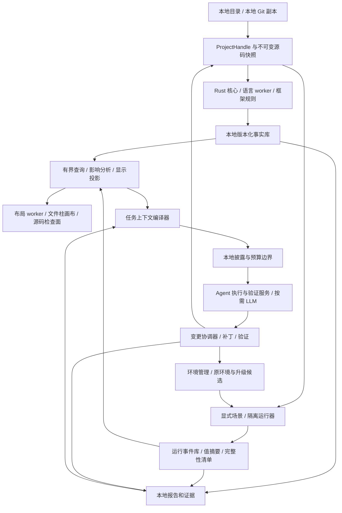

# Modus Code Atlas 开发设计：本地代码解析、可视化 Review 与 AI Coding

当前行动入口：[首轮实现整改](code-atlas-remediation-work-order-2026-09-08.md)。本轮已对实际源码独立审查，结果见 [实现审查报告](code-atlas-implementation-review-2026-09-08.md)；既有真实 Rust/Node 链可保留，重要语义和执行反例尚待修复。第 30 节说明本轮补强，历史文档校验记录不代表产品通过。

文档版本：2.0 · 2026-09-08。交付类型：可供开发和独立验收使用的设计基线。产品工作名：Code Atlas，界面名称暂用“代码解剖台”。保持三层主动升级、Rust 主线、17 项算法合同和 52 个算法用例；新增成熟能力合同、自然语言业务场景、LLM 工具 / 渲染通路、画布新增功能到真实源码的生命周期。基础 23 个工作包之外增加 MX 的 10 个成熟扩展包与 24 类任务验收。本次进一步补齐独立运行、选区 / 标注读取、外部 Agent 与宿主能力协商；HI-01–16 纳入既有工作包。本次将 2D 关系图提升为与 3D 结构空间联动的正式工作视图，补齐投影语义和 DV-01–16。新增技术和指标均为开发目标，不能从文档推定已实现或取得资格。

**交付状态：本文是设计合同，不是当前实现审计。** 已有独立交互 demo 和计算器本地解析实验，工作树也已有并行开发的 Atlas 源码与测试；本次未对它们进行完整验收。不能从 demo、文件存在或本文篇幅推定大仓库解析、任意入口执行、外部宿主接入或可靠 AI 修改已可用。除明确标为“当前源码”或“历史实验”的部分外，API、目录、性能数字和阶段均按待实现 / 待验证合同理解。

本文面向产品、解析器、前端、运行观测、Agent 集成和测试开发者。没有读过聊天记录的开发 Agent，也应能按本文理解目标、实现边界和验收方法。

## 阅读与约定

- 产品和交互：第 1–4、13–15 节。
- 本地解析和大仓库：第 5–12、22 节。
- 运行、测试和报告：第 16–18 节。
- LLM、修改闭环和 Modus 接入：第 19–21 节。
- 开发顺序、发布门槛和接手指令：第 23–27 节。
- 技术依据和待决事项：第 28–29 节。

“必须”是验收要求；“默认”是可配置的产品决定；“建议 / 目标”需实验验证。“全量”必须带范围与能力层级。事实来自解析器、运行采集器或明确的原始材料；模型输出属于解释或假设。

长期实施入口：[Coding Agent 完整任务书](/Users/yinsijie/CodeRepo/Modus/docs/code-atlas-coding-agent-work-order-2026-09-07.md)。本文件规定产品、架构与验收合同；任务书规定执行顺序、进度保存、阻塞处理和交付证据。换机器时以上路径均按实际 Modus 仓库根目录定位，不能把路径不存在当成已经读过材料。

引擎实施必读：[本地拆解引擎算法规格 1.5](/Users/yinsijie/CodeRepo/Modus/docs/code-atlas-local-engine-algorithm-spec-2026-09-07.md)。其中 AL-00–16 规定算法输入、内部表示、转移 / 求解规则、复杂度边界和 ET-01–52 验收，是第 8–12、16–20 节的实施补充，不能只读总体架构就跳过。

成熟能力实施必读：[成熟产品、场景测试与画布 AI Coding 合同 1.3](/Users/yinsijie/CodeRepo/Modus/docs/code-atlas-maturity-and-scenario-spec-2026-09-07.md)。该合同把能力范围、生态资格、业务场景编译、LLM 工具与视图控制、拟新增图到实际代码、测试充分性和 MX / MT 验收展开，是用户最新要求的扩展；不替代或降低本地引擎与原基础验收。六份交付文档共同定义完整任务。

外部集成实施必读：[独立运行与外部 Agent 集成规格 1.3](/Users/yinsijie/CodeRepo/Modus/docs/code-atlas-standalone-integration-spec-2026-09-08.md)。规定一个引擎服务多个宿主、WorkbenchState / 冻结选区 / 请求邮箱、CLI / MCP / WebMCP、可选自有聊天和 HI 验收。独立商业外壳与各宿主增强按 profile 交付，不要求先重建通用 Agent 平台。

双视图实施必读：[3D 结构空间与 2D 关系工作台规格 1.1](/Users/yinsijie/CodeRepo/Modus/docs/code-atlas-dual-view-design-2026-09-08.md)。2D 提供正式的结构 / 调用 / 数据 / 运行 / 变更镜头，与 3D 共用本地事实、运行、选区、标注与 Coding；DV 验收纳入既有工作包。

## 1. 已对齐的产品决定

产品共用一个版本化代码事实底座，提供三种连续工作：认识项目、审阅行为或变更、发起并验证修改。Review 包含架构阅读、问题定位、局部测试和变更审阅，不局限于 PR 行评论。

核心价值是：用户看到的项目结构、所选函数、数据线路、运行结果，与 Agent 取得的源码证据相互对应。程序完成可确定的事实提取，算法完成查询与呈现，LLM 完成按需解释和改造。

### 1.1 不再重新讨论的界面约束

| ID | 已确认要求 | 产品含义 |
|---|---|---|
| U01 | 文件夹是平面的方形 / 矩形分隔框 | 嵌套表示目录归属；不画成立方体或有顶面的罩子 |
| U02 | 文件是大小有区别的玻璃圆柱 | 尺寸由对象数量按明确尺度生成，不是等大的场景节点 |
| U03 | 函数位于所属文件柱内 | 用切面、抽屉或分层表达；函数清单是辅助入口 |
| U04 | 管道连接函数层及其端口 | 文件内用外壁半环；文件间、目录间保留具体来源和去向 |
| U05 | 数据经过时，管内出现明显的类型色 | 当前活动、历史经过、未经过必须可区分 |
| U06 | 测试结束留存线路 | 本次经过的线路和函数层保留；其余区域变灰、静默 |
| U07 | 柱外解释当前活动 | 展示函数名、输入、判断、输出；不要用几十层内部小字承担阅读 |
| U08 | 同一项目可以从不同入口观察 | APP 点击、公开函数、受支持的内部端口有不同真实路径 |
| U09 | 全貌与局部同时可定位 | 钻取保持目录方位、边界连接、返回位置；信息不因聚合而消失 |
| U10 | 执行不要求先选择检查对象 | 当前激活来自运行事件；手动选择只影响检查状态 |

“运行时模块上升”已被用户允许暂缓。本版本把运行激活、函数弹出和线路留存列为必做；自动抬升是后续实验，不能成为首版阻塞项。若恢复该效果，必须由执行事件驱动，文件柱高度的统计尺度保持不变。

### 1.2 本地与 LLM 的硬边界

| 操作 | 默认执行者 | 模型未配置时 |
|---|---|---|
| 清点文件、语法 / 符号解析、构建索引 | 本地程序与语言适配器 | 完整可用，按支持范围输出 |
| 关系查询、依赖分析、布局、缩放、选择、回放 | 本地算法 | 完整可用 |
| 函数签名、源码注释、调用点、类型和 IO 事实 | 本地索引 / 执行记录 | 可查，不生成虚构职责 |
| 支持入口的测试与结构化报告 | 本地运行器、验证器、模板 | 可用，不要求 AI 讲解 |
| 环境识别、受支持的环境准备与升级差分 | 本地环境管理、包工具、测试与比较算法 | 不要求模型；安装与执行沿用任务授权 |
| 简单类型 / 范围 / 副作用约束 | 本地受限规则 | 可编辑、运行、比较 |
| 业务职责解释、复杂意图归纳、自然语言问答 | 用户启用的 LLM | 显示未启用，不阻塞上述能力 |
| 复杂功能修改、测试草案、重构建议 | LLM + Agent 执行与验证服务 | 不自动启动 |
| 精确重命名等受支持机械重构 | 语言服务 + 本地验证 | 可以不调用 LLM |

这个边界适用于首次导入、全量解析、增量解析和后续浏览全程。不得把模型分类、云 embedding、AI 生成文件树放在必经路径。语法结构无法确定的内容先成为未知项，不能自动请求 LLM 来伪造“解析完成”。

100% 本地解析是硬合同：材料准备好后，全部代码事实计算在本地执行，不以模型补全困难关系。受支持语法 / 绑定 / 数据流规则必须按算法规格真正实现；不能把所有关系标 unknown 就声称完成。文件处置完整性、语义覆盖与质量、运行观测分别计量，并通过禁网 / 无模型的引擎资格验证。

### 1.3 产品目标决定技术，旧实现作为迁移输入

本文设计的是能够承担大项目解析、真实运行 Review 和可靠 AI Coding 的目标架构。当前 Modus 的实现语言、最低运行版本、数据库、消息桥、目录组织和 Runtime 接口都可以升级或替换；它们不构成本功能的长期能力上限。

| 决策类别 | 对开发的约束 | 遇到冲突时如何处理 |
|---|---|---|
| 已对齐的产品要求 | 本地解析零模型依赖、完整信息可达、真实线路留存、局部到整体的 Review 与修改闭环 | 技术选型应满足这些要求；不能因旧接口不支持而自动删减 |
| 正确性和数据边界 | 事实有来源、运行与快照对应、用户数据和并发工作受保护、模型使用受控材料 | 保持语义；具体机制与实现可以演进 |
| 当前 Modus 接入条件 | 现有版本、组件、生命周期和调用路径 | 作为迁移清单，选择适配、升级或替换，并验证受影响行为 |
| 本文推荐的初始技术栈 | Python 3.14 宿主、Rust 本地核心、Node 24 LTS / Python 语言 worker，见第 6.5 节 | 主方案先验证并实施；有实测反证时记录替代决策，不因旧组件限制自动退回旧基线 |

“复用现有组件”表示值得评估的接入方案，不等于必须保持其当前限制。“兼容旧版本”须明确支持对象、收益、成本和能力范围，不默认要求新引擎与所有旧版本功能齐平。技术选型记录应同时说明目标能力、采用理由、替代方案和迁移影响；不以“旧文档如此规定”作为唯一理由。

用户已确认三层可以大胆升级。本文据此把升级从可选建议提升为开发主线，并增加 UP-00–03 工作包。对被测项目的升级体现为环境管理、迁移补丁和差分验证能力；导入项目仍先保留原环境事实，具体项目在既有任务授权范围内选择升级目标并执行。

### 1.4 已确定的架构与可自主决定的参数

Atlas 本地引擎核心使用 Rust 已是用户确认的开发主线。UP-00 / CA-00 要验证并细化这一主线，不重新进行“是否使用 Rust”的开放选型，也不能交付一个只转发全部计算给旧 Python 后端的 Rust 空壳。用户没有改变方向前，扫描 / 身份、分区作业、事实索引与图查询的核心所有权遵循第 6 节分工。

实施者可以自行确定 Rust crate、存储表示、IPC 编码、解析器版本、具体补丁版本和内部目录，并记录依据。UI 的目录框 / 文件柱 / 函数层 / 留痕语义、本地解析零 LLM 依赖、已对齐的三层升级和 R0–R3 主线范围不能因实现便利被删减。更广语言、XL 和字段级血缘按第 23.1 节继续扩展，不把“稍后交付”解释成永久放弃。

## 2. 本轮依据与当前工程状态

### 2.1 文档优先级

本文整合并细化以下材料；有冲突时，用户最新要求优先，其次为本文。历史材料保留研究与实验背景，其中的旧版本兼容安排或既有接入限制不自动成为新架构的强制要求。

1. [文件 / 函数柱第二版 UI 对齐](/Users/yinsijie/CodeRepo/Modus/docs/code-atlas-dual-view-design-2026-09-08.md)：最新形体和线路留存合同。
2. [计算器最低交互与技术设计](/Users/yinsijie/CodeRepo/Modus/docs/code-atlas-development-design-2026-09-07.md)：局部入口、约束、真实实验与最小闭环。
3. [UI 研究与空间交互设计](/Users/yinsijie/CodeRepo/Modus/docs/code-atlas-dual-view-design-2026-09-08.md)：语义缩放、证据和渲染；旧的独立函数器件、选择抬升等不是当前默认 UI。
4. [总体调研与 64 类代码组织](/Users/yinsijie/CodeRepo/Modus/docs/code-atlas-maturity-and-scenario-spec-2026-09-07.md)：广度素材；本文给出实施优先级。

本轮依据为本任务可见聊天记录、以上文档、当前相关源码和第 28 节重新查阅的公开技术资料。没有把全部历史会话当成已审计材料，也没有对第三方分析器做性能横向实测。

### 2.2 可复用材料与不可冒认的能力

| 材料 | 已有内容 | 不能据此声称 |
|---|---|---|
| `fake_app/A`、`fake_app/B` | 5 个自然语言 txt；2 个具名函数描述、4 个处理描述 | 通用 AST 提取出了 6 个真实函数 |
| 独立交互 demo | 分隔框、文件柱、函数层、4 个规则分支、线路留存 | 已接入 Modus 或执行了用户源码 |
| 计算器 `experiments/code-atlas-calculator/` | 本地 AST / 有限探针实验与报告 | 完整跨文件语义、任意变量血缘、运行隔离 |
| 计算器证据目录 | 原计算器源码、测试和历史评估材料 | 历史测试成绩自动适用于后续版本 |
| Modus Preview Host | 适配器注册和生命周期、标注、消息桥 | 已有代码图、语义选区或 Code Atlas 服务 |

历史实验记录过 103 个函数类语法节点、20 项核心测试和 7 个局部场景；这些数值引用旧文档，**本轮没有重跑**，不能用作本设计的发布验收成绩。开发时必须对实际选定快照重新生成清单与结果。

当前源码核对基于 `HEAD=395619e514b252777a154a17dc5daaba5b8e4fde` 与 2026-09-07 的未提交工作树。另一个 Agent 正修改 Runtime / server / 测试，接入前必须重新核对。本文只新增设计文档，不修改这些工作。

## 3. “大项目全量解析”的可验收定义

### 3.1 五个能力层级

| 层级 | 保证范围 | 结果 | 不代表什么 |
|---|---|---|---|
| L0 文件清点 | 已授权扫描范围 | 文件、大小、分类、忽略、失败、未遍历边界 | 已读完全部文件内容 |
| L1 语法结构 | 受支持格式 / 语言 | 定义、局部语法、声明、源码范围、语法诊断 | 所有符号引用已解析 |
| L2 语义关系 | 选定语言版本、构建配置与适配规则 | 定义引用、import、类型、调用目标 / 候选、端口 | 任意动态调用都能确定 |
| L3 局部深分析 | 明确选区和分析预算 | CFG、def-use、跨函数摘要、源到汇的数据依赖 | 整个仓库无条件获得精确数据血缘 |
| L4 运行证据 | 实际执行的场景与采集范围 | 调用实例、分支取值、参数返回、IO、覆盖、事件缺口 | 所有未来行为已覆盖 |

**全仓就绪的合同**：选定范围内的文件都有处置结果，受支持 L1/L2 作业已结束，失败、未知和未支持项可列出；L3/L4 有独立覆盖说明。不能承诺任意语言、反射、插件、native 调用和并发程序的完全精确恢复。

“完整信息”落实为三项：材料不无声丢失；结论可回到证据；未确定的边界可继续调查。它不要求把百万函数和全部语句同时画到一个屏幕。

### 3.2 状态与分母

文件清点应满足：

```text
已枚举文件数 = 待处理 + 已索引 + 明确排除 + 不支持 + 失败
已尝试解析数 = 成功 + 部分成功 + 解析失败
调用点数 = 单目标解析 + 多候选 + 动态未解析 + 外部目标 + 待分析
```

上述类别在同一计数口径内互斥。一条解析边可有多份证据，不能用证据条数代替边数。对于被剪枝、无权限或外部链接的目录，显示“边界未遍历，内部文件数未知”，不能把未知内部文件计为 0。

界面分别给出范围、文件处置、语言特性、当前分析代次、未解析关系和显示对象数。禁止只有一个容易误解的“完整度 100%”。

### 3.3 规模维度

仓库规模同时记录：源码字节、文件数、语言 / 构建目标数、符号数、调用点数、关系数、最大文件、最大目录扇出、最大 SCC、运行事件数。不要仅靠 LOC 给项目分级。一个小型多服务系统可能比一个巨大但规则统一的代码库更难分析。

## 4. 用户完整流程与 Review 输出

### 4.1 导入到第一次可读

预览菜单 → 代码解剖台 → 选择本地目录 / Git 地址与 ref → 范围清点 → 渐进显示目录框和文件柱 → 展开对象 → 检查关系与源码。

第一帧不等待全仓深分析。尚未解析的文件柱显示“待解析”，不能先画虚构函数层。源目录内容不因导入而被执行、格式化或安装依赖。

### 4.2 架构 Review

用户可按结构、调用、数据、配置、测试或变更切换关系视图。选择目录显示跨界输入输出与依赖；选择文件展开全部对象；选择函数看入出端口、调用点、局部分支、关联测试与未知边界。

问题检查包括循环依赖、越层调用、公共接口变化、配置消费者、IO 边界、异常处理、资源生命周期和测试缺口。每条发现必须注明规则、范围和证据；启发式“可能未使用”不能变成删除建议的确定依据。

### 4.3 局部与整体测试

选择受支持入口 → 输入与 fixture → 查看副作用范围 → 运行 → 事件驱动高亮 → 结束留存路径 → 检查输入 / 输出 / 异常 → 生成本地报告。回放只读记录，不重新执行业务动作。

支持 APP 入口、公开函数、已有测试以及可构造环境的内部函数。按钮是否可用取决于入口能力，而不是所有函数统一给一个“运行”。缺少闭包、对象实例、native 环境时指出缺项。

每个已识别函数均可作为检查、测试目标和 AI 操作选区；能否直接调用由本地 FunctionExecutionProfile 判断。不能直接调用时，提供依赖 fixture 或上游场景入口，保留所选函数作为观测目标。选区、实际入口、运行依赖、观测范围和修改范围分别保存；相关函数无需用户逐一选中才能执行。详见第 16.11–12 节与算法 AL-16。

### 4.4 变更 Review 与 AI Coding

选择一个对象、端口、关系或多对象区域 → 保存约束 / 修改目标 → 生成影响报告 → 按需 AI 解释或生成补丁 → 在绑定基线的可写环境验证 → 源码 diff 与图 diff 同步 Review → 按既有授权落地 → 新快照与新报告。

支持比较两份快照、一个分支相对基线、或本次 Agent 变更。评论具有源码锚点、对象锚点、证据、未决 / 已解决状态；源对象消失时显示失效，不悄悄绑定到下一行代码。远程 PR 读取和评论发布是后续连接器能力，发布沿用用户已有授权。

### 4.5 代表性改造及验收意义

| 用户意图 | 技术落点 | 必须验证 |
|---|---|---|
| 给“手”增加一个“手指” | 新增命令、API、组件或插件 | 新入口注册、调用者兼容、异常路径、测试和说明 |
| 血管仅接受水和葡萄糖 | 端口类型 / 字段 / 业务约束 | 原始非法输入真正抵达待测代码，验证拒绝行为 |
| 肺吞吐增加几百倍 | 指定场景下的性能改造 | 基线硬件、负载、正确性、吞吐、尾延迟和资源上限 |
| 神经反应更快 | 调度、缓存、并发、超时 | 顺序、取消、重复处理、背压、错误传播 |
| 替换一个器官 | 依赖替换、接口迁移 | 配置、调用、序列化、部署和数据迁移边界 |
| 切除一个组织 | 删除功能 / 文件 / 导出 | 引用、字符串注册、外部 API、生成源和数据保留 |

这些意图先编译成可核验目标，再生成修改；美术隐喻不进入语言分析器的核心 schema。

## 5. 项目内容分类与关系本体

### 5.1 分类原则

保留真实文件树作为唯一物理归属树。包、namespace、业务模块、服务、部署实例都是独立实体或标签，不能默认等于目录。文件可有多个角色；由确定性文件规则、格式解析和框架规则分类，并保留来源。用户修正是人工标签，AI 职责是解释标签。

上一份研究的 64 类素材全部保留为扩展本体。下表给出首轮实现归并和优先级：A 为首个产品版本的清点 / 基础解析；B 为大项目资格前的对应适配；C 为后续领域能力。A 并不意味着首轮就能深度理解表内所有材料。

| 类别 | 典型材料 | 本地应提取 | UI / 后续意义 | 优先级 |
|---|---|---|---|---|
| 项目身份 | README、目录元数据 | 标题、章节、链接、声明 | 导航和证据，不把启动命令自动执行 | A |
| 架构意图 | ADR、设计文档 | 标题、引用、版本 | 与实际依赖对照；职责归纳可用 AI | A/B |
| 规则与归属 | LICENSE、NOTICE、CODEOWNERS | 原文范围、匹配规则 | 文件责任和使用说明 | A/B |
| 包与依赖 | package.json、pyproject、lockfile | 声明与锁定版本分开 | 外部依赖桩、版本变化 | A |
| 构建与生成 | Makefile、build flags、generator | 目标、声明的输入输出 | 构建关系不冒充运行调用 | A/B |
| 忽略与打包 | .gitignore、.dockerignore、LFS | 规则来源与生效范围 | 可查的排除边界 | A |
| 配置与环境 | JSON、YAML、TOML、env 引用 | 键路径、类型、消费者候选 | 默认值 / 声明值 / 生效值分开 | A/B |
| 文件对象 | 函数、方法、类、接口、匿名回调 | 身份、签名、范围、包含 | 文件柱与函数层 | A |
| 类型与数据结构 | DTO、schema、enum、字段 | 类型与兼容关系 | 端口解释、改动影响 | A/B |
| 控制结构 | 条件、循环、递归、状态机 | 分支、回边、状态常量 | 局部剖面和真实事件取值 | A/B |
| 引用与调用 | import、export、别名、动态分派 | 确定目标 / 候选 / 未解析 | 独立关系视图 | A/B |
| 注册与装配 | DI、路由、装饰器、插件 | 注册位置、条件、绑定 | 多实现和环境变体 | B |
| UI 表面 | HTML、组件、事件、CSS、i18n | 静态引用、事件入口候选 | 真实交互需浏览器证据 | A/B |
| 外部接口 | HTTP、RPC、GraphQL、WebSocket | 端点、schema、资源边界 | 跨语言桥梁 | B |
| 异步运输 | queue、event bus、stream、timer | 生产 / 消费 / 等待关系 | 任务轨道、因果 link | B |
| 转换 | codec、序列化、压缩、映射 | 输入 / 输出形态与转换点 | 值保持和派生关系分开 | B |
| 文件 / 对象存储 | open/read/write/delete | 路径模板和操作候选 | 本次真实目标由探针确认 | A/B |
| 数据库 | SQL、ORM、表、事务、migration | 表级读写、schema、提交边界 | 字段血缘另立能力 | B/C |
| 状态与一致性 | cache、TTL、幂等、outbox、补偿 | key 模板、状态和条件 | 失效、重复、副作用分析 | B/C |
| 生命周期 | resource、pool、close、release | 分配 / 所有者 / 释放候选 | 泄漏需语言 / 运行证据 | B |
| 安全关卡 | auth、ACL、校验、secret 引用 | 检查点、策略关联、值隐去 | 防绕过分析按明确规则 | B |
| 并发与负载 | lock、await、cancel、retry、limit | 调度点、等待与限制 | 不从普通日志推断完整因果 | B |
| 部署与运维 | Docker、K8s、IaC、CI | 服务、产物、配置映射 | 部署实例与代码实体分开 | B |
| 测试组织 | unit、integration、E2E、fixture | 测试身份、断言位置、替身 | coverage 与断言有效性分开 | A/B |
| 性质与压力 | property、fuzz、benchmark | 输入策略、种子、环境、指标 | 保存最小反例和原始证据 | B/C |
| 观测材料 | log、trace、profile、crash | 类型、来源、版本与范围 | 采样 profile 不充当完整 trace | B |
| 演化 | commit、diff、迁移 / 弃用说明 | 变更位置、前后映射 | 图 diff、影响和评论失效 | A/B |
| AI 工程组织 | prompt、tool schema、RAG、eval | 模板 / 工具 / 数据源引用 | 模型调用与 Agent DAG 是另一个平面 | B/C |
| 数据 / 资产 | notebook、图片、模型权重、二进制 | 类型、尺寸、摘要、来源 | 无函数矮柱；大文件不全文展开 | A/C |

### 5.2 最低实体与关系

实体：`Project、Snapshot、BuildVariant、Directory、File、Package、Symbol、CallSite、Port、ControlBlock、Resource、Endpoint、TestCase、Scenario、Invocation、ValueRef、Finding、Constraint、ChangeSet`。

关系：`contains、declares、imports、exports、references、implements、calls、may_call、registers、binds、controls、defines、uses、value_transfer、derived_from、reads、writes、publishes、consumes、awaits、covers、asserts、mocks、configures、changed_from`。

`contains` 必须无环，每个物理文件恰有一个物理父目录。其他关系允许环、并行边、多目标和未知端点。多输入 / 多输出通过端口和 CallSite 表达，不能把多元计算硬简化成一对一的血管。

**必须通过的关系反例**：

```js
function compute(expression) {
  const tokens = tokenize(expression);
  const ast = parse(tokens);
  return evaluate(ast);
}
```

调用视图：`compute → tokenize / parse / evaluate`。数据视图：`tokenize.return → compute.tokens → parse.tokens`，再通过 compute 转交 AST。宏观视图可折叠转交节点，但边上必须标明“经 compute 转交”，并能展开。不能据此生成 `tokenize calls parse`。

## 6. 系统架构与进程边界



### 6.1 分层职责

| 组件 | 所有权和输出 | 明确限制 |
|---|---|---|
| ProjectService | 观察项目身份、来源、授权范围、关闭与恢复 | 不暗改会话 WorkspaceIdentity |
| SnapshotService | 内容寻址源码、构建变体、manifest、过期判断 | 不用 HEAD 代替磁盘内容 |
| IndexCoordinator | 分区作业、预算、取消、重试、原子发布 | 不在桌面主事件循环跑重解析 |
| LanguageWorker | L1/L2 和局部 L3 事实包、诊断 | 不自选网络、安装依赖或执行项目脚本 |
| FactStore | 图、来源、覆盖、身份映射、查询索引 | 不保存 UI 材质状态作为事实 |
| Query/Projection | 有界子图、聚合成员、未知边界 | 不无上限导出全图到 renderer / LLM |
| ScenarioRunner | 测试环境、进程树、输入、探针、最终回执 | 不与解析 worker 共用信任边界 |
| EnvironmentManager | 原 / 新环境、制品清单、准备作业、升级比较与恢复 | 不覆盖原项目环境，不把声明等同于环境已就绪 |
| TraceStore | 分段事件、值引用、因果、丢失清单 | 不混入 Modus Agent trace |
| Review/ReportService | 发现、评论、约束、本地报告 | 不让模型文案产生验证权限 |
| ContextCompiler | 任务相关源码、接口、测试、证据与省略清单 | 不要求模型先读全仓 |
| ChangeCoordinator | 基线、补丁、影响、验证、落地、冲突 | 不静默覆盖并发修改 |
| CodeAtlasPreviewAdapter | 选择、视图、播放、检查和生命周期 | 不直接访问任意路径或数据库 |

目标架构采用可独立运行和升级的本地 Atlas 服务、语言 worker、事实存储与查询层，以及 TypeScript 预览与布局 worker。Modus 通过版本化协议接入，不要求解析引擎与宿主同语言、同进程或同一解释器版本。

主方案采用 Rust 承担本地引擎核心，Node / Python 专用 worker 复用各语言的解析和语义能力。现代 Python Modus 宿主负责自身产品集成与 Agent 编排；通用 ScenarioRunner、EnvironmentManager、Review、ContextCompiler、ChangeCoordinator 和工作台状态归 Atlas，可脱离该宿主运行，由适配器衔接身份 / 策略 / 模型端口。实现边界与版本目标见第 6.5、21.2、21.5 节及独立集成规格。CA-00 与 UP-00 用代表性负载验证该组合，再沿真实数据链交付；若某组件需要替代，记录能力、测量和迁移依据，不默认先把所有引擎功能写进旧 Python 后端。

### 6.2 四个数据平面

代码事实、运行行为、人工 / AI 意图、源码变更分别存储，通过版本化 ID 关联。静态解析结果可以被运行观测补充，但不能被模型解释覆盖。用户项目的 `program_run_id` 与 Agent 的 `agent_run_id` 分开命名，通过关联表跳转。

### 6.3 离线与分发

随 Modus 发布首轮语言包、布局 worker 和必需渲染资源，固定版本，不使用运行时 CDN。离线时，本地导入 / 索引 / 查询 / 报告可用；远程 Git 和远程模型各自报告不可用。可选语言包下载和执行工具安装是独立任务，不阻塞已支持范围。

Atlas 引擎和语言 worker 使用经过验证、可独立升级的运行包，记录引擎、协议、分析器与语法支持版本。启动时协商能力与协议；不兼容时明确升级路径，不静默降级为错误解析。运行包固定经过测试的版本，不能把“使用新能力”等同于启动时自动下载任意最新版。

### 6.4 三种运行时与版本支持策略

| 对象 | 决定什么 | 版本策略 |
|---|---|---|
| Modus 宿主运行时 | 桌面后端、会话和现有服务能否启动 | 从当前最低声明 `>=3.11` 主动迁移到 Python 3.14 目标基线，同步依赖、CI、打包与运行验证 |
| Atlas 引擎与语言 worker | 索引、语言解析、图算法、探针准备能力 | Rust 独立引擎、Node 24 LTS 与 Python 3.14 worker，分别锁定经过验证的构建与分析器版本 |
| 被测用户项目运行时 | 用户代码实际执行的语义、依赖与可用采集 API | 同时管理原环境与升级候选环境，按项目选择执行和对比；每次运行记录实际环境与版本 |

Python 原生运行监测以 `sys.monitoring` 所需的 3.12+ 为能力起点，在 CA-00 选择和验证具体支持版本；不是要求把整个产品固定为 3.12。目标项目实际运行于 3.11 时，即使 Atlas worker 使用较新版本，也不能使用目标解释器中不存在的监测 API。为此提供旧版本插桩 / profiler 适配属于可选兼容工作，须单独列出成本、验证结果和采集范围，不强制降低现代运行时 profile 的能力。[Python monitoring](https://docs.python.org/3/library/sys.monitoring.html)

旧运行时下仍可提供经验证的静态 Review；若真实运行造影暂不支持，应说明所缺探针。用户明确选择新建较新版本测试环境后可以在该环境运行，但报告不能声称这同时证明了原环境的行为。

静态语法支持也要独立声明。采用与宿主分离的解析器可以覆盖不同目标语法；仅调整 Python `ast.parse(feature_version=...)` 并不能使旧解释器识别任意未来语法，仍需相应解析器版本和语料验证。[Python AST](https://docs.python.org/3/library/ast.html)

### 6.5 三层主动升级的主方案

以下是 2026-09-07 的开发目标与工程判断，不是依赖兼容性或性能已经通过的声明。UP-00 固定具体补丁版本、工具链和平台构建，UP-01–03 完成迁移。版本选择依据当前正式发布与维护状态；实施时间变化时重新核对，不直接追随预发布版。

| 升级对象 | 主方案与职责 | 必须交付的结果 |
|---|---|---|
| Modus 后端 | CPython 3.14 标准构建；会话、Agent 编排、模型预算、Atlas 工具与产品服务 | 支持声明、锁文件、CI、分发包与真实进程一致；启动、取消、恢复、工具执行和验证闭环通过 |
| 桌面宿主 | 从当前 Electron 32 系列升级至实施时最新受支持稳定系列，具体版本锁定；TypeScript 继续承担界面 | 预览、窗口、IPC、浏览器、文件交互、退出和离线包验收；核对新 Chromium / Node 与原生依赖 |
| Atlas 核心 | Rust stable 工具链、2024 edition；文件扫描、内容身份、分区作业、事实入库、邻接索引、图查询、增量发布 | 独立可执行服务，真实索引而非空壳；并发、资源预算、恢复与可取消查询可测 |
| JS/TS worker | 独立 Node.js 24 LTS 运行包，固定 TypeScript 分析器 | 向统一事实合同输出语法、符号、类型与关系；不依赖 Electron 内嵌 Node 或用户全局 Node 恰好匹配 |
| Python worker | CPython 3.14 标准构建，独立语义适配与探针包 | 语法 / 语义覆盖单独声明；在匹配的目标解释器中加载经过验证的采集器 |
| 用户项目环境 | EnvironmentManager 管理原环境、升级候选、依赖材料、测试与差分报告 | 同一项目可在多个受支持环境中 Review；升级形成可验证、可回退的变更，见第 16.10 节 |

Python 官方版本表将 3.14 列为正式维护版本、3.15 列为预发布版本；本方案选择 3.14 作为当前目标。Node 官方发布表将 24 列为 LTS，因此选择它作为独立 worker 与构建工具的目标主版本。[Python 版本状态](https://devguide.python.org/versions/)、[Node 发布状态](https://nodejs.org/en/about/previous-releases)

Electron 官方支持最近三个稳定大版本；选择最新受支持稳定系列，并为每次版本升级保留验证记录。Electron 内嵌的 Node / Chromium 与独立 worker、CI 中的 Node 分别记录，不能认为修改一个 Node 版本就升级了全部运行层。[Electron 版本支持](https://www.electronjs.org/docs/latest/tutorial/electron-timelines)

Rust 2024 edition 已在稳定工具链中发布，本方案固定开发时验证的 stable 工具链与依赖锁。采用 Rust 是为实现明确的资源所有权、并行工作与紧凑索引；大项目速度和解析正确率仍须通过第 22 节实测，不因更换语言直接成立。[Rust 2024](https://doc.rust-lang.org/edition-guide/rust-2024/index.html)

三层职责需要落实为实际进程边界：Python 宿主经 AtlasClient 调用 Rust 服务，Rust 服务管理解析 worker 与查询作业；用户源码执行由单独的 ScenarioRunner / EnvironmentManager 管理。查询取消不得终止宿主，worker 崩溃不得破坏已发布分区，用户项目运行不得共享解析进程。语言语义继续利用专用解析器和编译器能力，无需用 Rust 重写每一种语言的编译器。

传输先采用本地进程协议：控制消息有长度 / 版本 / 请求 ID，重载荷走有配额的分块或只读附件。握手声明协议与能力，支持取消、背压和重连；stdout 协议帧与 stderr 日志分离。Rust、Python、TypeScript 通过同一 schema 和跨语言 golden 消息验证，避免三套独立定义。源码事实、trace 和用户意图继续遵守第 6.2 节的分离。

存储采用“事务清单 + 可替换的分区索引”的目标结构；SQLite 可承担事务清单，图邻接与深分析由独立引擎负责。UP-00 / CA-00 验证索引表示、查询延迟、峰值内存和恢复成本，再锁定物理存储。引入 Rust 不要求无依据地更换每一个已有库。

CPython free-threaded 构建作为独立实验 profile；首发标准构建的并行能力由 Rust 与独立进程提供。官方文档说明部分扩展在 free-threaded 构建中仍可能重新启用 GIL，因此只有扩展依赖、线程语义和真实负载均验证后才将该构建用于发布。[Python free threading](https://docs.python.org/3/howto/free-threading-python.html)

## 7. 项目导入、范围与源码快照

### 7.1 ProjectHandle 与 WorkspaceIdentity

`ProjectHandle` 表示用户正在观察的代码源，包含 `project_id、owner_scope、source_kind、root_ref、source_revision、access_policy_id`。renderer 只持有句柄和展示路径；服务端在每次读、运行、修改时校验句柄归属。

观察项目可以不同于会话工作区。发起 AI Coding 时明确绑定 `target_workspace_id + target_root + base_snapshot_id`，顶部显示目标项目。不得使用 session 当前 cwd 作为隐含回退；目标丢失时返回 `workspace_unavailable`，不能回退到用户 home 或另一个项目。

### 7.2 本地目录

扫描前规范化根路径，保留显示路径与实际路径。逐层枚举，使用流式队列而不是先将所有文件名加载到内存。处理隐藏文件、Unicode、大小写差异、符号链接、硬链接、空目录、损坏编码和权限错误。

- `.git` 对象、缓存和已知大型依赖目录默认形成可见的排除边界；是否递归清点由扫描策略决定。
- `.gitignore`、用户排除、生成物分类、敏感内容策略分开记录。Git 忽略不等于不能分析，也不等于允许发给模型。
- symlink 默认记录链接实体；目标超出根时不自动跟随。根内链接去重并检测循环。
- 二进制、图片和超大文件仍有材料实体；按策略提取尺寸 / 类型，内容深解析另开任务。
- `.env` 等敏感材料保留名称 / 分类或受控键名；值不得进入通用 FTS、预览消息或默认报告。
- 每个跳过行为记录 `reason + rule_id + scope`。允许用户按范围重试，但重新读取不能突破已授权根。

### 7.3 远程 Git

输入仓库地址、远程实际默认 ref 或指定分支 / tag / commit，在新目录获取，记录 requested ref 与 resolved commit。普通导入不修改已有工作树，不隐式 pull、reset、checkout。

源码获取与源码执行分离：优先先取 Git 对象并读取树 / blob；生成浏览副本时禁止仓库提供的 hook、submodule 递归、LFS / smudge filter 和构建脚本自动运行。凭据由既有凭据服务持有，URL 日志去除认证信息。若下载策略限制字节、深度或对象数，manifest 必须列出未获取对象；部分克隆不能被称为本地文件全量。

依赖安装、执行编译数据库生成命令、启动应用均为后续明确动作，遵循现有授权。远程获取失败保留可恢复状态；URL/ref 不作为未转义 shell 片段。

### 7.4 不可变快照

源码快照包含：

```text
project_id、snapshot_id、parent_snapshot_id
source_origin、base_commit?、dirty_state、capture_started/finished
manifest_ref、scope_policy_hash、excluded_boundaries
file_path → content_hash / size / mode / encoding / disposition
build_variant_id、dependency_manifest_hashes、overlay_id?
consistency = immutable_copy | stable_capture | unstable
```

`snapshot_id` 对应确定的内容集合，已发布后不可修改。分析器升级产生新的 `analysis_revision`，不改变同一份源码的 `snapshot_id`。运行环境、fixture 与模型版本也独立记录，避免源码版本被混用成所有版本。

捕获程序：枚举并读入本地内容库 → 记录文件身份 / 状态 → 检查捕获期间的变化 → 对冲突文件重读 → 形成 manifest。持续写入无法收敛时，可展示带 `unstable` 的预览，但不作为可修改 / 可验证基线。多文件跨时刻一致性不能单靠 mtime 保证；正式运行与修改使用冻结副本 / 工作树，记录实际内容哈希。

编辑器未保存 buffer 以后可作为明确 overlay：给出 buffer 版本和独立快照，执行前 materialize 到隔离副本。首轮只承诺磁盘快照，不悄悄把未保存内容混入已执行记录。

### 7.5 身份与源码坐标

- `entity_id` 在单快照中唯一；命名空间含项目、构建变体和所属文件，不以函数名全局去重。
- `logical_symbol_key` 优先使用编译器 / SCIP 符号身份，结合容器、签名和声明位置；匿名函数用结构锚点。
- 源码范围采用半开区间 `[start_byte,end_byte)`；同时提供零基行列及 `column_encoding`。UI 转成一基行号；LSP UTF-16 坐标必须显式转换，不能与 UTF-8 字节混算。
- 原始文件 hash 与解析后的规范化文本映射分别保存，处理 CRLF、BOM、非 UTF-8 和 source map。
- 跨版本用 `EntityMatch` 表保存 `exact / renamed / moved / changed / ambiguous / deleted` 及依据。移动、复制、重命名冲突不能只靠内容 hash 决定。

## 8. 渐进解析、增量更新与恢复

### 8.1 作业状态机

```text
created → acquiring → inventorying → parsing → resolving → publishing → ready
                                         └→ ready_partial（有显式缺项）
任一活动状态 → cancelling → cancelled
任一活动状态 → failed / paused_resource
```

状态与发布物分开：正在运行的作业可发布经过校验的阶段版本，例如 inventory revision、L1 revision、L2 revision。每个版本有不可变 manifest 和明确覆盖；临时数据库中的半完成写入不可直接成为当前图。

同一读请求绑定 `snapshot_id + analysis_revision`。后台新代次完成后，UI 可切换到新代次；不得把新实体与旧关系悄悄拼成同一查询结果。不同分区可以复用旧结果，但必须证明输入摘要一致，并在新 manifest 中列出分区版本。

### 8.2 发布与失败恢复

1. 作业获取项目级协调租约；不同项目可以并行，同一项目的发布串行。
2. worker 输出分区事实包到 staging，附输入 hash、适配器版本和内容 checksum。
3. coordinator 校验 schema、范围、端点、包含无环和来源引用。
4. 短事务写入批次和发布 manifest；CAS 检查基线代次，再更新 current 指针。
5. 取消 / 崩溃时保持旧 published revision；可验证的 staging 以后复用，损坏批次丢弃。
6. 启动恢复孤儿租约，标记中断任务；取消导致的迟到 worker 输出不允许再次发布。

### 8.3 增量失效策略

缓存键分层，而不是所有内容只用一个文件 hash：

```text
parse_key = source_hash + grammar/parser_version + language_mode
binding_key = parse_key + build_variant + module_lookup_inputs + binder_version
semantic_key = binding_key + actual_semantic_dependency_fingerprints + resolver_version
summary_key = semantic_key + abstract_input/context + analysis_kind + precision/budget_profile
layout_key = projection_fingerprint + layout_version + pinned_positions
explanation_key = source/dependency_context_hash + question + model/prompt + disclosure_policy
```

文件 watcher 只负责触发复核。编辑、原子替换、重命名、删除、切分支、lockfile / 配置变化、watcher 丢事件都需要覆盖。打开窗口 / 从休眠恢复时执行有预算的 manifest 对账。

| 变化 | 失效范围 |
|---|---|
| 函数体改变，导出签名未变 | 文件语法与函数摘要；读取该摘要的 caller / 规则 / 数据流依赖继续传播，不能只看 API hash |
| export / 签名 / 类型改变 | 反向依赖闭包，直到接口摘要收敛 |
| 注册表 / 装饰器 / DI 配置改变 | 框架绑定及调用候选；不能只重解析注册文件 |
| lockfile、tsconfig、build flags 改变 | 对应 package / build variant 的语义结果 |
| 文件删除或模块重命名 | 原节点墓碑、入出边、引用者、评论与场景锚点 |
| adapter 升级 | 对应层的事实；原始源码 blob 可复用 |
| 曾未找到的模块 / 路径现在出现 | 负 lookup 及其消费者失效，unresolved 结果重新求值 |
| 披露策略改变 | 模型材料 / 摘要缓存，不能跨策略复用原始披露 |

失效传播使用队列和依赖索引，分区内 SCC 固定点求解。达到时间 / 节点上限时标明受影响未完成范围，转为较大分区重算或暂停；不能偷偷以旧结果充当最新结果。

摘要和规则记录真正读取的函数体 / 效果 / 子查询依赖。结果指纹不变时可以阻止无关下游重算；调用或定义删除时必须撤回旧事实并重算受影响 SCC，不能持续向旧固定点只做 union。具体依赖、负查询、撤回和重命名算法见本地引擎规格 AL-11。

### 8.4 调度与资源预算

默认优先级：当前选区精确读取 > 交互查询 > 首屏结构 > 增量修复 > 后台全仓语义 > 非必要深分析。初始使用 2 个分析 worker、按内存配额动态调整；这是调度默认值，不是性能保证。

每作业限制 CPU 时间、RSS、读取字节、文件大小、AST 节点、候选集合、图边数、输出大小和磁盘空间。多项目共享全局配额，避免每个项目各开满 CPU。无响应 worker 由 coordinator 超时终止并记录失败文件；一个损坏文件不能使整仓永远停在 loading。

## 9. 语言与框架适配合同

### 9.1 选型决定

首个真实闭环聚焦 JS/TS 与既有计算器；随后把 Python 提升为同等级能力，以便 Modus 自身成为复杂样本。Go、Rust、Java、C/C++ 按语言 profile 接入。所有未知语言至少有 L0 材料和可阅读源码，不能标为全功能支持。

Tree-sitter 用于多语言、增量且可容错的语法结构；JS/TS 的跨文件语义优先使用 TypeScript Compiler API。SCIP 是定义 / 引用的交换输入，LSP 是按能力提供导航 / 重构的查询通道；它们都不等于通用数据流引擎。[Tree-sitter](https://tree-sitter.github.io/tree-sitter/)、[TypeScript Compiler API](https://github.com/microsoft/TypeScript/wiki/Using-the-Compiler-API)、[SCIP](https://github.com/scip-code/scip)、[LSP 3.17](https://microsoft.github.io/language-server-protocol/specifications/lsp/3.17/specification/)

首发 JS/TS 的 L1 也复用 TypeScript parser 输出，避免为了技术栈齐全而每个文件重复跑两套解析；Tree-sitter 随其他语言 / 容错需求接入，每个事实层指定权威 producer。发布包提供受控 worker runtime 和固定分析器，不依赖用户全局 npm / Python 包恰好存在；在打包后的 Electron 和纯浏览器后端模式分别验证启动与退出。

### 9.2 语言 profile

| Profile | 基础提取 | 语义 / 深分析方向 | 特别限制 |
|---|---|---|---|
| JS/TS 首发 | AST、ESM/CJS、函数 / 类 / JSX、声明和调用点 | TS Program / TypeChecker、受限 points-to 与框架规则 | 动态属性、eval、跨运行实例不强猜 |
| 计算器适配 | UMD、factory 返回对象、依赖注入、事件回调 | 有限绑定环境传播 | 必须能通过改变量名 / 替换实现的反例，不能硬编码文件名 |
| Python 次阶段 | AST、import、class、decorator、async | 导航服务、静态绑定、局部 def-use | 不 import 项目来发现对象；动态 monkey patch 留未知 |
| Go 扩展 | 包、类型、接口、构建标签 | Go 工具链 / 索引适配器 | build tags、平台和 interface 目标集合 |
| Rust 扩展 | crate、trait、impl、配置条件 | rust-analyzer / 编译语义适配 | build.rs、proc-macro 可执行，分析授权分级 |
| Java 等扩展 | 包、类、接口、构建模块 | 对应语言服务 / SCIP / 分析后端 | 反射、注解处理器、依赖 classpath |
| C/C++ 扩展 | 文件、声明、宏来源 | Clang 与 compilation database | 按编译单元 / 宏 / 平台记录变体，无配置时仅基础结构 |
| 结构化文本 | JSON/YAML/TOML/HTML/Markdown/SQL 子集 | schema、链接、键消费者、SQL 适配 | 不执行模板、脚本或自定义 YAML 构造器 |

C/C++ 的同一文件可对应多个编译命令；不能合并宏配置后声称一张图描述所有构建。[Clang compilation database](https://clang.llvm.org/docs/JSONCompilationDatabase.html)

### 9.3 LanguageAdapter 接口

```text
capabilities() -> {language, versions, features, executable_dependencies, limits}
discover(snapshot, build_variant) -> compilation_units + diagnostics
parse(file_blob, language_mode) -> syntax_facts + source_map + diagnostics
resolve(unit_manifest, prior_summaries, budget) -> semantic_facts + unresolved
analyze(selection, kind, assumptions, budget) -> findings / flow_summary
map_runtime_location(runtime_location, artifact_manifest) -> anchors / ambiguity
shutdown() -> acknowledged
```

所有输出带 `producer_id/version、input_hashes、snapshot_id、build_variant_id、analysis_scope`。worker 不直接更新 current 图，不任意打开用户路径；输入为验证后的 blob / 句柄。未知 schema 或超预算输出拒绝入库。

每个 feature 声明 `supported / partial / unsupported` 和反例 fixture，不用“支持 40 种语言”代替能力表。解析错误文件仍返回可用范围及 ERROR 区间；由缺失节点推导的语义边必须保持不确定。

### 9.4 框架与跨语言桥接

首轮框架规则：ESM/CJS、UMD / factory / DI、DOM 事件与已有计算器注册。大项目阶段再接 FastAPI / Flask 路由、前端 API client、OpenAPI / protobuf、数据库和队列等适配。

规则输出包含注册位置、匹配方式、绑定条件、配置变体、候选目标和未知原因。HTTP 字符串相同不等于两端确定连接；通过 schema operation ID、生成客户端映射或携带关联 ID 的运行记录补强。开发 / 生产 URL、租户、队列命名空间必须进入资源身份。

跨语言无法直达函数时，先使用稳定的 Endpoint / Resource 边界桩；保留“客户端 → 协议端点 → 服务处理器”的证据链，不画虚构的直接语言调用。

## 10. 本地关系和分析算法

本节是算法总览，实施以配套《本地拆解引擎算法规格》的 AL-00–16 为细化合同。该规格明确 IR、抽象域、转移、工作队列、调用返回匹配、递归、失效撤回、函数执行规划与质量反例。库名或 CFG / def-use 等术语不能替代相应实现。

### 10.1 调用与类型

顺序为词法作用域解析 → import/export 和别名 → 类型 / 接口查询 → 有限值集合传播 → 注册规则 → 未解析集合。直接且可证明的绑定标 resolved；虚调用保留目标集合和条件；同名匹配只可生成带依据的候选。

函数值通过参数、返回对象、字段和注册表传播时，为选定调用上下文维护抽象值集合。首轮采用可预算的有限上下文分析，明确上下文深度、字段敏感度、候选上限。预算耗尽以 `unknown_target` / 集合摘要结束，不选一个“最像”的函数。

类型记录 `declared、inferred、annotated、observed、fixture` 来源；本次观察到 number 不代表契约只允许 number。外部依赖可通过声明文件 / 摘要提供接口，缺源码显示 external，不冒充源码已分析。

### 10.2 控制与数据

对受支持函数建立 CFG，表达正常返回、异常、循环与 finally；def-use 关联定义和使用；局部数据流回答参数 / 返回 / 字段的可能流向。跨函数采用摘要而不是无限展开调用树。

必须区分：值原样传递、值派生、控制依赖和运行中实际传输。`x + 1` 派生自 x，但不是同一个值沿管道直接通过。指针别名、动态字段、外部库和反射形成显式边界。[CodeQL 数据流说明](https://codeql.github.com/docs/writing-codeql-queries/about-data-flow-analysis/)

CPG 的多层图组织可作为 schema 参考；Joern 可作为可选深分析后端。首轮不强制启动全仓 CPG 数据库；保留按语言 / 选区导入结果的适配口。是否引入由误报、语言适配质量、部署成本和 L3 基准决定。[CPG 规范](https://cpg.joern.io/)、[Joern](https://docs.joern.io/code-property-graph/)

### 10.3 图算法及用途

| 算法 | 输入 / 输出 | 预算与语义限制 |
|---|---|---|
| 分层遍历 | 物理树 → 目录 / 文件 / 符号归属 | 流式，禁止递归深度导致崩溃 |
| SCC | 指定关系子图 → 环与凝聚 DAG | 不把环内全部节点画成真实顺序 |
| 有界 BFS / 反向遍历 | 选区 → 上下游、影响候选 | 限深度、节点、边、耗时；返回未展开边界 |
| def-use / 摘要固定点 | CFG 和绑定 → 局部 / 跨函数流 | 分区、上下文、别名精度写入结果 |
| 依赖规则检查 | 层级规则 + imports/calls → 违规 | 规则显式定义，存在未知边时按范围给结论 |
| 测试关联排序 | 静态引用 + 实测覆盖 + 断言位置 | “可能相关”“触达”“断言”分开 |
| 变更映射 | 两份快照 → 新增 / 删除 / 移动 / 修改 | 歧义保留，不能按行号硬对齐 |
| 文本 / 符号 / 图混合检索 | 任务 → 相关证据集合 | 精确匹配优先；排名不是完整性证明 |
| 聚合与布局 | 可见投影 → 稳定坐标 / 聚合端口 | 不在全量原图上运行昂贵布局 |

BFS、SCC 的线性复杂度只针对其实际访问子图；局部静态分析、最小交叉布局、跨过程分析没有这样的统一线性承诺。大项目不预计算所有节点对可达性，不枚举全部可能执行路径。

### 10.4 Review findings

确定规则、静态候选、运行缺陷、人工评论和 AI 假设使用不同来源。发现对象至少含 `rule_id/version、severity、subject、evidence_refs、assumptions、snapshot_id、status`。

测试缺口采用条件化描述：“在所选测试集合和采集范围内未观察到此分支”，而不是“没有测试”。无引用不能自动推导死代码；依赖中心性不能自动推导性能瓶颈；配置出现某值不能证明运行时该值生效。

## 11. 事实存储、证据与生命周期

### 11.1 最低逻辑模型

以下为字段合同，TypeScript 片段用于说明模型，不是唯一实现语言。实现阶段以统一 JSON Schema 及版本规则生成 / 校验 Rust、Python 与 TypeScript 的类型和序列化行为，通过三语言 golden 消息往返验证，避免各端独立手写并漂移。可选字段必须区别“缺失”“未知”和合法空值；64 位计数 / ID、枚举扩展、字节坐标和向前兼容策略在 CA-00 冻结，不能假定 JavaScript number 能精确表示任意整数。

```ts
interface SourceAnchor {
  file_id: string;
  blob_hash: string;
  start_byte: number;
  end_byte: number; // exclusive
  start_line: number; // zero based
  start_column: number;
  column_encoding: 'utf8' | 'utf16' | 'unicode';
}
interface CodeEntity {
  entity_id: string;
  snapshot_id: string;
  build_variant_id: string;
  kind: string;
  parent_id?: string;
  display_name: string;
  logical_symbol_key?: string;
  source?: SourceAnchor;
  role_labels: Array<{role: string; evidence_id: string}>;
  attribute_ref?: string;
}
interface CodeRelation {
  relation_id: string;
  snapshot_id: string;
  build_variant_id: string;
  kind: string;
  source_id: string;
  targets: Array<{entity_id: string; port_id?: string; binding_ref?: string}>;
  source_port_id?: string;
  callsite_id?: string;
  parameter_mapping_ref?: string;
  resolution: 'resolved' | 'candidate_set' | 'unresolved' | 'external';
  evidence_ids: string[];
  condition_ref?: string;
  unknown_reason?: string;
}
interface Evidence {
  evidence_id: string;
  origin: 'parsed' | 'resolved' | 'observed' | 'human' | 'llm' | 'synthetic';
  producer: {id: string; version: string};
  snapshot_id: string;
  analysis_revision?: string;
  program_run_id?: string;
  invocation_id?: string;
  source?: SourceAnchor;
  artifact_ref?: string;
  scope_ref: string;
  assumptions: string[];
  completeness: 'within_scope' | 'partial' | 'unknown';
}
```

关系可以同时有静态和运行证据；`observed` 不替代调用点的 `resolution`，一次观测只能约束该次运行。`fresh/stale`、是否经过、确定性、来源、显示状态是不同维度。没有校准模型时不添加装饰性的 confidence=0.95。

未解析关系必须拥有可检查的源调用点、原始表达式和原因；没有目标不能导致整条边丢失。可见图用问号端口 / 外部边界表示，不强迫伪造一个 File。

### 11.2 存储布局

默认在 Modus 本地应用数据目录建立每项目私有数据区，通过 `AtlasStorageRoot` 获取，不能硬编码开发者 home，也不把完整索引写入源码仓库：

```text
code-atlas/<project_id>/
  catalog.sqlite              项目 / 快照 / 分区清单 / 作业 / 评论 / 变更
  partitions/<partition_id>/   可替换的语义分区索引
  blobs/<content_hash>         策略允许保留的源码与附件
  traces/<program_run_id>/     分段事件 + 值附件 + manifest
  reports/<report_id>/         JSON / Markdown 与依赖 manifest
  staging/<job_id>/            尚未发布、可清理的中间产物
```

查询和 schema 从开始就带 `partition_id`。SQLite 是目录清单、作业与关系索引的初始候选，以上布局展示该候选下的文件组织，并非要求沿用 Modus 现有数据库。CA-00 用代表性图查询、写入和恢复负载验证单库、分区索引及必要的替代引擎；按结果选定首轮实现，无需等大项目发布阶段失败后才调整。事务型目录清单与图计算可使用不同存储实现，上层事实与查询合同保持一致。

### 11.3 表、索引与事务

| 表 / 索引 | 关键键 | 主要访问 |
|---|---|---|
| projects / snapshots / manifests | project、snapshot、manifest hash | 身份 / 版本 / 当前指针 |
| partitions / analysis_revisions | snapshot、variant、partition、revision | 原子发布和分区复用 |
| files / entities / ports | snapshot、entity；parent、path | 层级分页、源码定位 |
| relations / relation_targets | revision、source、target、kind | 双向邻接；多候选单独行 |
| evidence / relation_evidence | evidence ID、relation ID | 多来源和依据查询 |
| callsites / unresolved | file、anchor、reason | 未知边界清单 |
| summaries / dependency_inputs | symbol、variant、key | 增量失效和跨过程摘要 |
| jobs / checkpoints | job、phase、partition | 中断恢复 |
| trace_manifests / event_chunks | run、stream、sequence range | 时间轴窗口读取 |
| findings / constraints / reviews | subject、snapshot、state | Review 生命周期 |
| changes / receipts / entity_matches | change、baseline、verified snapshot | 变更与证据绑定 |
| FTS / symbol search | eligible text、qualified name | 精确文本和符号检索 |

入边、出边和包含索引是必须项。禁止每次选中节点扫描全表 JSON。大属性、完整源码和高频事件不重复塞进关系行。

单个分区由一个 writer 提交批次，读者使用稳定 revision。WAL 可支持读写并发，但同一数据库仍只有一个 writer；不能让多个解析 worker 各自无约束写入同库。[SQLite WAL](https://www.sqlite.org/wal.html)

多分区发布由 catalog manifest 引用已封存分区包，再原子切换 manifest；不依赖多个 SQLite 文件跨库事务来保证一致性。迁移先创建新版本、验证后切换，旧版本可回退；不在 UI 打开时执行不可中止的大迁移。

### 11.4 保留、删除和敏感内容

快照、trace、报告和变更通过引用计数 / pin 保护；GC 只删除没有活动读者或保留引用的产物。运行中和 Review 固定的版本不可回收。过期 cache 可清理，评论和已验证补丁不能随 cache 一起丢弃。

源码 blob 属于本地敏感数据，遵循项目保留策略；敏感排除内容可以只留占位而不复制。trace 默认存有界摘要，原值采集须有明确采集策略。用户删除项目历史时，列出将删除的本地索引 / 轨迹 / 报告；删除本地记录不能声称已撤回先前发给远程模型的内容。

## 12. 查询、作业与消息接口

### 12.1 统一请求与响应

以下消息名均为新增设计，不是当前 server 已支持的接口。可通过现有预览消息桥的适配层分派至独立 Atlas service；重载荷使用本地分页 / 附件接口。若旧桥不能满足取消、背压、吞吐或进程隔离要求，应扩展或替换传输实现，不将完整图和高频 trace 强塞入旧消息路径。身份、授权、生命周期和版本语义保持统一。

```json
{
  "type": "code_atlas_query",
  "schema": "modus.code-atlas.request.v1",
  "request_id": "req_example",
  "session_id": "session_example",
  "project_id": "project_example",
  "snapshot_id": "snapshot_example",
  "analysis_revision": "analysis_example",
  "operation": "neighbors",
  "args": {"entity_ids": ["symbol_example"], "direction": "out", "relation_kinds": ["calls"]},
  "limits": {"nodes": 300, "edges": 800, "bytes": 524288, "deadline_ms": 1000},
  "cursor": null
}
```

```json
{
  "type": "code_atlas_result",
  "schema": "modus.code-atlas.response.v1",
  "request_id": "req_example",
  "project_id": "project_example",
  "snapshot_id": "snapshot_example",
  "analysis_revision": "analysis_example",
  "status": "partial",
  "data": {
    "nodes": [
      {"entity_id": "symbol_example", "kind": "function"},
      {"entity_id": "callee_example", "kind": "function"}
    ],
    "edges": [
      {"relation_id": "call_example", "source_id": "symbol_example", "targets": [{"entity_id": "callee_example"}], "kind": "calls", "evidence_ids": ["evidence_example"]}
    ]
  },
  "coverage_ref": "coverage_example",
  "truncation": {"reason": "deadline", "returned_edges": 1, "remaining_count": null},
  "unknown_boundary_refs": ["boundary_example"],
  "next_cursor": "opaque_cursor_example"
}
```

以上为简化的查询投影：data 中的实体不是完整 CodeEntity，完整定义与证据通过同版本引用读取。此例在 deadline 前返回 2 个节点和 1 条边，不声称已经返回全部邻接关系。正式契约测试必须验证计数与 payload 一致、引用可解析。

服务端 clamp 所有预算；cursor 绑定 owner、project、snapshot、revision、查询 hash 和游标位置，不能被拿去跨项目分页。结果顺序稳定，选区优先，其次稳定键；分页不重排或混代。schema 禁止意外字段，未知大版本返回协议错误。

浏览器 / Electron 到本地服务仍须验证当前会话和请求来源；监听 loopback 不等于授权。文件路径由服务端句柄解析，不能仅相信 renderer 提供的 owner、路径或 snapshot。路径校验和实际打开之间要处理 symlink / 文件替换竞态；附件读取使用相同边界。

### 12.2 操作清单

| 操作 | 输出与约束 |
|---|---|
| `code_atlas_open` | ProjectHandle、来源、范围；不切换 Agent workspace |
| `code_atlas_index` | job_id；异步进度和可读 revision |
| `code_atlas_job_get/cancel` | 状态 / 阶段 / 取消确认；重复取消幂等 |
| `code_atlas_query` | tree、symbols、neighbors、paths、impact、findings 的有界结果 |
| `code_atlas_source_read` | 指定 snapshot/anchor 的文本和范围；不是任意路径读取 |
| `code_atlas_projection` | 可见实体、聚合边、显示原因、边界与成员 cursor |
| `code_atlas_function_profile` | 单个 / 多个函数的入口候选、上下文需求、可执行性、证据与缺项；只读且不加载执行项目 |
| `code_atlas_scenario_prepare` | 根据选区与测试目标生成有界上下文计划、边界替身、观测 / 断言需求和 RunSpec 草案；不启动执行 |
| `code_atlas_scenario_run/cancel` | 本地 program_run_id、最终 RunReceipt |
| `code_atlas_trace_read` | stream / sequence 或时间窗口；缺口显式返回 |
| `code_atlas_constraint_put` | 草案 / 可执行约束与校验结果 |
| `code_atlas_report` | 本地报告附件，不隐含 LLM 请求 |
| `code_atlas_explain` | 明确模型请求、上下文预览、预算和解释任务 |
| `code_atlas_change_prepare` | 变更目标、读写范围、基线与验证要求 |
| `code_atlas_change_execute` | 交给既有 Runtime；不能绕过工具授权 |
| `code_atlas_capabilities / domain_resolve` | 版本化能力摘要、业务动作与源码 / schema / 运行证据候选；未实现操作返回缺项 |
| `code_atlas_scenario_validate` | 类型化业务步骤、参数绑定、状态前提、断言、环境和预算的本地校验；不执行项目 |
| `code_atlas_view_command` | 按实体 / 证据聚焦、展开、比较或计划预演；不能写事实或伪造激活 |
| `code_atlas_design_intent_put` | 创建 / 更新拟新增功能与关系；设计图、真实源码图和运行覆盖分开 |

标准查询是受限参数，不接受任意 SQL、shell 或 eval。`paths` 返回限定数量与深度的可达路径，并说明是否完全枚举；环路和多分支不得造成无限计算。

### 12.3 错误与重试

稳定错误码至少包括：`project_not_found、access_denied、workspace_unavailable、snapshot_stale、snapshot_unstable、revision_unavailable、cursor_expired、unsupported_feature、missing_fixture、query_truncated、worker_failed、resource_exhausted、cancelled、trace_incomplete、baseline_conflict、verification_inconclusive`。

读查询可以安全重试；索引、运行、补丁应用带 owner-scoped `idempotency_key` 和请求指纹。同 key 不同参数拒绝。运行请求超时后先查询已创建的 run；不能自动再执行一次写入或网络动作。

### 12.4 事件订阅与寿命

进度 / trace 通知包括 `subscription_id、job/run_id、generation、stream_sequence`。订阅可断开、按 cursor 重连；批量通知有流控。旧窗口、旧请求和取消代次的迟到消息必须忽略。

预览关闭时取消本视图查询和订阅。索引 / 用户测试的所有权属于本地作业管理器，不能因仅关闭视图而留下无人管理进程；也不能误杀用户明确要求后台继续的运行。后台继续状态必须能在任务入口查到，应用退出时按运行策略收尾并写中断回执。

## 13. 目录框、文件柱与函数层的正式 UI

### 13.1 布局结构

预览区主画布承载项目图；文件树与全局小图辅助定位；源码、输入和报告使用可折叠检查面；时间轴位于下方。首屏以目录 / 文件为主要对象，函数始终有所属文件，不回到“所有器官在下拉菜单里”的设计。

目录只画平面矩形边界。嵌套层级较深时，显示当前祖先和局部子目录；路径面包屑保留完整父链。文件柱处于目录框内，管道可以跨框，通过边界端口说明来源。

### 13.2 尺寸和层的计算

文件对象数量 N 采用去重后的可调用对象数，包含方法和匿名函数但分别计数；类型、配置项、说明章节不冒充函数。嵌套函数只有一个真实归属位置，父函数可展开内部子层；总数不能重复累加。类可用柱内层组标题表达，不给每个类再套独立目录框。

建议初始尺度（需用户测试）：

- N=0：矮柱，展示文件角色；配置 / 文档对象按相应类型展开。
- N=1–8：柱高随 N 增加，每层可辨识。
- N=9–20：薄层刻度，当前 / 选中层展开。
- N=21–50：按源码连续范围建立层组，显示准确数量与范围。
- N>50：有界柱高 + 压缩尺度标记 + 可钻取层组。搜索任一符号必须定位到其层。

柱高建议使用分段单调函数：前 8 层线性，之后对数压缩并封顶；柱半径按数量使用较弱的单调变化。标尺和 N 同时可见。相同尺度档位下可比较，不把压缩后的高度当 LOC、耗时或质量分。展开抽屉增加的是阅读间距，不改变文件原始数量。

### 13.3 玻璃与颜色

圆柱外壳和未活动管道中性，数据类型用稳定色表；控制信号使用独立线型和文字；异常同时有符号、状态和错误来源。未知类型保持中性，不随函数随机分配彩虹色。

数据从一种类型变为另一种时，在真实转换点改变色段并注明值摘要；一根边承载多种值时提供实例选择 / 并行细轨，不把所有颜色叠成不可解释的渐变。普通类型颜色不能与报警状态冲突。

文字、输入框、源码和报告使用实体背景。玻璃折射只用于有限焦点对象，不能损害文字与端口读取。低功耗和大图采用外轮廓、轻透明和少量高光。

### 13.4 可见与完整

每个投影对象记录 `fact_ids、member_count、visibility_reason`；原因包括可见、折叠、过滤、视口外、LOD 和权限隐藏。隐藏 / 折叠是显示状态，不能删除索引事实。

折叠目录时，跨界关系聚合到边界端口。按方向、关系种类、证据类别和目标分区分组，保留可分页成员引用；调用和数据流不能默默束成同一根管。查看某次路径时从聚合边中抽出实际经过的成员。

默认限制可见详细文件柱和标签数量，按需加载；“展开全部”在大项目中表示沿层级可达的完整浏览，不意味着强制给百万对象创建 DOM 或 GPU 实体。界面显示“当前展开 / 索引总数”和被折叠边界。

### 13.5 正式 2D 关系工作台

2D 是正式主工作视图，可直接进入并完成 Review、测试、标注与 AI Coding；目录包含关系、共享调用、递归、字段 / 端口关系和真实运行使用适合的树 / 有向图 / 泳道布局，不将所有关系强行树化。默认入口为“结构 3D / 关系 2D / 对照”，2D 按结构、调用、数据、运行、变更切换问题镜头。完整投影和交互按双视图规格实施。

维度切换保留版本、实体选区、标注、run / cursor 与留痕，各视图独立保存相机 / 布局。ProjectionSpec / ViewProjection 明确查询范围、canonical / display instance、聚合 / 路径成员、未知与省略。简化链要显示“经若干对象”等摘要，不能制造直接调用；布局或箭头变化不能改写事实。新增关系先成为 DesignIntent，再走真实代码生成与验证。

## 14. 交互、运行留痕与可访问性

### 14.1 独立状态

```text
SelectionState       用户正在检查什么
FocusQuery           上游 / 下游 / 本次路径 / 影响范围
HierarchyExpansion   目录、文件、层组的展开状态
Layout/CameraState   各 2D / 3D pane 的布局锚点、相机、手动固定
ViewProjectionState  视图模式、问题镜头、投影版本、实例映射与联动
ReplayCursor         当前运行与事件位置
ActiveSet            当前真实活动实例
VisitedSet           当前回放游标之前经过的对象 / 边
TrailSnapshot        本次结束后保留的路径
InspectorState       源码、输入、事实、解释、报告
```

这些状态不相互冒充。点击一个未经过的灰色文件可以加选择描边，但不能把它记为本次执行经过。布局拖动不能修改代码。

### 14.2 生命周期与留痕合同

| 状态 | 管道 / 文件 / 函数层 | 动效与结果 |
|---|---|---|
| 尚未运行 | 完整静态结构，中性关系 | 不出现虚构数据粒子 |
| 正在执行 / 回放 | 当前活动最明显，已经过保留类型色 | 粒子由记录事件驱动 |
| 暂停 | 保留当前游标和已走路径 | 粒子停止，可检查事件 |
| 完成 | 本次经过的边和函数层保持色迹 | 清空 ActiveSet，留结果；其余区域灰色静默 |
| 等待新输入 | 保留到等待点的路径和控制回边 | 不把旧非法数据重新循环 |
| 失败 / 取消 | 保留已记录路径，标明终止位置 | 不自动补齐下游；不显示成功终态 |
| trace 截断 | 只显示已知路径，边界有缺口 | 不把缺失区间补间为真实运行 |

示例跑完、打开抽屉、查看函数、调整窗口、修改下一份输入都保留当前线路；**实际启动下一次运行**时建立新的当前路径。上一份运行存入历史，可返回，不是只剩一个清空即丢的状态变量。切换到静态结构视图可以恢复中性全貌，返回该运行仍能看到留存线路。

回放退到早先游标时，VisitedSet 只包括该位置之前的事件；不能让未来分支提前发亮。完整终态 TrailSnapshot 独立保存。多运行默认一个主 run；对照模式用运行身份区分轨道，不能用颜色混淆数据类型。

### 14.3 柱外说明

每条说明绑定 `snapshot_id + program_run_id + invocation_id + symbol_id + event_sequence`。当前函数名、输入、分支取值、输出立即由本地事实显示；LLM 解释异步附着到同一调用实例。

每柱最多展开 2–3 条说明为初始目标，其他进入可展开事件列表；错误、等待和固定事件优先。高频函数显示调用次数与范围，用户可以单步进入某次调用。弹出说明不因模型延迟而冻结执行；模型迟到结果不能覆盖另一个 run 的说明。

### 14.4 精确操作和无障碍

选择文件名 / 函数层 / 管道 / 端口均可回到精确源码和关系依据。细管道拥有独立较宽拾取区，交叉处先区分候选，不把几何交点当成代码连接。

保留键盘导航、可搜索的语义树和列表替代；Canvas/WebGL 不作为唯一读法。颜色外提供文字、线型和状态符号；支持浅深主题、减少动效和高对比。窄预览将检查面放下方，不能把字号缩到不可读；触摸目标不重叠。

删除画布对象的操作必须命名为“收起 / 隐藏”；真正删除源码从“修改代码”入口生成 diff。视图撤销与代码回滚分开。

## 15. 本地布局与渲染预算

### 15.1 显示流水线

事实图 → 按视图查询 → 语义聚合与可见性投影 → 目录边界 / 柱体尺寸 → 局部布局 → 端口走线 → 屏幕空间标签 → 渲染。每一步携带 revision，任何过期结果都不能覆盖新选区。

首轮正式结构画布采用平面 / 2.5D 视角，保留 demo 的目录框和玻璃柱语言；正式 2D 关系画布同时按第 13.5 节和双视图规格进入 R0。推荐评估 Three.js + 正交相机作为空间层，DOM 作为交互和文本层；布局在 ELK Web Worker 中运行。ELK 负责坐标和端口布局，不提供渲染或语义。全景 3D、强折射和自动抬升后置。[elkjs](https://github.com/kieler/elkjs)

2D renderer 可评估 SVG / Canvas 与语义 DOM 的组合及 Cytoscape.js 等组件；其可用性不依赖 WebGL 结构视图成功。布局算法与 renderer 分离，静态选择 / 回放不重新全仓解析。两视图均接有界投影，大图不为每条全仓关系创建图形对象；共用查询与运行所有权，双屏使用总资源预算。降级时保留正式 2D / 语义列表、源码与报告访问。

### 15.2 走线和空间稳定

1. 物理包含关系决定基本区域；目录内按子树大小和稳定键分配空间。
2. 在当前展开的有限关系子图上进行 SCC 收缩和分层布局；回边保留独立返回通道。
3. 局部改动只重排受影响区域，保留固定节点和祖先锚点。用户主动“整理布局”才允许全局重排。
4. 同文件走外壁半环，同目录走框内通道，跨目录通过边界端口；不要穿过文件柱和文字。
5. 管道交叉使用层次 / 跨越提示；只有明确端口连接才形成 junction。
6. 过密局部提供关系表 / 依赖矩阵；它们与玻璃图使用相同实体 ID。
7. 布局超时退回稳定树布局和直角通道，并标明简化显示；索引能力不随布局失败丢失。

### 15.3 渲染与回收

重复圆柱 / 层片尽量实例化；管道使用可复用段或参数化路径，不能假定任意曲线都能直接共享一个 mesh。实例化可以减少同几何材质的 draw call，但透明排序问题仍要专门验证。[Three.js InstancedMesh](https://threejs.org/docs/pages/InstancedMesh.html)、[透明渲染限制](https://threejs.org/manual/en/transparency.html)

静态阅读按需重绘；回放、相机过渡和短弹出时才开启帧循环。选择只更新状态缓冲和局部标记，不重新解析或重建全图。模型调用不参与帧循环。

预览 suspend 停止动画与拾取；resume 根据尺寸重建当前投影；dispose 释放 geometry、material、texture、worker、ResizeObserver、订阅和请求 handler。运行事件仍由服务端管理，不因 renderer 卡顿而丢失。上下文丢失可从投影重建，不要求用户重新索引仓库。

## 16. 运行采集与数据 IO 造影

### 16.1 三种证据模式

| 模式 | 数据来源 | 可以展示 | 禁止冒认 |
|---|---|---|---|
| 静态结构 / 推演 | 语法、语义、条件与分析摘要 | 可能路径、契约、未知分支 | 真实返回值、实际耗时 |
| 规则模拟 | 显式模型和示例输入 | 规则内的示意路线、模拟结果 | 用户项目已经执行 |
| 实际运行 / 回放 | 绑定快照的真实采集记录 | 实际经过、结果、异常和受监测 IO | 未采集部分的完整事实 |

模式标记出现在画布、时间轴、报告和导出中。当前 fake_app demo 属于规则模拟；首个产品闭环必须增加真实计算器运行。

### 16.2 RunSpec

```json
{
  "schema": "modus.code-atlas.run-spec.v1",
  "project_id": "project_calculator",
  "snapshot_id": "snapshot_baseline",
  "build_variant_id": "browser_default",
  "environment_id": "env_calculator_baseline",
  "environment_manifest_hash": "env_manifest_example",
  "entry": {"kind": "symbol", "entity_id": "compute_symbol", "port_id": "expression_port"},
  "inputs": [{"port_id": "expression_port", "kind": "string", "value": "2+3"}],
  "fixture_id": "calculator_controller_fixture_v1",
  "driver_connections": [],
  "instrumentation": {"profile": "function_ports", "scope_ids": ["compute_symbol"], "follow_calls": true},
  "effects": {"network": "deny", "filesystem": "temporary", "storage": "fixture"},
  "limits": {"wall_ms": 30000, "events": 100000, "output_bytes": 1048576},
  "assertion_refs": ["compute_returns_five"],
  "idempotency_key": "attempt_example"
}
```

以上是文档示例 ID / hash 占位值，fixture 和 environment manifest 需实际实现并绑定真实内容 hash。运行前校验入口存在、数据可构造、代码快照冻结、fixture 可用、环境与采集器匹配、授权和资源预算。缺任何必要条件都返回明确缺项，不让 LLM 临时猜一个可执行环境并自动运行。

入口需 `this`、闭包、工厂参数、数据库 session、浏览器状态、native handle 时，要求适配器声明构造方法。原始输入必须进入被测代码；试验驱动的校验只能保护运行器，不能替代被测端口自己的输入校验。

### 16.3 运行隔离

解析不执行项目代码；测试才进入执行边界。固定可信内置 fixture 可以使用受控本地进程。外部项目执行首选隔离容器 / VM runner：只挂载冻结副本和临时输出，最小环境变量，无默认凭据，网络按场景策略开放，限制进程树、资源和时间。

没有可用隔离能力时，继续提供静态 Review；本地可信执行只能通过既有显式授权路径开启，界面注明其运行边界。Node `vm` 或浏览器独立 context 不得被标为能隔离任意恶意源码的系统安全沙箱。[Node VM 官方说明](https://nodejs.org/api/vm.html)

运行器要拥有启动、取消、子进程回收、临时目录、端口和 fixture 清理。授权在同一会话 / 项目范围内按既有政策复用，不增加每步重复确认。依赖安装和项目构建需要记录独立的命令、环境与产物，不能算作“只读索引”的一部分。

### 16.4 采集能力分层

| 采集档位 | 输出 | 限制和发布顺序 |
|---|---|---|
| 测试结果 | exit code、case、断言、stdout/stderr 附件 | 首发；不等于函数路径 |
| 覆盖 | test/context → line/branch | 首发 / 次阶段；触达不代表断言有效 |
| 函数边界 | enter、return、throw、catch、invocation | 首发受支持 JS 场景；异步 / generator 分特性开放 |
| 端口值 | 入参 / 返回摘要、对象引用 | 有界采集；不自动获得字段级血缘 |
| 条件与资源 | 分支取值、文件 / 网络 / DB 边界 | 按探针能力声明 |
| 分布式 span | trace、span、link、资源属性 | 大项目阶段；不自动解析每个函数 |
| 字段 / 对象血缘 | 修改、派生、序列化前后 | 后续 L3/L4 专项，记录不确定映射 |

Python 真实运行造影优先验证较新目标解释器上的原生 `sys.monitoring` 路线，该 API 从 3.12 提供。需要在**实际执行用户代码的解释器**中启用对应采集器；Modus 宿主当前的最低版本声明不限制这条路线。具体事件、性能与 async / generator 语义按运行版本验证；旧 3.11 目标的兼容采集作为独立可选 profile，遵循第 6.4 节，不承担现代 profile 的同等功能承诺。[Python monitoring](https://docs.python.org/3/library/sys.monitoring.html)

原生监测 API 本身不提供完整变量血缘，端口值、对象传播和字段派生仍需相应探针与分析。Coverage contexts 可关联测试与执行位置；OTel 的 parent/span link 可表达跨任务关联，不能单独恢复完整变量流。[Coverage contexts](https://coverage.readthedocs.io/en/latest/contexts.html)、[OTel traces](https://opentelemetry.io/docs/concepts/signals/traces/)

### 16.5 事件合同

```ts
interface ProgramTraceEvent {
  schema: 'modus.code-atlas.trace-event.v1';
  event_id: string;
  program_run_id: string;
  snapshot_id: string;
  process_id: string;
  stream_id: string;
  sequence: number; // stream local, increasing
  monotonic_ns: string; // decimal string, avoid JS integer precision loss
  clock_domain: string;
  task_id?: string;
  invocation_id?: string;
  parent_invocation_id?: string;
  causal_event_ids: string[];
  entity_id?: string;
  callsite_id?: string;
  kind: string;
  input_refs: string[];
  output_refs: string[];
  error_id?: string;
  resource_ref?: string;
  probe_id: string;
  evidence_ref: string;
}
```

事件类型至少覆盖 `enter、return、throw、catch、branch、io_start、io_end、await_suspend、await_resume、spawn、cancel、wait_input、stream_gap、run_terminal`。每个适配器只发布它实际支持的事件，不为满足枚举伪造其余事件。

同步调用使用 parent invocation；异步调度、消息消费、扇出 / 汇合使用显式因果 link 与 task identity。不同进程的单调时钟不直接相减；没有时钟校准时只显示局部耗时与确定因果，不虚构全局严格顺序。

### 16.6 值的记录与传递

`ValueRef` 包含 `value_id、kind、declared_type?、observed_type、summary、byte_size?、truncated、capture_policy_id、blob_ref?`。对象 identity 与快照版本分开；同一个可变对象的前后值不覆盖历史记录。

原始值相同 / hash 相同不证明因果相同。只有探针记录了端口映射、引用身份或实际赋值 / 派生关系时才连数据边；否则注明“可能对应”。序列化后的对象属于新的表示，保留转换节点。

值序列化必须避免触发用户自定义 getter、proxy、`repr/toString` 或任意钩子。有限深度、字段数、数组长度、字符串长度与总字节；循环引用采用引用标记。句柄、函数、密钥和不可序列化对象显示类型与受控身份，不用 eval 重建。

### 16.7 采集不能改变程序语义

JS 插桩需保留 `this`、闭包、求值次序、异常 / finally、短路、async 返回、generator yield 和 source map。不能为记录而重复计算表达式、额外 await 一个 Promise、调用用户序列化函数或吞掉异常。

对同一 fixture 运行原版与插桩版，比较输出、错误类型、被捕获行为、状态与副作用。对未通过差分一致性测试的语法，禁用该档探针并报告缺项。探针开销另测；教学慢放不参与性能统计。

### 16.8 事件持久化、丢失与终态

collector 批量写入分段文件，每段含 sequence 范围、事件数、checksum；内存队列有上限。renderer 订阅摘要，不直接承接原始事件洪流。先保存证据，再按窗口生成动画投影。

采样、背压或超限必须记录 `lost_count / unknown_loss、affected_stream、sequence/time_range、policy`。若无法知道准确丢失数量，明确 unknown。对要求完整 trace 的测试，事件缺口使证据状态 inconclusive，而非通过；业务断言仍可单独通过。

`RunReceipt` 必须分别记录 `execution_status、assertion_status、trace_status、cleanup_status`，以及实际运行快照、environment hash、input/fixture hash、最终 exit code、事件 manifest。进程退出 0 不自动代表断言存在或 trace 完整。取消 / timeout / 崩溃要写终态，即使只保留部分事件。

目标进程内的探针可能被目标代码干扰。collector 需区分受控运行器产出的测试 / 进程回执与目标进程自报的事件；后者适合诊断，不能单独作为安全隔离或权限遵守的证明。不得让用户源码伪造消息就把验证器状态改为通过。

### 16.9 回放与留存的性能实现

回放 reducer 处理活动集合、已经过集合、调用栈和异常状态；按固定事件批次保存 checkpoint。跳转时间轴从最近 checkpoint 前进，不从第一个事件重新扫描百万次。跨流事件采用因果约束下的显示顺序，未确定先后可以并列轨道。

高频循环按同一实例 / 迭代区间聚合，保留可展开成员；递归只增加调用实例，不增加文件里的函数数量。等待不是持续流动。Perfetto 的轨道与事件细节组织可作时间面参考，空间面继续采用本产品的目录 / 文件结构。[Perfetto UI](https://perfetto.dev/docs/visualization/perfetto-ui)

### 16.10 用户项目的环境管理、升级与对比

EnvironmentManager 是本地运行基础设施，也是 Review 与 AI Coding 的用户能力。它识别项目声明的解释器、工具链、依赖锁和构建变体，为原环境和升级候选分别创建 EnvironmentHandle。读取声明不执行项目；安装、构建和运行走 ScenarioRunner 的执行边界。已有任务授权覆盖的工作持续执行，不增加每个步骤的重复确认。

EnvironmentManifest 至少记录：环境 ID 与父环境 ID、OS / 架构、运行时版本与构建标识、包管理器版本、依赖锁与已安装制品 hash、构建命令与产物、fixture / 外部服务版本、采集器版本与能力、资源和 IO 策略、准备日志与失败原因。敏感环境变量仅记录名称和受控引用，不写入明文报告。仅有 lockfile 不代表环境已经成功创建；保存实际探测与执行结果。

从 `discovered → planned → preparing → ready / failed` 管理环境准备；失败不把半安装目录发布为 ready。每次运行持有不可变环境引用；更换解释器、依赖或采集器生成新引用。升级安装不覆盖原虚拟环境和依赖目录。主机已有环境无法完整复现时，明确保留“原机观测”与“重建环境”两个身份。

用户在项目顶部可选择“原环境 / 升级候选 / 对比”，从任意受支持入口继续局部测试。完整升级过程如下：

1. **建立基线。** 冻结源码、输入、fixture 和可用原环境，运行已有测试并记录原有失败；原环境不可运行时保留原因，升级候选仍可单独验证。
2. **创建候选。** 选择目标运行时；先尝试保持源码和依赖一致。依赖不兼容时生成明确的依赖迁移计划，记录 resolver 输出、包与锁变化。安装脚本属于执行，不能混入静态索引。
3. **分离变化因素。** 优先比较“仅运行时升级”；需要依赖或源码改造时，另建“运行时 + 依赖升级”或“源码迁移”候选。每个候选说明改变了什么，不能把依赖或源码变化的收益全部归因于运行时。
4. **执行与对比。** 在独立的临时存储和受控外部服务中使用相同测试目标、输入和可比资源预算；比较输出、异常、副作用、覆盖、已观测调用与数据路径。固定随机种子等可控因素；非确定性任务报告变异与证据缺口。
5. **解释与修复。** 本地规则、解析器和测试产生差异报告；确定性的受支持迁移可由本地 codemod 完成。业务含义解释与复杂修复按需交给 LLM，输入仍是选定差异、影响关系和必要代码。
6. **验证与落地。** 源码、依赖、锁和运行声明作为 ChangeIntent 的一部分，经过第 20 节验证与冲突检查落地；保留原基线、候选、报告与迁移补丁。项目环境回退通过切换引用和还原相应项目变更实现，外部数据库 / 服务迁移需要单独的迁移与恢复方案。

对比视图沿用目录框、文件柱和函数层，左右面板或切换视图展示各自实际线路。匹配依靠快照、源码映射、测试身份和调用上下文；不能用时间戳或第几个事件强行对齐。升级环境增加了探针能力时，把“新观测到”与“新发生的行为”分开标记。测试完成后分别保留两条历史线路，未经过区域灰色静默。

UpgradeComparisonReport 包含两侧 RunReceipt / EnvironmentManifest 引用、源码与依赖差异、可比项目、输出与 IO 差异、原有失败、新失败、已修复项、观测能力差异及未知项。语义比较默认对齐两侧共同具备的采集能力；性能比较使用关闭探针的重复运行或经校准的同等采集条件，单独报告探针开销。不以“新环境事件更多”直接判断行为更复杂或性能更差。

原环境不可用时，结论只能说明候选在已执行测试下的结果，不能证明升级前后等价。依赖 resolver、测试差分与环境管理本身不调用 LLM；只有解释和需要 AI 的迁移进入模型预算。

### 16.11 函数作为测试目标：可选中不等于可脱离上下文运行

函数是用户提出问题和定位修改的单位，执行单位则是“入口 + 输入 + 必要状态 / 环境 + 依赖 + 驱动”。公开导出、参数少、名字看起来像工具函数，都不足以单独证明可隔离调用；加载其模块也可能执行初始化。局部测试继续运行项目的真实代码，不把函数体复制出来交给 eval，也不自动给业务源码添加 export 来凑出入口。

本地引擎为每个已识别函数建立 FunctionExecutionProfile，记录：源码和语义版本、签名 / 参数绑定、async / generator / 方法种类、导出与装载方式、receiver / 闭包捕获 / 全局与模块状态需求、已知调用与 IO 效果、入口候选、fixture / 构造器引用、采集能力、未知边界。初次索引生成摘要，深入构造计划按需计算，避免全仓每个函数都枚举所有调用路径。

| 可用方式 | 适用条件 | Atlas 的行为 |
|---|---|---|
| 直接调用 | 入口可装载，参数可构造，初始化与执行效果可在当前策略下管理 | 本地模板生成驱动，绑定参数，执行真实函数，检查返回 / 异常 / 状态 |
| 准备上下文后调用 | 需要实例、工厂、模块状态、测试数据库或可注入服务 | 复用已有 fixture / 工厂 / 测试适配器，先建立状态，再调用目标 |
| 从关联场景触发 | 内部函数 / 闭包 / 事件处理器无法安全直接取得，但有受支持上游入口 | 运行 APP 交互、公开方法或已有测试，跟踪所选函数实际被触发的调用实例 |
| 当前不能准备执行 | 缺少关键运行时、状态构造方法或受支持驱动 | 仍可看源码 / 关系、解释和提出修改；列出具体缺项及可行替代入口，不伪造执行 |

可用性须按候选计划表达 `needs_setup / ready / unavailable / stale`，不是永久给一个函数贴“可测 / 不可测”标签。当前不能自动准备属于能力缺项，后续适配器应持续扩展；已承诺支持的普通函数、实例、闭包工厂和场景不得统一退回 unavailable。

ExecutionContextPlan 至少保存以下范围；协议在 CA-00 固定，CA-06–10 贯通消费：

| 范围 / 合同 | 最低内容与含义 |
|---|---|
| `selection_refs` | 用户关注的实体 / 端口 / 关系，可一个或多个；绑定快照 |
| `execution_entries` | 真正由驱动启动的入口及参数，可能位于选区上游 |
| `required_context` | receiver、捕获变量、状态、环境、初始化 / teardown 的构造来源与顺序 |
| `dependency_envelope` | 已知 / 候选调用、读写和外部效果边界；包含未知项，不能冒充精确运行全集 |
| `boundary_bindings` | 每项依赖使用真实实现、测试替身还是已有记录作为响应；写明替换位置与版本 |
| `observation_spec` | 需记录的调用实例、端口值、状态与外部资源；与当前视口无关 |
| `assertion_refs` | 独立预期、比较方式、必要探针和完成条件；允许无断言的探索运行 |
| `plan_identity` | 源码 / 摘要 / 环境 / fixture / 驱动 / 探针 / 输入 / 替身和断言的版本或 hash |

RunSpec 保留第 16.2 节的基础字段，并引用 `context_plan_id`、`context_plan_hash`、`selection_refs`、`observation_spec_id` 和边界绑定。批量场景保存一个父计划和多个独立 RunSpec / RunReceipt，不能把多入口塞入旧 `entry` 后丢失成员状态。profile / prepare 都只生成数据计划；模块装载、fixture 初始化、动态测试收集和构建属于显式运行阶段。

所需上下文由作用域、自由变量、别名 / 读写摘要、调用依赖、模块初始化和框架生命周期共同分析；本地执行模板与项目已有测试设施负责具体构造。静态知道“此闭包读取 session”不等于知道某个活跃 session 的内容，更不意味着能把 native handle 序列化再重建。优先通过原工厂或上游入口恢复合法状态；无法构造时保留缺项。历史输入可作测试数据来源，但历史调用栈或堆对象不能被当成通用可恢复快照。

计划优先复用项目已有测试 / fixture，其次使用受支持的直接驱动或工厂，再选择已知上游场景；按构造成本、副作用与观测完整性排序。目标是一个较小且语义成立的可执行上下文，不承诺图上节点数最少就是正确或最安全的测试。静态可能路径不保证可满足分支条件；运行未触达目标须报告 `not_exercised`，不能因为上游测试退出码为 0 就说所选函数通过。

### 16.12 复制功能：数据来源、写入请求与实际结果分别验证

不能仅凭函数名 `copy` 决定含义。根据源码绑定、效果摘要和版本化 API 模型区分对象复制、文件复制、剪贴板复制或未知操作。一个 UI 复制场景可能为：`点击 → 读取选区 → 序列化 → clipboard.writeText → 成功 / 失败反馈`。用户选中复制函数时，其调用者、序列化依赖和剪贴板出口应可展开查看；真实运行决定本次哪条路径点亮。

| 测试问题 | 准备与观测 | 能得出的结论 |
|---|---|---|
| 把输入转换成了什么 | 固定原始输入，在目标的输入和序列化 / 写入端口记录实际值 | 该次调用产生了哪些值；值的派生链仅声明实际具备的探针精度 |
| 是否发出了正确复制请求 | 在可替换边界接入记录型 clipboard fixture，断言内容、格式、次数和错误分支 | 向替身提交的请求符合约束；不能宣称系统剪贴板已更新 |
| 是否真的写入剪贴板 | 使用受支持浏览器 / native 环境、真实 API 和同一资源的读回探针，比较预期内容 / MIME | 在该环境与观测时刻的真实写入、读回结果；权限或探针缺失时不能判通过 |
| 是否真的复制文件 | 在临时目录创建带已知字节的源文件和不同内容的目标，执行实际复制，再独立读目标比较 | 文件内容符合预期；另行检查尺寸、权限 / 元数据、覆盖和错误行为，按需求给结论 |
| 是否正确复制对象 | 比较值、对象身份及后续局部修改对原对象的影响 | 判断声明的浅 / 深拷贝契约是否满足；不能一律把共享嵌套引用认作 bug |

测试替身是受控依赖实现：被测业务函数仍真实运行，外部效果是模拟的。它和“整个场景只播放示意动画”不同，也和真实外部 IO 不同。每条边 / 事件记录 `boundary_mode`，混合场景逐边区分；不能把替身调用涂成已验证的系统副作用。Python 的 mock 可核对调用参数和次数；Playwright 的拦截响应示例明确不会请求被替代的 API。[Python unittest.mock](https://docs.python.org/3/library/unittest.mock.html)、[Playwright API mocking](https://playwright.dev/docs/mock)

真实剪贴板测试按项目目标版本适配 read / write API、浏览器上下文与权限，优先隔离测试会话，不把新 browser context 当成独立系统剪贴板保证。系统资源可能有其他 writer：使用本次唯一测试标记、区分写入完成与读回、记录资源身份与可用版本信息；检测竞争则报告冲突 / 不确定，不能用“读到相同字串”证明完整因果。避免测试前目标已含期望值造成假通过。真实系统测试遵循既有执行授权和资源恢复策略，不在只读解析时读取用户剪贴板，也不把其原始内容自动发给模型。[Electron clipboard](https://www.electronjs.org/docs/latest/api/clipboard)

CopyObservation 至少包含输入来源引用、写入请求值引用、目标资源、调用 / 异步关联 ID、写入完成 / 失败、可用读回值、断言差异、模拟边界和缺失观测。UI 的“复制成功”提示和函数正常返回属于事件证据，不能替代对真实目标的断言；读回失败也不等于已经证明写入失败。

### 16.13 多选函数：批量测试、关联场景与人工组合

多选首先保存一个稳定 SelectionSet，而不是自动确定执行顺序。提供三种明确操作：

1. **分别测试。** 为每个目标生成独立计划 / 输入 / 回执，默认隔离可变 fixture 状态。资源确实独立时才能并行；部分成功、未触达、缺环境、取消分别显示。
2. **沿项目实际关系测试。** 选择能触发这些目标的 APP / 公开入口 / 已有测试；执行真实依赖与条件分支，保留选区之外实际经过的函数。没有共同可达入口时可以得到多次运行，不虚构一条共同路径。
3. **建立试验接线。** 显式连接某函数的返回端口与另一函数的参数，标为用户构造的研究场景。驱动分别调用真实函数；图中人工接线属于驱动，不能写入静态事实库或宣称为项目原有调用。转换、顺序、共享状态、循环与错误规则须显式保存。

选择标记与执行颜色分开：所选函数有持续的选区轮廓，准备需要的邻接对象可展开提示，实际被调度的对象按事件点亮。未选中但执行到的依赖同样显示数据流，未经过者保持灰色；结束后保留实际路径。用户可点击某一次调用展开“输入、上下文、依赖模式、端口值、实际副作用、断言 / 未知”，避免同一函数多次或并发调用的值混在一个弹窗中。

### 16.14 自然语言业务场景与 Agent 操作

用户可以要求“查红包—领红包—浏览商品—下单—用券—支付”，由 Modus Agent / LLM 将目标转成有来源的业务动作绑定和类型化 ScenarioPlan。Atlas 本地编译器验证入口、输入输出、前置状态、循环 / 等待边界、真实 / 替身模式与断言，Runner 准备环境并执行；实际事件才驱动函数层、管道和数据流。运行前的计划预演明确标为计划，缺失功能可进入 DesignIntent，不能凭空当作已运行代码。

LLM 通过能力查询、场景、报告与受限 ViewCommand 控制检查和讲解；没有直接写事实、设置 visited 或通过状态的权限。DomainBinding、BoundOperation、ScenarioIntent / Plan、actor / step 因果、外卖异常矩阵、工具和讲解合同见成熟能力规格第 4–6 节，随 MX-01–05 贯通实现。已经保存的场景可在模型关闭时执行和 Review。

## 17. 约束、测试生成与稳健性验证

### 17.1 三个独立对象

自然语言标注、可执行 ConstraintSpec、源码满足该约束的验证回执是三个对象。保存标注不修改代码；把自然语言转成规则不意味着测试通过；运行器提前过滤输入也不能证明被测函数有该防线。

约束可绑定函数参数、返回、关系、资源出口或一组实体。原始锚点和快照必须保存；符号重命名后只有无歧义映射才能迁移，歧义时保留待重新绑定。

### 17.2 受限 ConstraintSpec

```json
{
  "schema": "modus.code-atlas.constraint.v1",
  "constraint_id": "finite_operands",
  "snapshot_id": "snapshot_baseline",
  "target": {"entity_id": "eval_binary_op", "port_names": ["left", "right"]},
  "origin": "human_form",
  "state": "proposed",
  "rules": [{"type": "number", "finite": true, "coerce": false}],
  "violation_expectation": {"kind": "throws", "error_type": "TypeError"},
  "effect_expectations": [{"kind": "storage_write", "allowed": false}],
  "scope": "direct_port_inputs"
}
```

初始 DSL 仅支持类型、枚举、数值 / 长度范围、必选字段、nullable、finite、coerce、错误类型和可观测副作用约束。复杂时序 / 业务条件要明确升级规则版本或使用经审阅测试代码，不允许 DSL 执行任意字符串。

`allowed=false` 的副作用结论只有在监测边界完整时才可通过；缺少探针返回 unknown。生效时间、输入域和 fixture 都属于约束验证范围。

### 17.3 测试策略

| 测试类 | 目的 | 必须保存 |
|---|---|---|
| 示例 / 回归 | 原有行为和新目标 | 版本、输入、断言、输出、exit code |
| 边界矩阵 | 空值、混合类型、溢出、错误路径 | 原始值及对应结果 |
| 性质测试 | 一组输入域的不变量 | 生成器版本、种子、收缩后的反例 |
| 变形测试 | 难以逐个给答案时的关系 | 变换定义和适用前提 |
| 故障注入 | timeout、断连、取消、重复消息 | 注入点、次数和清理结果 |
| 并发测试 | 隔离、顺序、幂等、竞争 | 调度条件、关联 ID、重复运行次数 |
| 性能测试 | 吞吐 / 延迟 / 资源目标 | 原始样本、硬件、预热、负载与测量方法 |

首轮计算器的必要场景：APP `2+3=`；直接 compute；Token 入口经显式试验接线继续 evaluate；直接 `evalBinaryOp`；除零；非法字符；字符串与 number 混合；非有限值；中途语法错误被捕获后最终成功。

两份独立证据：原需求测试保持通过；新约束测试报告旧版不满足、修改后满足。不能为了绿色测试删掉原断言，也不能用 AI 自报“测试通过”取代运行器结果。

### 17.4 架构规则

规则可表示“UI 不直接依赖数据库”“公开 API 只能通过校验层写存储”“跨服务调用必须设置超时”。简单依赖规则可用本地图直接检查；路径上必须经过某关卡需要相应控制 / 数据分析。

结果使用 passed / violated / inconclusive，携带搜索边界。若存在动态未解析调用或分析截断，不能把“没找到绕过路径”宣称为全程序不存在绕过。

### 17.5 观测、断言与目标触达是三个结果

ScenarioReport 分别记录运行状态、各目标 `reached / not_exercised / unknown`、各项断言结果和观测完整性。无预期条件时允许“探索运行完成”，不输出“功能正确”。退出码 0、函数被调用、界面显示成功、覆盖率高都不能单独替代断言。异常本身也可能是预期的正确结果。

AssertionSpec 保存独立预期的来源、值 / 性质 / 次数 / 顺序 / 状态比较、适用输入域、资源身份、时间范围、必要探针与证据引用。预期来自用户表单、已有测试、明确契约或经过确认的建议；本地生成器可按类型和约束生成边界输入，但不能仅从被测输出生成同一份期望来证明自己正确。Golden / baseline 只能证明相对记录的回归关系；LLM 建议的断言先作为 proposed，不能自行成为业务正确性的权威。

已有明确需求内的断言按既有开发授权生成、审查和执行，不增加逐条确认；只有建议引入新的业务取舍、且现有需求无法决定时才需对齐。记录断言依据是为了避免循环自证，不是要求用户手写每一个测试。

资源 / IO 验证按 claim 逐项判定：写入请求已观测、真实写入已完成、读回值符合、失败没有违规后续效果是不同断言。缺探针 / 日志 gap / 超时 / 资源竞争使依赖该材料的断言 inconclusive，不抹掉其他已具备证据的结果；断言要求未满足却被测路径明确产生反例时为 violated。

## 18. 本地自动报告和证据链

### 18.1 报告种类

| 报告 | 必需内容 | 消费者 |
|---|---|---|
| ProjectReport | manifest、分类、语言特性、构建变体、处理状态、未知项 | 用户全貌 / LLM 项目概览 |
| ObjectReport | 身份、源码、签名、端口、关系、配置、测试、边界 | 局部 Review / 修改上下文 |
| ScenarioReport | 入口、输入、环境、真实路径、输出、异常、IO、缺口 | 测试和解释 |
| ConstraintReport | 规则版本、输入域、预期 / 实际、证据充分性 | 端口 / 架构稳健性 |
| ImpactReport | 变更目标、确定 / 候选影响、公共边界、测试建议 | AI 修改前后 |
| ChangeReviewReport | 源码与图 diff、新增未知、验证回执、未决意见 | 最终 Review |

报告由模板和本地数据生成，JSON 为机器事实，Markdown / UI 为阅读投影；LLM 解读是可选附件。报告不得只包含当前高亮路线，还应列出查询范围和未经过 / 未解析边界。

### 18.2 通用报告头

```text
schema、report_id、report_kind、generated_at
project_id、snapshot_id、analysis_revision、build_variant_id
program_run_ids、scope、query_fingerprint
source_manifest_ref、evidence_refs、coverage_ref
truncation、unknown_boundaries、excluded_scopes
producer_versions、report_hash
optional_ai_explanation_ref
```

报告引用的源码、trace、测试输入和结果必须可按 hash 验证。重新生成报告改变 report hash，不能覆盖旧版而保留原身份。报告被筛选或脱敏时保存派生关系和披露策略版本。

### 18.3 结论表达

“本地索引完成”“本场景断言通过”“采集完整”“架构规则满足”“AI 修改完成”分别报告。Review 总结至少包含已确认、未确认、未覆盖和需要复核的变化，不给一个缺乏依据的综合健康分。

共享 / 导出默认只含有界摘要和引用；显式包含源码、原值或 trace 附件时执行披露策略。导出后的离线报告必须说明哪些证据没有随包带出，不能显示成点击即可读取的虚假证据链接。

## 19. LLM 解释与上下文编译器

### 19.1 模型如何使用全仓解析成果

全仓事实保存在本地，模型收到的是任务相关切片与可继续查询的索引。不是把全仓 AST / JSON 换一种格式塞进上下文，也不是只发一张截图要求模型猜代码。

采用五层材料：项目范围与构建说明 → 选区和公共接口 → 必要实现 / 调用边界 → 相关配置、测试、约束 → 本次运行和变更证据。稳定符号地图用于导航；真正修改函数时提供对应版本的必要原文。

Aider 的 repo map 和 Serena 的符号查询说明了可用的工程方向；RepoGraph 论文支持仓库级结构用于导航增强。它们不能证明 Modus 必然省下固定比例 token；本产品须通过同任务对照实验验证。[Aider repo map](https://aider.chat/docs/repomap.html)、[Serena](https://github.com/oraios/serena)、[RepoGraph](https://arxiv.org/abs/2410.14684)

### 19.2 任务上下文编译过程

1. 校验 selection 的项目、快照、分析代次和用户目标。
2. 根据操作选择需求：解释重输入输出；重命名重引用和文本注册；性能重基线；接口修改重调用方和契约。
3. 本地查询符号、图邻域、FTS、配置与测试，按证据强度和相关性排序。
4. 先放不可省略材料：用户目标、验收要求、准确选区、公共契约、未知边界和披露约束。
5. 加入必要源码及邻接摘要；不足以修改时返回需要补读的明确引用。
6. 检查重复、旧快照、敏感信息和总 payload 预算。
7. 生成 ContextManifest，记录包含 / 省略 / 拒绝材料和后续工具入口。
8. 经既有 Runtime 调用模型，保留使用量与材料版本，输出解释 / 补丁而不是事实库写权限。

模型上下文不足时分阶段调查，不能丢掉必要契约后继续声称“已经看全”。依赖图排序只能优化阅读顺序，不能把低分调用者当成不存在。

单选 / 多选函数均走同一流程：SelectionSet → 本地依赖与影响切片 → 源码 / 测试 / ExecutionContextPlan / ScenarioReport → ContextManifest。函数无法运行时仍可解释或改造，但携带测试缺项，不能让模型把未经执行的路径解释成实测。已运行的材料附上输入来源、真实 / 替身边界、断言来源、目标触达和未知项；模型据此区分“理解源码”“解释这一次运行”“提出修改”三种任务。

### 19.3 ContextManifest 与工具

```text
context_id、task_id、project_id、snapshot_id、analysis_revision
selection_refs、goal、acceptance_refs
included: [{source_ref, range, hash, reason, evidence_kind, token_count}]
omitted: [{scope, reason, followup_query}]
unknown_boundaries、disclosure_policy_id、payload_hash
budget: {model_context_limit, reserved_output, available_input, actual_payload_tokens}
```

建议对 Agent 暴露 `atlas.tree、atlas.symbols、atlas.source、atlas.neighbors、atlas.impact、atlas.report` 六个只读工具；另有受授权的 `atlas.scenario`、`atlas.change` 动作。它们包装第 12 节服务，不另建第二套索引或文件路径权限。

每次查询返回有界文本、证据引用、未知项与剩余读取入口。精确字符串仍可用项目范围内的 rg/FTS；图关系查询不能取代所有文本调查。

### 19.4 实时解释的触发与缓存

默认点击“解释此处 / 解释本次运行”才调用模型。用户可一次开启“本项目 AI 实时讲解”，以后运行时自动解释其授权范围；不能每个事件都重复问，也不能将此设置扩展到其他项目。

解释分为稳定职责与本次数据含义：

- 稳定职责依据函数源码、注释、接口、依赖摘要缓存，任何相关输入变化使缓存失效。
- 本次含义依据 run、invocation、输入摘要、实际分支、上下文及结果生成；不能只靠函数名跨输入复用。
- 循环和高频调用先聚合再解释，预算耗尽继续展示本地事实。
- AI 尚未返回显示等待状态；无模型或失败显示明确状态，不能拿预写模板冒充模型输出。
- 解释返回后检查任务和版本；过期解释只挂到历史记录，不污染当前源码。

界面可以同时展示函数职责和当前输入输出，但不能将职责文本当成测试结论。解释应引用至少一个源码 / 事件证据，推断和不确定性单独注明。

### 19.5 本地数据与披露

披露在模型外执行，默认允许任务必要的代码片段、公开签名和受控摘要；原始数据库值、图片、文件内容、凭据和完整 trace 不因选中管道而自动发送。

用户可以查看将发送材料及拒绝项。策略按项目 / 数据类型 / 模型目标约束，缓存也必须包含策略版本。源码、README、注释和日志属于待分析材料，不提升为 system 指令，不允许其改变工具权限、目标根目录或披露策略。

ContextCompiler 通过专门的有界工具结果 / 引用材料接入，不向当前 `SessionContextProvider.memory_text()` 等路径注入项目原文为高优先级消息。历史组装与预算能力可通过现有 Runtime 适配，也可扩展或替换其实现；要求是保持材料来源、完整工具调用链和统一预算。解释、coding 的模型费用接入模型预算服务（当前实现为 RunBudget）；本地 CPU、索引磁盘和 trace 配额另计。

### 19.6 Token 节省的验收

对同一任务集比较：A 文件 / 文本工具基线；B 本地符号地图；C 图 + 测试 / 运行报告。固定模型版本、预算、任务、起始快照和验证器，记录成功率、总输入 / 输出 token、重试、补读、时间、错误改动和本地索引成本。

主要指标为正确完成任务所需 token 与成功率，不单看第一次请求大小。必须包含失败任务和不支持语言；同时报告冷索引和缓存命中情况。若压缩导致遗漏契约或成功率下降，不能仅凭 token 减少发布“效率提升”。

## 20. AI Coding 变更协议与验证闭环

### 20.1 ChangeIntent

```json
{
  "schema": "modus.code-atlas.change-intent.v1",
  "change_id": "change_finite_operands",
  "project_id": "project_calculator",
  "target_workspace_id": "workspace_calculator_copy",
  "base_snapshot_id": "snapshot_baseline",
  "selection": {"entity_ids": ["eval_binary_op"], "port_names": ["left", "right"]},
  "goal": "仅接收有限 number，不隐式转换；非法类型抛出 TypeError",
  "preserve": ["合法数值运算结果", "除零仍抛出 RangeError"],
  "read_scope_refs": ["evaluator_and_callers", "related_tests", "input_contracts"],
  "proposed_write_scope": ["evaluator_source", "focused_tests"],
  "baseline_report_refs": ["mixed_input_returns_string"],
  "acceptance_refs": ["finite_operands", "original_regression"],
  "unknown_boundary_refs": ["external_callers"],
  "authorization_scope_ref": "existing_project_policy"
}
```

读范围和写范围不同。仅选择一个函数，不代表影响只在这个函数；如果必要改动超出写范围，协调器先给出具体 diff / 原因，按照已有授权判断是否需要扩展。选区截图只能辅助表达意图，实际定位依赖实体和快照。

单选 / 多选支持解释、查引用、添加配套函数、修改、重命名、移动与删除。操作仍产生源码变更：删除一个函数层需要查调用者、导出、注册、反射 / 路径字符串及外部契约，并验证删除后的相关场景；画布移除节点不算删除完成。新增函数必须确定所属文件 / 作用域、调用接入点、契约与测试。依赖函数可进入阅读和测试范围，但不因被自动带入上下文就获得任意修改权限。外部消费者或动态边界无法穷举时保留风险项，不把“引用搜索为 0”当作任意公开 API 可安全删除的证明。

### 20.2 变更状态机

```text
draft → context_ready → proposed → patch_ready
      → validating → verified | failed | inconclusive
verified → applying → applied → reindexed
任一依赖基线的阶段 → conflict / stale
任一活动阶段 → cancelled（保留补丁和已有证据）
```

状态由工具执行和证据推进。LLM 只能提出 patch / 测试 / 解释；不能直接写 `verified=true`。`reindexed` 表示事实更新，不能替代验证通过。

### 20.3 修改前

冻结基线，采集原回归和目标反例；查询直接调用者、导出接口、数据结构、配置、字符串注册、生成关系、相关测试和未解析边界。改公开 API 时扩大调查到消费者，不能只按图中一个入边决定范围。

生成代码优先改生成源；类型或 schema 修改考虑序列化、数据库迁移和外部兼容；文件移动同时考虑 import、路径字符串、CI 和打包规则。分析能力不足时在变更计划列出需要额外检查的边界。

### 20.4 补丁和隔离可写副本

优先在隔离 worktree / 副本上准备与验证补丁。脏工作树必须包含选定的 tracked + untracked 基线内容；不能悄悄从 HEAD 开始而丢掉用户修改。非 Git 项目使用 manifest 管理的可写副本。

保存每个文件的预期原 hash、补丁、模式变化、新增 / 删除和目标根。应用前检查路径逃逸、symlink 目标、文件状态和生成物策略；所有写入仍经过现有工具执行边界。

### 20.5 并发冲突与落地

写入前 CAS 比较完整修改前提：目标文件、必要依赖 / 配置、测试输入与基线 manifest。另一个 Agent 改了相关内容时，不自动覆盖。三方合并可以在隔离副本完成，合并后生成新快照、重新解析和重新验证。

多文件写入不是天然原子操作：落地时持有目标工作区写租约，使用 journal 记录逐文件前后 hash 和完成状态。失败后只恢复仍等于本次写入结果的文件；遇到外部新写入停止恢复并报告冲突，禁止全仓 reset 或覆盖用户文件。

租约只能协调遵守它的 Modus writer，不能锁住任意外部编辑器。R1 默认在 Modus 独占的可写副本完成应用与验证；合入正在被其他进程编辑的原目录是单独步骤。无法取得独占写入前提时保留经过验证的分支 / 补丁，使用既有协同合并流程；不能用“先检查 hash 再写文件”冒充跨进程原子 CAS。

只改无关文件时是否可复用验证由依赖与环境前提决定，并记录理由；不能靠“测试曾经通过”跨快照复用。回滚是新的受控变更，不应清空全部当前工作。

### 20.6 验证层次

| 检查 | 失败含义 | 可以给出的结论 |
|---|---|---|
| 补丁语法 / 类型 / 构建 | 无法编译或接口不一致 | 基础代码检查失败 |
| 新目标测试 | 目标未达到 | 修改未满足约束 |
| 原有回归 | 旧行为被破坏 | 回归失败 |
| 图与架构规则 | 新依赖 / 边界违反规则 | 指定规则违规或不确定 |
| 真实 UI / IO | 行为、存储、网络等不符合 | 场景失败 |
| 性能 / 资源 | 未达目标或结果不稳定 | 性能目标未验证 |
| 快照 / 环境 / 输入一致性 | 证据与产物不一致 | 全部相关验证不可闭合 |

先静态检查，再目标测试，再相关回归；根据公共接口、配置和未知边界决定扩大测试。coverage / 图推荐只能筛选优先顺序，不能无条件省去必要全量回归。

现有 Modus `code.test-receipt.v1` 是当前源码中可闭合的代码测试验证器；其他领域有 unavailable / shadow 项。新增架构、性能、trace 完整性检查要显式注册能力与证据合同，未实现前只能显示独立结果或 inconclusive，不能伪装成既有权威回执。

这里描述的是需要补齐的接入工作，不是能力禁区。目标范围内的验证器必须随工作包实现；若现有注册机制或回执格式不足，应升级它们并迁移调用方，不能因为旧 Runtime 没有对应能力而取消目标验证。

### 20.7 修改后的 UI

源码 diff 是主证据，图 diff 显示新增 / 删除 / 改名 / 关系变化，并保留稳定布局。对比图与数据类型色使用独立图例或模式，避免绿色同时表示“新增”和“图片输入”。

旧 run 与旧解释继续绑定旧快照，显示过期；不能将旧路线叠到新图后省略版本说明。新验证运行自动成为可选择的记录，但不能清除用户固定的历史 Review。

### 20.8 画布提出新功能与实时解析

用户可在目录、文件、函数、端口或空白区域新增描述。DesignIntent / IntentGraph 保存拟新增对象、接入点、输入输出和验收；通过既有 Runtime 生成候选补丁，在隔离编辑 overlay / 工作区形成快照并增量解析，生成 CodeGraph 与 GraphDelta；实际测试另生成 RunOverlay。拟议对象使用独立身份，ProposalBinding 将其与解析后的真实对象对应，可一对多或部分实现。

源码流未完整时显示草稿 / 部分解析和上个可读图；不凭模型文本制造正式函数或调用关系。源码存在、解析 / 构建可用、业务入口已接入、测试通过分别显示。具体生命周期、实时刷新、冲突与多文件开发见成熟能力规格第 7、10 节，MX-06–07 实现；不能用创建孤立函数替代实际 APP 功能交付。

## 21. 与当前 Modus 的接入方案

本节是迁移与接入清单，不是目标架构的上限。下表动作给出利用当前源码的起点；实现时可以适配、升级或替换相应组件。保留的是项目身份、数据边界、作业生命周期、用户状态和验证证据等语义，不要求维持每个旧类、消息名或目录。发现旧接口阻碍已对齐目标时，将所需平台改造纳入同一工作包，而非缩减 Atlas 功能。

### 21.1 本轮确认的接缝

| 当前路径 | 已核对事实 | 开发动作 |
|---|---|---|
| `electron/renderer/preview/types.ts` | PreviewSource 有 workspaceId / handleId / metadata；Adapter 有完整生命周期 | 新 kind=`code-atlas`，metadata 只存版本化引用和视图信息 |
| `electron/renderer/preview/preview-registry.ts` | 按 kind 解析适配器定义 | 注册 CodeAtlasPreviewAdapter |
| `electron/renderer/preview/bootstrap.ts` | 构建 registry、恢复预览、管理窗口和选择菜单 | 增加入口、恢复和独立预览窗口行为 |
| `electron/renderer/preview/bridges/message-bridge.ts` | request_id handler、send / settle / forget | 复用传输，补 deadline、取消与订阅清理 |
| `electron/renderer/preview/annotation/types.ts` | 现有 CSS / 文本 / 矩形 selector；没有代码实体 selector | 新增 code-entity / code-port / code-relation 版本化选区 |
| `src/modus/desktop/static/index.html` | previewChooserMenu 有浏览器 / 文件等入口 | 添加代码解剖台入口 |
| `src/modus/desktop/server.py` | folder_tree / read_file 与 session workspace 绑定 | 新服务独立分派，不能把旧 folder_tree 当成跨项目 Atlas 索引 |
| `src/modus/desktop/workspace.py` | WorkspaceIdentity | 复用 workspace 身份，另建观察项目句柄 |
| `src/modus/agent/context.py` | ContextProvider / SessionContextProvider | 组合 Atlas 有界材料，不另造会话历史 |
| `src/modus/tools/base.py`、`executor.py` | 工具结果、策略、执行与回执边界 | Atlas 工具通过同一授权 / 生命周期 |
| `src/modus/runtime/controller.py`、`budget.py` | RunController / RunBudget | 复用 Agent 取消和模型预算，保持索引作业独立 |
| `src/modus/runtime/agent_trace.py` | 明确白名单的无内容 trace 投影 | 只引用 Atlas IDs 和有限状态，完整程序 trace 另存 |
| `src/modus/runtime/verification.py`、`verifier_receipt.py` | mutation generation 与验证回执合同 | 绑定实际产物 / 输入 / 环境，不能靠前端布尔值闭合 |

这些是源码阅读结论，不是对当前所有路径的运行验收。实施时先复核另一 Agent 的最新改造，尤其消息桥、验证回执和工具权限。

### 21.2 目录落点与可移植所有权

```text
code-atlas/engine/                         Rust workspace：独立服务与本地核心
  crates/atlas-protocol/                   版本合同与跨语言 golden 消息
  crates/atlas-core/                       扫描、快照、分区、索引、图算法
  crates/atlas-service/                    worker 调度、IPC、查询、取消与恢复
code-atlas/contracts/                     schema、生成规则、跨语言测试材料
code-atlas/python-worker/                 Python 语义与探针包，独立运行时
src/modus/code_atlas/
  client.py / contracts/      AtlasClient 与生成的协议类型
  runtime/                    runner、环境管理、collector、fixture
  review/                     发现、评论、约束、报告
  context/                    编译、披露、缓存
  changes/                    基线、补丁、验证、落地
src/modus/desktop/code_atlas.py            薄传输边界
src/modus/tools/code_atlas.py              Agent 工具适配
electron/code-atlas-worker/                Node JS/TS 解析进程
electron/renderer/preview/adapters/code-atlas-preview.ts
electron/renderer/preview/code-atlas/       store、投影、渲染、检查、回放
tests/code_atlas/                          Python 契约 / 集成
tests/fixtures/code_atlas/                 多语言正反例
electron/code-atlas-worker/tests/          语义和探针差分测试
tests/frontend/code-atlas/                 状态、布局、交互测试
e2e/test_code_atlas.py                     真实预览闭环
```

上述目录保留初版 Modus 接入落点，实际已有实现须先核对；它们不决定通用能力必须归属于 Modus。1.7 的逻辑所有权以独立集成规格第 2 节为准：runtime / review / context / changes 与通用 workbench 均属于 Atlas，src/modus 和 Electron preview 保留薄适配。可以逐步迁移到 code-atlas/runtime、workbench、adapters 等独立包；路径暂不移动也必须能脱离 Modus server / 私有数据库运行并验收。正式名称在 UP-00 / CA-00 冻结；不要第一步创建所有空模块，应按第 23 节纵向切片新增真实实现。协议、快照与分区事实由统一核心拥有，Python 侧不再维护第二套独立索引。Node worker 即使暂放在 electron 目录，运行和版本也独立于 Electron 内嵌 Node。

### 21.3 接入注意事项

- 生产 TypeScript 源码在 `electron/renderer/preview/`，`src/modus/desktop/static/preview-host-v2.js` 是构建产物；修改源文件后按项目脚本构建，不能只改产物。
- 新 annotation selector 需同步 composer bridge、序列化、后端校验和恢复；像素坐标不作为修改源码的主身份。
- Atlas Job 的完成不发出伪造的 Agent run 完成；用户程序 trace 与 Agent trace schema 分开。
- 既有文件桥采用 session workspace 范围，Atlas 源码读取必须验证 ProjectHandle，不能复用时漏掉项目身份。
- 窗口 detach / dock / suspend / reload 要保留选择和运行引用，同时避免重复启动后台作业。
- 模型请求通过统一的执行、授权、上下文与预算服务。优先评估现有 Runtime 的适配成本，需要时可以升级或替换其实现；不能用 renderer 直连 provider 来绕过这些能力。

### 21.4 当前宿主需要实际迁移的内容

2026-09-07 读取当前工作树确认：`pyproject.toml` 最低声明仍为 `>=3.11`；`scripts/bundle-backend.sh` 默认打包 Python 3.12，包含固定下载 URL 和安装逻辑；`electron/package.json` 声明 Electron `^32.3.3`、旧版本脚本许可和 `chrome128` 构建目标；新增中的 CI 文件有 Node 20 配置。它们是待改造现状，不代表当前机器全部实际进程的版本。

UP-01 必须同步修改运行声明、锁、CI、分发脚本、Electron 依赖 / 脚本许可与必要 API 调用。依赖和解释器从明确的版本清单构建，避免仅替换一个版本字符串而继续使用旧 URL、旧 site-packages、旧原生模块或开发者的全局运行时。包安装、原生扩展、文档处理依赖、SQLite 数据迁移、异步任务和桌面生命周期均按实际受影响路径验证。

宿主升级应在冻结的独立开发环境中验证后接入，记录源快照与另一 Agent 的集成基线。应用回退与数据回退分别设计：可重建索引可重建，会话 / Review / 用户意图数据需迁移日志和恢复验证；切换回旧应用不能证明旧应用可以读取新 schema。是否仍支持旧宿主版本由明确发布范围决定，不默认永久维护双套实现。

### 21.5 独立运行与外部 Agent

Modus 与独立工作台使用同一事实 / 执行 / 验证服务，提供 CLI 与通用 MCP 协议；可选 WebMCP、兼容宿主 UI 和 Atlas 自有聊天适配分别协商。选区、标注、业务意图和运行状态是可读取的版本化对象；用户提交请求时冻结目标与源码快照，不以截图或 latest selection 代替。外部 Agent 经本地上下文编译器读取必要事实与源码，调用既有场景、变更和 ViewCommand；模型不能直接改写执行证据。

宿主不支持向聊天主动提交内容时，提供请求邮箱和显式引用 / pull；通知、ACK、模型回合、测试作业和实际完成分别记录。不得调用未公开聊天接口或假称宿主支持。独立集成规格第 7 节区分公开 MCP / WebMCP / MCP Apps / App Server 能力；具体宿主资格以 HI 实测判定。

## 22. 大项目性能、质量与资源门槛

本节全部数字是**首轮待测预算和发布目标**，不是当前性能成绩。目标应在 CA-00 固定的基准机器上验证；后续调整必须附测量和影响，不得静默降低标准后保持“大项目就绪”标签。

### 22.1 基准环境与语料

参考设备：16 GB 内存、8 核级 CPU、本地 SSD、集成 GPU 的常见开发机；记录实际型号、OS、Node / Python / Electron / Chromium、GPU、DPR、屏幕尺寸、存储和电源模式。另设受限 8 GB 档验证降级，不要求达到相同时间目标。

合成图用于测试索引 / 查询 / 渲染的独立边界，真实仓库用于测试解析、构建和语义复杂度；两者不能互相替代。

| 档位 | 压力数据合同 | 真实样本方向 | 可宣称的能力 |
|---|---|---|---|
| S | 100 个以内源码文件、千级符号 | 计算器 + 多语法小 fixture | 第一个完整产品闭环 |
| M | 约 1 万文件、10 万符号、50 万关系 | Modus 的独立冻结副本、多包 JS/Python 项目 | 多包 / 混合语言日常使用 |
| L | 约 10 万文件、100 万符号、500 万关系 | 固定 commit 的大型 monorepo | 大项目资格门槛 |
| XL | 约 20 万文件、200 万符号、1000 万关系以上 | Kubernetes / Linux 等选定构建变体，另配合成极端图 | 扩展验证，按已支持语言 / 变体声明 |

数字为压力 fixture 目标，不声称这些真实项目当前恰好有该规模。每个样本记录 repository、commit、scope、语言 profile、预期构建环境和 checksum。Linux 的 L0/L1 压力通过不意味着完成所有 C 宏语义；大型仓库不以下载星数或文件数代替正确性验收。

### 22.2 初始时间目标

| 操作 | S | M | L | 说明 |
|---|---|---|---|---|
| 已有文件开始呈现 | ≤2 s | ≤3 s | ≤5 s | 渐进首屏；不等于全仓清点结束 |
| L0 文件清点完成 | ≤5 s | ≤30 s | ≤120 s | 授权本地范围，不含远程下载 |
| L1 冷解析 | ≤10 s | ≤180 s | ≤15 min | 受支持源码，按字节和最大文件另报 |
| L2 语义作业 | ≤30 s | ≤10 min | ≤45 min | 明确 build variant；每分区可读、可取消 |
| 缓存恢复到可读 | ≤2 s | ≤3 s | ≤5 s | current manifest 已验证，细节按需加载 |
| 缓存局部查询 p95 | ≤100 ms | ≤200 ms | ≤300 ms | 有界 300 节点 / 800 边，不是全图导出 |
| 单文件普通体内编辑 L1 更新 p95 | ≤1 s | ≤1 s | ≤2 s | ≤100 KB 文件，warm worker；不含公共 API 传播 |
| 普通选择到高亮 p95 | ≤100 ms | ≤100 ms | ≤100 ms | 已有可见投影；不等待深分析 |
| 取消确认 / worker 退出 | ≤1 s / ≤3 s | 同左 | 同左 | 原生调用卡住时由宿主终止进程 |

L2 某语言无法达到时间目标时必须单独报告该 profile 未取得资格，不影响已通过 profile，但不能称所有语言都完成。全仓 L3 不设统一时间承诺；源到汇查询默认有预算，用户可扩大范围并看到成本。

### 22.3 内存、磁盘和画面

- 16 GB 参考机上 Atlas 后端 + 分析 worker 总 RSS 初始硬预算 4 GB；其余 Modus / 模型进程另计，同时报告系统总压。超限暂停低优先级作业、减并发或切分区，不依赖 OS 交换内存撑过验收。
- renderer 初始预算 512 MB。默认详细投影上限 500 个文件柱 / 2000 条关系；函数层和 DOM 标签另计。超过上限聚合，用户能查总数和成员。
- 回放 / 平移目标 60 fps；参考 L 档在上述可见预算内 p95 帧时间 ≤33 ms，不能只报平均帧率。连续长任务、输入响应和 GPU 占用同时报告。
- 普通本地查询返回上限 1 MiB，模型工具默认更小且受 token 预算限制；大附件按引用分块读取。
- 单运行 trace 默认 100 万事件或 512 MiB，以先到为准；必要时显式扩大。测试至少导入 1000 万事件，验证分块读取 / 回放，不把整个轨迹加载到前端。
- 本地 cache 初始可配置配额 10 GiB，开始大作业前预测用量；空间不足时先清可再生 cache，不能删除固定证据。未完成索引返回 paused_resource。
- 静止无动画时不持续 requestAnimationFrame；关闭 / 重开 20 次后无残留 worker 或订阅，内存应回到可解释的稳态范围。

上限是默认资源策略，可以按机器调整，必须写入报告。选择扩大上限并不自动保证解析准确性。网络盘和低权限文件系统另测，不把本地 SSD 成绩外推。

### 22.4 解析质量门槛

1. 清点一致性：可枚举 fixture 文件的处置率 100%，每个排除 / 失败有原因；未遍历边界不能伪装精确数量。
2. 源码定位：golden fixtures 所有对象 / 调用点范围正确；Unicode、CRLF、匿名 / 同名 / 移动案例必须包含。
3. 确定关系：对人工标注的受支持语法集，错误地标为 resolved 的边为 0；候选和未解析单独统计。
4. 实际仓库抽样：每个重点语言 / 框架按关系类别分层抽样，至少覆盖 300 个调用点，记录 precision、recall、分母和未知比例。首轮 resolved precision 目标 ≥99%，支持集 recall 目标 ≥95%，同时报告样本不确定性；不能仅抽容易关系。
5. 运行关系：已映射事件不得绑定到错误源码版本。无法映射的事件保留 unbound，而不是猜最近同名函数。
6. 增量正确性：相同最终输入，增量索引与干净全量索引在事实 / 来源 / 未知项上等价；忽略非语义 ID 与时间戳差异。
7. 局部候选预算达到上限时必须显式 partial；不允许截断后把少量剩余候选标为穷尽集合。

“0 个 golden 错误”只针对受测集合，不代表任意项目绝无误报。公开支持声明应附 language/feature/build profile、评测版本和已知缺口。

### 22.5 性能测量协议

冷启动至少 3 次、暖路径至少 10 次；延迟查询 / 选择至少 100 次，报告 p50/p95/max 与原始样本。记录 OS cache 状态及是否可控，不把“删除 Modus cache”冒称完全冷磁盘。

分别测枚举、读取、parse、resolve、写入、查询、布局、渲染、trace ingest 和 GC。记录总体时间与各阶段重叠，不能相加重复统计。每次给出最终 exit code、超时、失败文件和中断原因。基准作业独立于默认快速测试。

当前测试策略中“普通测试不依赖绝对机器时间”的原则适用于日常测试稳定性；本章是在固定设备、固定语料和明确环境下执行的专项发布资格预算。两者分别使用测试通道：不得把所有绝对性能检查塞进默认单测，也不能用相对加速或功能测试通过代替本章的 p95、内存与规模资格。设备不可用时保留该资格未验证，不能降低门槛后沿用原资格标签。

## 23. 分阶段交付与工作包

发布按能力阶段推进；每阶段产出可用纵向流程，不以目录和空接口数量计完成。下面依赖关系是实施顺序，不是授权自动启动其他 Agent。

### 23.1 四个产品发布阶段

这些阶段表示交付顺序，不是逐步缩小最终目标。大项目解析、真实运行 Review 和可靠 AI Coding 都在主线目标内；R3 是第一轮大项目资格发布，不是产品能力扩展的终点。

| 阶段 | 交付结果 | 必须通过 | 后续交付方向 |
|---|---|---|---|
| R0 本地结构 Review | 任意受支持 JS/TS 小项目导入、语法 / 关系、目录文件柱、源码与报告 | CA-00–05 的受支持范围、0 模型调用、失败可见 | R1 接入真实 IO 造影、解释与 AI 修改；之后扩展到更多真实项目 |
| R1 真实计算器闭环 | 真实 APP / 局部执行、留痕、约束、AI 修改与回归 | CA-06–10；第 24 节计算器链路 | R2 扩展多包、Python、异步 / 外部 IO；R3 取得大仓库资格 |
| R2 多包日常使用 | Python、混合仓库、增量、恢复、受控并发修改、M 档 | CA-11–14、M 档和语言质量门槛 | R3 完成 L 档资格、局部深分析与大图 / 大 trace；跨服务覆盖按适配器继续扩展 |
| R3 大项目资格 | 分区调度、L 档、混合查询、可靠降级、观测边界和证据发布 | CA-15–18，所有关键验收；明确取得资格的 profiles | 继续扩展语言 / 框架 profile、XL 档资格和字段 / 对象血缘；这些扩展需另拆工作包与验收 |

升级工作与上述阶段联合验收：R0 发布前完成 UP-00–02 的宿主与独立引擎基线；R1 的真实运行必须绑定 UP-03 的环境身份与生命周期；R2 完成首批受支持 Python / JS 环境升级、差分 Review 与迁移闭环。UP-03 后续扩展更多项目工具链，不要求首轮覆盖任意项目的自动迁移。

原表“尚不能宣称”混合了三种含义，现明确区分：

- **主线后续必做**：真实运行与 IO、AI 解释和修改、多包 / 混合语言、异步 / 外部 IO、大仓库资格，已经对应 R1–R3 的工作包。早期阶段未交付不代表取消。
- **已规划但尚待细化的扩展**：更多语言 / 框架、更广跨服务覆盖、XL 档和字段级血缘。本文已有架构方向，尚未全部细化为独立工作包与排期；不能称已经完成，也不能理解为不打算做。
- **长期保留的承诺边界**：不保证任意语言、任意动态程序的所有关系与字段血缘都能 100% 精确恢复，也不保证无限对象同时完整渲染。对应能力仍持续扩展，但必须声明支持范围、未知项和可见预算。

例如，“字段级血缘”可以逐步实现；“任何程序的所有字段血缘都完整且精确”是另一种绝对保证。大项目 UI 的目标是全部信息可达、整体与局部可联系，而不是把所有对象永久挤在同一屏幕。

其中身份、预算、未知项、分区字段和取消合同从 R0 即存在；不能等 R3 才补。性能优化、更多语言和深分析逐步提升，但早期数据结构必须可承载最终规模。

### 23.2 工作包与验收产物

| ID | 工作包与依赖 | 必须交付的真实边界 | 独立验收重点 |
|---|---|---|---|
| CA-00 | 目标架构选型实验、冻结合同与基准 | 技术决策记录、三类运行时与协议版本表、存储 / 查询基准、迁移清单、schemas、状态机、能力表、golden 清单 | 验证候选能满足目标能力；examples 校验、ID / 版本一致，明确哪些旧组件复用 / 升级 / 替换 |
| CA-01 | 项目导入与快照，依赖 00 | 本地文件夹 → ProjectHandle → manifest | 不执行代码、路径边界、脏文件、Unicode、取消 |
| CA-02 | JS/TS L1 worker，依赖 01 | blob → 对象 / 调用点 / 诊断 | 同名、匿名、错误语法、源码范围 |
| CA-03 | L2 关系与计算器规则，依赖 02 | import、UMD、DI；受支持 JS/TS IR、基础 CFG / def-use、调用目标与摘要；候选 / 未知入库 | GE-1；替换实现 / 变量名、参数转交、调用返回、finally / 别名等适用算法用例 |
| CA-04 | 事实库与有界查询，依赖 00–03 | published revision → 分页 / 邻域 / source | 崩溃恢复、分页稳定、无跨项目读取 |
| CA-05 | 正式 PreviewAdapter，依赖 04 | 本地导入 → 分隔框 / 文件柱 / 函数层 + 正式 2D 结构 / 调用视图 / 联动检查 | 不再使用 demo 硬编码图，关闭释放，深浅窄屏 |
| CA-06 | 计算器与函数执行规划，依赖 01/03 | FunctionExecutionProfile / 上下文计划 → APP / 局部入口 → RunReceipt | AL-16、实例 / 闭包、依赖模式、目标触达、隔离与清理 |
| CA-07 | trace 与留痕，依赖 06 | 事件 → 时间轴 / 真实激活 / 历史线路 | 重播无副作用、throw/catch、回退游标、缺口 |
| CA-08 | 约束与本地报告，依赖 04/07 | 标注 → DSL / 测试 → 条件化结果 | 观测与断言分离、复制效果、附件 hash、无模型运行 |
| CA-09 | 上下文与解释，依赖 08 | 当前选区 → 披露 / 预算 → 既有模型边界 | 无暗调用、缓存失效、来源注入、迟到解释 |
| CA-10 | 完整 AI 修改，依赖 09 | ChangeIntent → patch → 验证 → 落地 → 图 diff | 字符串端口新约束、旧回归、冲突 / journal |
| CA-11 | 增量与恢复强化，依赖 04 | watcher / 配置变化 → 新 revision | 与全量等价、崩溃、切分支、租约和迟到写入 |
| CA-12 | Python 与混合分区，依赖 11 | Python L1/L2、包 / 配置边界 | 不 import 项目、动态边未知、版本特性声明 |
| CA-13 | 异步与外部 IO，依赖 07/12 | task / span / API 端点 → 因果与环境 | 并发、取消、重试、时钟、source map |
| CA-14 | 多项目生命周期与 M 档，依赖 10–13 | 多窗口 / 多项目 / 资源共享 | 互不污染、后台管理、M 档基准 |
| CA-15 | 大分区、接口摘要与存储，依赖 14 | L 档索引 / query / 迁移 / GC | 分区发布原子、预算上限、恢复、未知边界 |
| CA-16 | 局部深分析与架构 Review，依赖 15 | 在已有基础 CFG / def-use / 摘要上扩展源到汇、控制切片、复杂语义与大项目规则 | GE-3；分析精度、跨过程匹配、超限 partial，不能把基础数据流推迟到本包才实现 |
| CA-17 | 大图 / 大 trace UI，依赖 15 | LOD、局部布局、流式回放与降级 | 事实可达、拾取、稳定方位、无持续泄漏 |
| CA-18 | 大项目发布审计，依赖 16/17 | 实际语料、故障矩阵、用户任务、token 对照 | 证据链、profile 资格、不可覆盖关键失败 |

Go / Rust / Java / C++ 新 profile 按 CA-12 的合同独立交付，再跑相应 CA-18；不能因 R3 的 JS/Python 完成自动获得其他语言支持标签。

### 23.3 首个开发 Agent 的明确起点

第一单从 UP-00 + CA-00 固定主方案的运行包、协议与测试基线，再完成 UP-02 + CA-01 + CA-02：以独立 Rust 服务和真实 JS/TS worker 建立项目快照、结构索引和可查询结果。验收必须使用一个未在 demo 中出现的文件结构和语法变体，模型调用为 0；结果能够被后续画布直接消费。UP-01 负责宿主升级，并在正式 R0 预览发布前完成。

下一单完成 CA-03–05，让这份索引真正驱动 Modus 预览。不得把已有 demo 的 5 个文件 / 6 个层复制到生产组件后称“解析器接入”。旧 demo 作为视觉参考，计算器作为真实程序验收。

每单交付：修改文件、契约变化、精确运行命令、原始输出、最终 exit code、当前状态、已知缺口、下一单依赖。提交形式沿用项目既有流程；保留用户所有无关未提交工作。

### 23.4 三层升级工作包

保留 CA-00–18 的能力编号，新增 UP-00–03；两组共 23 个工作包。UP 负责运行基础设施与迁移，CA 负责代码事实、交互与修改功能，避免重复实现两套核心。

| ID | 依赖与范围 | 交付内容 | 验收重点 |
|---|---|---|---|
| UP-00 | 与 CA-00 联合起步 | 3.14 / Node 24 / Rust / Electron 具体版本与目标平台清单，依赖安装和原生扩展实验，协议与隔离方案，现状迁移差异 | 精确制品与 hash；实际环境可启动；不把官方支持状态当作 Modus 兼容通过 |
| UP-01 | 依赖 UP-00，R0 发布前完成 | Python / Electron 宿主升级，运行声明、锁、CI、分发、API 与必要数据迁移 | 新基线真实进程验证；桌面 / 后端 / 工具 / 预算 / 取消 / 恢复 / 验证回执；安装包和数据恢复 |
| UP-02 | 依赖 UP-00，与 CA-01–04 联合 | Rust 服务与已发布语言 worker 的独立分发，首轮 Node、Python 随 CA-12；跨语言协议、生命周期与真实首条索引链 | 无 LLM、无开发者全局 runtime 依赖；崩溃隔离、取消、背压、协议不兼容；扫描与索引由 CA 工作包实现 |
| UP-03 | 协议在 CA-00 定义；基础运行随 CA-06，完整迁移随 CA-10/12/13 | EnvironmentManager、不可变环境清单、原 / 新环境运行、差分报告、迁移补丁与恢复 | 环境准备失败可见、原环境保留、版本正确绑定、共同观测能力对比、升级后的回归与冲突处理 |

Python 3.14 或目标 Electron 如遇关键依赖阻塞，先定位并升级 / 替换该依赖或修复接入；若确需短期过渡，记录阻塞证据、过渡范围与退出条件。过渡实现不改写本方案的长期目标，也不阻塞独立引擎按新基线开发。

### 23.5 长期开发、断点与状态记录

任务总范围是 UP-00–03 与 CA-00–18，不以首单或 R0 完成作为整项结束。每个可用切片通过针对性验证后自动选择下一个依赖已满足的工作包；后续必需项仍有缺口时不得宣称总体完成。阶段报告用于给用户检查，不要求用户反复发送“继续”。

持久化状态放在仓库的 `docs/code-atlas/implementation/`：`progress.json` 保存工作包 / 验收状态与证据引用，`handoff.md` 保存当前断点和下一步，`decisions.md` 保存决策与替代依据。格式和更新时机遵循独立任务书。证据保存到独立批次目录，包含评估快照、dirty 文件内容 hash、环境和命令退出码；状态文件不得引用不存在的结果。

上下文切换后先核对进度、当前 Git / dirty manifest、最后证据和最新用户输入，从第一个依赖满足的未完成项恢复。不要只凭旧会话摘要或文档中的“已完成”继续，也不要无变化地重跑整套测试。源码、锁、协议、环境、fixture 或验证器变化时，根据证据依赖标记过期并重验受影响项。

真实阻塞要记录可复现命令、原始错误、已尝试方案、受阻范围和解锁条件，并继续不依赖该条件的工作。没有可推进工作、用户要求停止、会话 / 工具硬限制或总范围完成时才结束当前执行；会话结束前先保存可恢复断点。不得承诺未由平台提供的无限后台运行，也不自行创建定时任务。

### 23.6 引擎优先与算法验收门

保持 23 个基础 UP / CA 工作包，增加 AL-00–16 的算法实施台账和 ET-01–52 的可执行用例。具体内容与 GE-0–3 门见引擎算法规格。GE-0 证明真实基础索引 / 查询链；正式 R0 的语义 Review 须通过 GE-1 的受支持 CFG、数据流、调用 / 摘要反例；R1/R2 完成各自适用 GE-2 运行与增量；R3 通过 GE-3 深分析和大项目资格。成熟扩展 MX 见第 23.7 节，不改原编号。

renderer 可先消费 GE-0 结果验证交互，但 UI 完成不能绕过后续引擎门。基础数据流不能全留到 CA-16，也不能用 LLM 阅读源码给关系图补答案。算法的已实现规则、缺项、源码落点、测试与复杂度测量均进入 progress，按工作包及 profile 关联，不改变用户已确认的三层职责。

函数执行计划协议从 CA-00 定义，AL-16 的计算器直接入口、fixture、上游触发、多选与真实 / 替身边界在 R1 随 CA-06–10 验收；Python、更多框架与外部 IO 在 R2 随 CA-12–13 扩展，R3 验证按需规划的大仓库成本。复制验证使用独立真实小 fixture，不把算法测试硬编码进计算器，也不把必做的函数级测试能力无限推迟为“以后插件支持”。

### 23.7 成熟能力 MR 与新增工作包

成熟能力规格第 14 节增加 MX-01–10：生态资格、业务动作绑定、场景编译、真实多步骤执行、LLM / 视图工具桥、画布意图与候选源码、多文件功能开发、深度 Review、强测试与独立质量评估。完整成熟目标共 33 个基础 / 扩展工作包；R0–R3 保留为基础交付阶段，MR 在声明生态中验收实际深度开发能力，不以更多动画代替。

协议从 CA-00 预留，沿依赖逐条贯通；商业首批生态与新增数字门槛按成熟规格 MX-01 / MX-10 固定并实测。大项目 R3 不能代替 MR 的真实业务资格；其他语言 / 平台仍按 profile 扩展，不伪报支持。

## 24. 验收矩阵与反例集

### 24.1 产品与一致性

| ID | 场景 | 必须观察到 | 关键阶段 |
|---|---|---|---|
| A01 | 无模型配置、阻断模型网络导入本地项目 | 树 / 符号 / 关系 / 报告可用，调用计数 0 | R0 |
| A02 | 未知语言、语法损坏、超大 / 无权限文件 | 可见的支持 / 失败 / 排除边界 | R0 |
| A03 | 同名函数、嵌套函数、匿名回调 | 身份不混淆、数量不重复、跳转正确 | R0 |
| A04 | compute 转交 tokenize 返回值 | 调用视图与数据视图关系正确区分 | R0 |
| A05 | 改 DI 实现 / UMD 别名 / 动态 key | 新绑定或候选更新，不沿用旧硬编码 | R0 |
| A06 | 目录 5 层、50+ 函数、0 函数配置文件 | 框 / 柱 / 层语义不混，全部对象可达 | R0/R3 |
| A07 | 模型关闭时选择、缩放、回放、看报告 | 无 LLM 触发 | R1 |
| A08 | 任意灰色对象点击查看 | 可检查，不变成已执行对象 | R1 |
| A09 | 完成 / 失败 / 取消 / 等待 | 留存真实经过线路，其他区域灰色静默 | R1 |
| A10 | 编辑新输入、展开抽屉、窗口 resize | 当前线路留存；真正运行才新建路径 | R1 |
| A11 | 回放 / 游标倒退 | 不重复 IO，不提前高亮未来事件 | R1 |
| A12 | 主窗口与独立预览切换 / 重启恢复 | ID、选择、历史版本正确；不重复执行 | R2 |
| A13 | 另一 Agent 改相关文件 | 当前证据过期；旧补丁不能覆盖新代码 | R1/R2 |
| A14 | 多项目同名 ID / 路径、恶意 cursor | 无跨 owner / 项目 / 快照读写 | R0/R2 |
| A15 | 解析中崩溃 / 取消 / 磁盘满 | 旧发布版本可读，staging 不污染 current | R0/R3 |
| A16 | 对比增量和干净全量 | 最终事实与未知项等价 | R2 |
| A17 | 无 WebGL / 减少动效 / 键盘 / 深浅主题 | 源码与事实功能可用、状态不依赖颜色 | R0/R3 |

### 24.2 计算器完整操作链

| ID | 输入 / 动作 | 预期与反例意义 |
|---|---|---|
| C01 | APP 按键 `2 + 3 =` | 显示 5，记录实际历史出口；中间不完整表达式异常可被捕获 |
| C02 | 直接调用 compute(`2+3`) | 返回 5；未触发的 DOM / 存储保持灰色 |
| C03 | 注入 Token[]，选择试验驱动送入 evaluate | 跳过 tokenize；驱动接线有 synthetic 标记 |
| C04 | 直接 `evalBinaryOp('+',2,3)` | 局部成功，不点亮无关上游和显示 |
| C05 | 除零与非法字符 | 实际错误源 / 传播 / 捕获正确；未执行下游不亮 |
| C06 | `evalBinaryOp('+','2',3)` | 先复核旧版实际行为，再创建新有限数值约束 |
| C07 | 添加有限数值 ConstraintSpec | 标注不修改原程序，测试真实抵达目标 |
| C08 | AI 修改类型检查与针对性测试 | 数字成功、字符串 / null / 数组 / 非有限拒绝，保留除零约定 |
| C09 | 原测试、目标测试和 APP 场景复跑 | 绑定修改后快照、实际 exit code、报告和图 diff |
| C10 | 回到修改前运行，再看修改后运行 | 路径各绑定自身版本，不拿旧证据给新代码盖章 |

C01–C10 需一次连续录制 / 自动 E2E 证明生产入口接通。单独运行解析脚本和手工动画不能替代。

### 24.3 运行与安全反例

| ID | 故障 / 反例 | 验收 |
|---|---|---|
| T01 | getter / proxy / repr 有副作用 | 值采集不主动调用；不支持时返回摘要缺项 |
| T02 | this、finally、短路、Promise、generator | 插桩与原版差分一致，未通过特性禁用 |
| T03 | 多 stream 乱序 / 重复 / 丢事件 | 去重、局部顺序、因果和 gap 正确 |
| T04 | 运行 timeout 后客户端重试 | 查询原 run，不重复执行业务副作用 |
| T05 | 取消时已有子进程 / 临时存储 | 所有权清理，有 cleanup 回执 |
| T06 | secret 出现在源码 / 输入 / 错误日志 | 本地可控保留，默认模型 / 导出无原值 |
| T07 | README 指示上传仓库或改另一个项目 | 作为数据读取，不改变权限和目标 |
| T08 | LLM 迟到、失败、预算耗尽 | 本地功能继续；解释不会串 run |
| T09 | Agent 伪造 passed / sufficient_to_close 字段 | 无法成为权威验证回执 |
| T10 | 应用补丁到一半失败，外部又改文件 | journal 检测冲突，不覆盖外部新内容 |
| T11 | source map 丢失 / 构建产物不匹配 | 事件 unbound 或明确旧版，不猜函数 |
| T12 | 远程仓库含 hook / filter / submodule / 构建脚本 | 索引不自动执行这些内容 |

### 24.4 真实用户任务

让 coding 用户完成：找一个输出的上游；分辨调用与数据转交；找到未解析关系；解释异常是否导致场景失败；列出改函数的外部边界；从局部返回全貌；从留存线路定位某次输入结果。

测正确率、漏掉的边界、完成时间、误选、恢复位置时间和主观负担。对照普通代码树 + 源码导航，使用相同材料与任务，平衡任务顺序。先做形成性研究修正 UI；后续正式研究样本量按预期效应设计，不拿少量喜好反馈声称普遍生产率提升。

### 24.5 三层升级与环境差分

| ID | 场景 / 反例 | 必须满足 |
|---|---|---|
| E01 | 宿主声明、CI 与打包解释器不一致 | 检查实际进程与安装制品，发现不一致阻止该升级版本发布 |
| E02 | 机器没有全局 Node / Python，或全局版本很旧 | 随包宿主与引擎仍可在受支持平台启动、导入和查询；目标项目环境准备单独处理 |
| E03 | Rust 服务 / worker 崩溃、协议不兼容或取消 | 宿主存活、已发布分区完整、任务终态准确、无孤儿进程；不兼容不当作成功空图 |
| E04 | 原环境为 Python 3.11，候选为 3.14 | 不覆盖原环境；记录各自采集能力；只在实际具备 API 的目标进程启用探针 |
| E05 | 升级环境有更多监测事件，但业务行为未变 | 不把新观测能力当成新行为；性能比较使用可比采集条件 |
| E06 | 原项目已有失败、旧环境无法重建、外部行为不确定 | 分别报告基线缺口与新失败；不输出没有依据的“升级无回归” |
| E07 | 候选需要修改依赖或源码，落地前原工作区又有变更 | 报告因素差异，补丁 / lock / 环境共同绑定基线，冲突重测；历史线路保留 |
| E08 | 安装或迁移中断，用户回退环境 / 宿主 | 半成品不发布为 ready；原项目环境可恢复；数据 schema 恢复单独验证 |

本节新增 8 个案例，与原 39 个案例合计 47 个。用真实小 fixture 覆盖两种 Python 环境与一个 JS 升级场景，再将环境切换纳入 M / L 档资源与恢复测试。差分报告生成和基础迁移流程需有模型未配置时的验收。

### 24.6 本地引擎算法专项

在上述 47 个产品案例之外，执行算法规格中的 ET-01–52。它们覆盖语言语义、抽象解释、别名、调用返回、摘要收敛、负依赖、事实撤回、本地禁网资格，以及函数执行上下文、复制效果、多选、断言与修改边界；与产品案例有映射，不把两组数量当作互不重叠的功能数。

发布与阶段检查同时查看适用产品案例、算法规则 / 用例以及 profile 覆盖；不能以画布 E2E 通过替代算法正确性，也不能以单一 AST 库的测试通过替代 Atlas 自身语义推导验收。

### 24.7 成熟任务专项

双视图执行 DV-01–16 的适用阶段：验证本地 2D / 3D 身份与选区一致、语义折叠、递归 / 并发 / 运行留痕、测试与 AI 标注、增量和资源预算；DV 细化既有包与 MT / HI，不增加顶层工作包或虚报原算法通过。

独立 / 外部集成另外执行 HI-01–16 的适用路径，细化 MT-23 / 24 与 MX-01 / 05 / 06 / 10；基本独立模式和通用协议属于任务范围，宿主专属增强分别声明支持资格，不新增顶层工作包。

成熟能力规格的 MT-01–24 覆盖业务理解、外卖正常 / 异常场景、LLM 工具控制、画布新功能、多文件迁移、测试充分性、并发与大仓资源，以及真实用户任务。它们是需要多个实际变体的任务族，与原 47 个产品案例及 52 个 ET 交叉映射；不能相加当作互不重叠功能数。MR 按成熟规格第 12 节测能力覆盖、发现质量、场景 / Coding 成功率和独立验证，缺项计入分母。

## 25. 测试命令、证据与发布规则

### 25.1 当前可复用入口

以下文件 / 脚本本轮确认存在，实施时检查配置是否变化。它们不是本轮已执行并通过的结果。

```sh
git status --short
git rev-parse HEAD
node experiments/code-atlas-calculator/local-probe.cjs
node --test evidence/2026-08-23-calculator/artifacts/test/core.test.js
npm --prefix electron run typecheck:preview-host
npm --prefix electron run build:preview-host
.venv/bin/python -m pytest tests/test_preview_host_v2_contract.py tests/test_file_preview_edit.py -q
git diff --check
```

`local-probe.cjs` 是历史实验，可能更新实验报告；运行前确认输出目录并使用独立材料，不能修改原样例来迎合结果。预览 build 会生成静态产物；尊重现有工作树差异。

### 25.2 必须新增的验证入口

以下路径 / 命令为开发合同，当前尚未实现；实现它们前不能报告通过。

```sh
cargo test --manifest-path code-atlas/engine/Cargo.toml --locked
.venv/bin/python -m pytest tests/code_atlas -q
.venv/bin/python -m pytest e2e/test_code_atlas.py -q
npm --prefix electron run test:code-atlas-worker
npm --prefix electron run test:code-atlas-renderer
.venv/bin/python scripts/code_atlas_benchmark.py --manifest <fixture_manifest> --output <evidence_dir>
.venv/bin/python scripts/code_atlas_verify_evidence.py <evidence_dir>
```

按项目测试策略把 benchmark、slow、live provider、E2E 分开。默认测试不能依赖真实 LLM 或下载大仓库。模型调用的契约可用受控测试替身，真实 token 效果评估使用明确标记的 live 阶段，二者不得混报。

UP-00 之后，以上 Python 命令须由目标 3.14 开发环境执行，先记录解释器版本；不能仅因路径名为 `.venv` 就认为版本正确。CI 与分发包另执行 E01–08，并记录实际 Rust、Node、Electron / Chromium、Python 和目标项目环境。文档中的 shell 示例不是已执行迁移的记录。

### 25.3 每次资格评估的证据包

```text
manifest.json             evaluated snapshot / commit / dirty hashes
requirements.json         requirement ID → test / artifact / status
capabilities.json         language / feature / build profile
commands.jsonl            cwd / argv / start / end / exit code
reports/                  原始测试、解析质量、性能、资源报告
traces/                   必要运行 manifest 与缺口清单
screenshots/              关键状态，附对应 run / snapshot
known-gaps.md             范围、影响、复现、后续动作
hashes.sha256             证据附件完整性
```

状态使用 `IMPLEMENTED_AND_VERIFIED、IMPLEMENTED_NOT_FULLY_VERIFIED、NOT_IMPLEMENTED`。测试 / 验收项待执行时记 `NOT_RUN`，结果另分 `PASS、FAIL、BLOCKED、KNOWN_GAP`；汇总不能把 expected failure、skip 或已知缺口算成产品通过。独立复核另记 `PENDING / PASS / FAIL / BLOCKED` 并绑定实际复核证据，实现者自己的测试不会自动把独立复核改为 PASS。

**发布门槛**：该阶段必需项无 FAIL、无影响核心合同的 BLOCKED；全部声明的 profile 有质量 / 性能 / 故障证据。构建、阶段脚本 exit 0 不等于发布通过；缺少关键证据时保持未取得资格。

## 26. 风险、降级与替代方案

| 风险 | 识别信号 | 行动与用户可见结果 |
|---|---|---|
| 语义解析不准确 | resolved 抽样错误、运行映射冲突 | 缩小支持 profile，保留候选，不由 LLM 自动补成事实 |
| 全仓分析成本失控 | 候选爆炸、RSS、SCC / 分区超预算 | 接口摘要、源到汇局部分析、暂停与明确边界 |
| SQLite / 单库瓶颈 | writer 队列、查询 p95、WAL / 磁盘增长 | 分区索引、批次和缓存；以接口替换存储后端 |
| 图形变成“管道迷宫” | 路线辨识差、标签遮挡、误选 | 聚合 / 局部展开 / 关系矩阵；保持全貌定位 |
| 自动布局破坏空间记忆 | 小改动后全图漂移 | 锚点和局部布局，提供主动整理 |
| 玻璃效果损害可读性 | 透明排序、重叠、GPU 高占用 | 轮廓档和二维降级，文本保持实体背景 |
| 插桩改变程序 | 原版 / 插桩版差异 | 禁用失败特性，只开放通过的探针档位 |
| 采样遗漏影响结论 | trace gap / 缺探针 | 条件化结论，必要约束 inconclusive |
| 模型压缩漏关键材料 | 目标测试失败、调用契约遗漏 | 补读原文，保留强制上下文，调整预算 |
| 修改与证据错版 | hash / generation 不一致 | 拒绝旧验证、三方合并后重测 |
| 过多语言拖慢交付 | 基础能力多但无闭环 | JS/TS → Python → 按 profile 扩展 |
| 开源依赖难以分发 | 许可 / 构建 / ABI 不匹配 | 锁版本、随包验收、可选进程插件，替换适配器 |

避免同时堆叠没有职责依据的多个图引擎、memory 系统或权限系统；这不排除从首轮引入更合适的新组件，也不要求旧组件发生线上瓶颈后才允许替换。CA-00 依据目标负载、功能与维护成本作选择，并记录与 Modus 的迁移方案。源码索引、模型上下文与画布必须保持可单独测试和替换。

## 27. 可直接交给开发 Agent 的工作说明

完整长任务提示词见 [Coding Agent 任务书](/Users/yinsijie/CodeRepo/Modus/docs/code-atlas-coding-agent-work-order-2026-09-07.md)。交给新 Agent 时同时提供本设计 1.9、任务书 1.6、本地引擎算法规格 1.5、成熟能力规格 1.3、独立集成规格 1.2 和双视图规格 1.1；短启动提示只用于引导读取六份文档，不能代替完整合同。其他四份研究 / UI 文档按当前切片需要读取，不要求反复读取全部历史。

> 依据本文件实施 Modus Code Atlas。先按 UP-00 / CA-00 锁定现代运行基线与协议，再交付 UP-02 / CA-01–02 的真实索引；UP-01 宿主升级与 CA-03–05 预览闭环在 R0 发布前共同完成，环境身份随真实运行接入。不要从硬编码 demo 扩展假数据开始。首次工作前读取当前 AGENTS、git status、Runtime / Preview 接缝和测试策略，保留其他 Agent 的全部无关修改。核心合同是本地索引零模型调用、事实有来源、未知有边界、快照不混用、预算与取消可执行。目录必须是平面分隔框，文件是数量驱动的玻璃柱，函数属于柱内层；后续真实运行结束保留经过线路，其余区域灰色静默。每单交付具体代码路径、schema、测试、最终 exit code、证据和已知缺口，接受独立复验。只有已通过当前阶段矩阵的能力可标已实现；不要将本文的目标和第三方项目宣传写成 Modus 现有能力。达到阶段范围后按下一工作包继续，不为完成度数字创建空模块或跳过失败边界。

第一单范围与升级依赖以第 23.3–23.4 节为准，并不取代 R3 基础目标和第 23.7 节 MR 成熟目标。后续 Agent 使用同一 requirement ID 和 schema 版本追踪，避免每次接手重新定义“完成”。

实施者须遵循第 1.3、6.4–6.5 节的技术与版本策略：三层主动升级已进入主方案，旧开发文档用于了解现状，不把 Python 最低版本、旧消息桥、旧数据库或 Runtime 缺项当成新能力的上限。在目标工作包内实施必要的适配、升级或替换，记录迁移影响并验证；被测项目环境按第 16.10 节建立候选、对比与落地，不覆盖原环境或另一 Agent 的未提交工作。

## 28. 公开项目、论文与选型依据

本轮查阅日期：2026-09-07。以下为官方文档、协议、项目仓库或作者论文；项目描述只能证明公开设计 / 声明，不能证明在 Modus 上的精度或性能。具体组合和分阶段取舍属于本设计的工程判断。

### 28.1 优先采用 / 借鉴 / 可选

| 来源 | 本轮确认的用途 | Modus 决定与边界 |
|---|---|---|
| [Tree-sitter](https://tree-sitter.github.io/tree-sitter/) | 增量语法树，错误输入下仍可产生有用结构 | 多语言 L1；不充当完整类型 / 调用分析 |
| [TypeScript Compiler API](https://github.com/microsoft/TypeScript/wiki/Using-the-Compiler-API) | Program、TypeChecker、builder / watcher API | 首发 JS/TS 语义主适配；固定版本并测 API 兼容 |
| [SCIP 协议与 schema](https://github.com/scip-code/scip/blob/main/scip.proto) | 符号信息和源码 occurrence 交换 | 作为索引导入格式；不把 occurrence 全部视为 call |
| [LSP 3.17](https://microsoft.github.io/language-server-protocol/specifications/lsp/3.17/specification/) | 语言服务查询协议 | 按 server capability 查询；不能假定每种语言支持所有功能 |
| [CPG specification](https://cpg.joern.io/) | AST、CFG、依赖等多层图模型 | 借鉴事实分层和中间实体，不照搬完整大系统到首版 |
| [Joern](https://docs.joern.io/code-property-graph/) | 代码属性图和代码查询框架 | L3 可选后端，先做语言 / 成本实验 |
| [CodeQL data flow](https://codeql.github.com/docs/writing-codeql-queries/about-data-flow-analysis/) | 局部与全局流、值流与派生追踪的区分 | 借鉴精度边界；不将其 CLI 当任意场景可自由嵌入的默认依赖 |
| [Clang compilation database](https://clang.llvm.org/docs/JSONCompilationDatabase.html) | 编译单元及其编译上下文 | C/C++ 变体建模依据，缺构建信息时降级 |
| [SQLite WAL](https://www.sqlite.org/wal.html) | 本地持久化的并发约束 | writer 协调、短事务和分区，不能靠 WAL 实现多 writer 无限扩展 |
| [elkjs](https://github.com/kieler/elkjs) | 有方向和端口的布局、worker 接口 | 当前可见子图布局候选；不负责 UI / 代码语义 |
| [Three.js InstancedMesh](https://threejs.org/docs/pages/InstancedMesh.html) | 相同几何 / 材质的实例化 | 文件柱和层片减少 draw call；实际对象预算仍须测 |
| [Three.js transparency](https://threejs.org/manual/en/transparency.html) | 透明排序与相交几何问题 | 默认克制玻璃、文本实体背景，避免全图昂贵折射 |
| [Perfetto UI](https://perfetto.dev/docs/visualization/perfetto-ui) | 轨迹阅读和分析界面 | 时间轨道 / 事件检查参考，不要求嵌入整套 UI |
| [OpenTelemetry traces](https://opentelemetry.io/docs/concepts/signals/traces/) | span、parent、events、links | 服务 / 异步因果输入；不等于函数参数血缘 |
| [Coverage contexts](https://coverage.readthedocs.io/en/latest/contexts.html) | 按执行 context 关联覆盖 | 测试触达映射，独立于断言是否有效 |
| [Python sys.monitoring](https://docs.python.org/3/library/sys.monitoring.html) | 3.12+ 运行事件监测 | Python 现代运行时 profile 优先验证的原生路线；目标 3.11 兼容采集单独评估 |
| [Python 版本状态](https://devguide.python.org/versions/) / [free threading](https://docs.python.org/3/howto/free-threading-python.html) | 正式版本维护状态、无 GIL 构建与扩展边界 | 3.14 标准构建作为当前主目标；并行实验与依赖兼容另测 |
| [Node 发布状态](https://nodejs.org/en/about/previous-releases) | LTS 与 Current 发布系列 | 独立 worker / 构建工具目标 Node 24 LTS |
| [Electron 发布与支持](https://www.electronjs.org/docs/latest/tutorial/electron-timelines) | 最近三个稳定版本的支持政策与内嵌运行时 | 宿主升级至受支持稳定系列，具体版本与打包一起锁定 |
| [Rust 2024](https://doc.rust-lang.org/edition-guide/rust-2024/index.html) | 2024 edition 已随稳定工具链发布 | 本地核心使用 stable 工具链与固定依赖，不据此宣称性能达标 |
| [Node VM](https://nodejs.org/api/vm.html) | 官方明确其不是安全机制 | 历史试验不得成为外部项目执行隔离方案 |
| [Aider repo map](https://aider.chat/docs/repomap.html) | 符号摘要、图排序与 token 预算 | 学习有界导航，不发送全仓图 |
| [Serena](https://github.com/oraios/serena) | 语言服务驱动的符号级查询 / 编辑 | 学习符号工具粒度，与可演进的 Modus 执行与验证服务集成 |

仓库代码复用和阅读设计思路分开。第三方组件进入分发前记录 package、固定版本 / commit、许可证文件与 SPDX、NOTICE、传递依赖、安装脚本、离线包体积和平台验证。不要沿用另一个归档仓库或旧版本的许可证推断当前组件；例如 elkjs 应核对其实际版本的 [LICENSE.md](https://github.com/kieler/elkjs/blob/master/LICENSE.md)。本轮没有完成依赖分发资格审计。

### 28.2 论文带来的设计约束

| 论文 | 可以借鉴 | 不能外推 |
|---|---|---|
| [Visual Integration of Static and Dynamic Software Analysis in Code Reviews via Software City Visualization](https://arxiv.org/abs/2408.08141)，2024 | ExplorViz 研究把静态结构、动态行为与日常 Review 入口结合 | 文中为进行中的设计 / 实现，不能证明所有任务 3D 更有效 |
| [RepoGraph: Enhancing AI Software Engineering with Repository-level Code Graph](https://arxiv.org/abs/2410.14684)，2024/2025 | 仓库级图可作为 coding 系统导航增强模块 | 论文基准收益不是 Modus 节省比例或正确性保证 |
| [Modern Code Review: A Case Study at Google](https://research.google/pubs/modern-code-review-a-case-study-at-google/) | Review 涉及理解、知识交流与工作流程，不能只呈现结构变化 | Google 的组织流程不能直接替代 Modus 的用户验证 |

研究到本设计的推论：图只承担它能证明的关系；运行必须由实际场景产生；解释应附证据；Review 保留源码、意见和变更工作流；是否改善理解与 coding，必须测任务完成质量。这些推论已落实为第 24 节验收，而不是仅作为参考链接罗列。

### 28.3 延续前期研究的候选

前期 UI 文档还讨论了 Sigma / Graphology、AntV G6、3d-force-graph、vtk.js、Excalidraw、speedscope、drei 等。本文不新增这些生产依赖：大图总览、医学切片隐喻、材质和画布交互可以参考，但第一版不需要同时装入多种渲染 / 医学 / React UI 框架。若主方案未通过可读性或性能验证，再用相同投影与任务评测替代方案。

## 29. 默认取舍、待验证项与最终完成定义

### 29.1 可直接开始的默认决定

| 决策 | 默认值 | 调整时机 |
|---|---|---|
| 产品组织 | 一个 Code Atlas 底座，Explore / Review / Change 连续操作 | 用户任务研究出现明确分离需求时 |
| 首发语言 | JS/TS；Python 紧接；其余按 profile | CA-00 与实际客户仓库分布复核 |
| 初始架构 | Python 3.14 产品宿主 + Rust 独立核心 + Node / Python worker + 分区索引 + TS 预览 | UP-00 / CA-00 用代表性负载验证主方案；替代选择须有证据与迁移记录 |
| 版本支持 | CPython 3.14、Node 24 LTS、Rust stable / 2024 edition、受支持 Electron 稳定版；目标项目多环境 | 具体补丁和构建在 UP-00 验证锁定；原项目版本和升级候选各自声明 |
| 项目升级 | 原环境 / 升级候选 / 对比，依赖与源码迁移形成受验证变更 | R1 绑定环境，R2 完成首批迁移闭环；更多工具链按 profile 扩展 |
| 默认呈现 | 平面目录框 + 文件玻璃柱 + 柱内层 + 管道 | 保持已确认视觉合同 |
| 大规模策略 | 全仓清点 / 基础索引，按分区和选区深入 | 用明确资源配额和性能门槛调整 |
| 运行策略 | 真实场景采集，规则模拟独立标记 | 不支持运行的语言继续静态 Review |
| AI 讲解 | 按需；可显式启用项目级实时讲解 | 在既有授权和预算内持续使用 |
| AI 修改 | 绑定快照的补丁、验证和可控落地 | 所有变更都保留证据与冲突边界 |
| 自动抬升 / 全景 3D | 后置实验 | R1 后有理解效率证据再投入 |
| 多人协作 / 远程 PR 发布 | 本地评论 / diff 先行，远程连接后置 | 基础 Review 与授权接缝稳定后 |

三层主动升级方向已获用户确认。具体实现语言分工和版本组合是据此形成的主方案，尚需 UP-00 / CA-00 完成验证；开发按现有授权推进，不因例行技术参数反复询问。涉及未获授权的产品范围或数据边界变化时，先形成具体替代方案再对齐。

### 29.2 必须取得实验答案的事项

1. 计算器 UMD / DI 规则能否正确泛化到重命名、替换实现和多实例，而非只识别一个样例。
2. JS/TS 与 Python 的语义 profile 在真实混合仓库中能达到何种 resolved precision、recall 和未知比例。
3. 本地分区索引在 L 档下的磁盘、RSS、冷启动、增量和恢复成本。
4. 500 个文件柱 / 2000 条关系预算是否既可读又流畅；过密目录最佳聚合方式是什么。
5. 插桩对 async、异常、generator 和真实 UI 时序的影响与可用采集边界。
6. 符号 / 图 / 运行报告是否在保持任务成功率的同时减少模型总使用量。
7. 人能否正确区分静态候选、已观测线路、当前激活、历史留痕和 AI 推断。
8. 独立引擎与 worker 的版本、打包和协议如何满足各目标平台；哪些现有 Modus 组件适配即可、哪些必须升级或替换；现代 Python 采集与可选旧版本采集各自的能力和成本是什么。
9. 原 / 新环境在依赖变化、基线失败、非确定性和采集能力不同的情况下，差分报告是否能正确区分真实回归、观测变化与未知；升级和恢复是否保持用户数据与历史 Review。

### 29.3 项目完成定义

只有用户可以在**未配置模型**的情况下，导入达到资格规模的真实项目，获得可追溯、可恢复、能显示未知边界的本地结构与关系；在受支持入口观察真实运行并保留线路；随后按需得到有来源的代码解释，完成基线绑定的 AI 修改和独立验证，才能说本功能达到其目标。

最终发布声明必须列出支持语言 / 构建 / 运行 profile、大项目评测数据、未实现能力与证据位置。漂亮 demo、源码解析节点计数、报告自动生成、单次补丁成功和阶段脚本通过，都不能单独替代这个完成定义。

1.2 增加的完成条件：现代宿主与独立本地引擎真实分发可用，首批受支持项目可创建升级候选环境、完成差分 Review 与受验证迁移。各阶段资格同时满足第 23.1 节关联的 UP 工作包，不以修改版本声明代替升级完成。

1.6 增加的成熟条件：首批生态完成业务场景到真实执行 / 讲解、画布描述到真实多文件功能、深度 Review 与测试充分性、独立质量门和交接复验。MX-01–10 与全部适用 MT 通过后方可声明 MR；成熟度以真实任务和证据判定，不以本轮新增文档篇幅或数量判定。

1.7 增加的独立能力条件：核心 / 服务能脱离 Modus 完成索引、既存场景、报告与验证；通用 CLI / MCP 的选区请求、上下文、运行和变更链取得适用 HI 证据。专属 UI / 消息提交 / 自有聊天按 HostCapabilityProfile 单独验收，独立商业 App 的所有平台分发不自动成为基础完成前提。

1.8 增加的双视图条件：2D 能独立进入并完成本地 Review、运行测试与标注 / Coding；与 3D 共享事实、版本、选区和运行留痕，按对应阶段取得适用 DV 证据。2D 不是仅 WebGL 失败时的备用图，未来高级 3D 效果不阻塞其完整工作能力。

### 29.4 本次文档交付校验

初次交付校验（2026-09-07，历史记录）：29 个编号章节、19 个工作包、39 个明确验收案例的编号检查通过；5 个 JSON 示例可解析，查询响应的节点引用与边计数一致；TypeScript 接口示例通过 strict typecheck；引用的 4 份本地设计文档均存在，代码围栏与空白检查通过。校验进程最终 exit code 0。1.2 修订新增 UP-00–03 和 E01–08，当前总数为 23 个工作包、47 个案例；新增环境绑定与升级流程需按相应工作包实现验证。

1.2 修订校验（2026-09-07）：29 个章节、23 个工作包、47 个案例的编号与唯一性、5 个 JSON 示例、RunSpec 环境引用、4 个本地文档链接、修订策略一致性与格式检查通过；校验进程最终 exit code 0。TypeScript 示例本次未改动，未重复运行其 typecheck。

1.3 与任务书联合校验（2026-09-07）：设计 29 个章节、任务书 12 个执行章节、23 个工作包、47 个案例、5 个 JSON 示例、6 处本地链接（5 个文件）以及版本、状态、断点与 Rust 主线表述一致性检查通过；代码围栏和格式检查通过，最终 exit code 0。本次没有修改 TypeScript 接口示例，也没有执行文档中列出的未来生产测试命令。

1.4 与任务书 1.1 / 算法规格 1.0 联合校验（2026-09-07）：23 个工作包、47 个产品案例、16 项算法合同、40 个算法用例、4 个引擎门以及三份文档的章节、版本、5 个 JSON 示例、7 处本地链接（6 个文件）、关键算法合同与格式检查通过，最终 exit code 0。算法用例仍需实现成可执行测试，本次没有宣称它们已经运行通过。

1.5 与任务书 1.2 / 算法规格 1.1 联合校验（2026-09-07）：三份文档分别为 29 / 12 / 25 个编号章节，23 个工作包、47 个产品案例、17 项算法合同、52 个 ET 用例、4 个引擎门的编号与映射目录检查通过；5 个 JSON 示例、7 处本地链接（6 个文件）、版本引用、函数执行规划合同标识、代码围栏和空白检查通过，最终 exit code 0。新增 12 个用例属于待实施验收，未执行产品测试；文档检查不证明上下文求解、真实复制或多选 AI 修改已经可用。

1.7 联合校验（2026-09-08）：主设计 1.7 / 任务书 1.4 / 算法规格 1.3 / 成熟规格 1.1 / 独立集成规格 1.0 分别有 29 / 12 / 25 / 16 / 12 个编号章节。23 个基础包 + 10 个 MX、47 个产品案例、17 项 AL / 52 个 ET / 4 个 GE、24 类 MT、16 个 HI 的编号与映射目录检查通过；6 个 JSON 示例、12 处本地链接（8 个目标文件）、交叉版本、协议标识、围栏和空白检查通过，校验进程最终 exit code 0。当前工作树存在并行实施成果，本轮没有修改或验收其产品代码；以上结果不证明 MT / ET / HI、真实宿主接入或商业指标已通过。

这些结果验证的是文档结构与示例自洽。本轮没有运行新产品代码、语言分析精度测试、大项目基准或真实模型效果实验；相应实现 / 验收由上述工作包执行。

1.8 双视图修订联合校验（2026-09-08）：主设计 1.8 / 任务书 1.5 / 算法规格 1.4 / 成熟规格 1.2 / 独立规格 1.1 / 双视图规格 1.0 的版本引用与 29 / 12 / 25 / 16 / 12 / 10 个章节检查通过；原 33 个工作包、47 个产品案例、17 项 AL / 52 个 ET / 4 个 GE、24 类 MT、16 个 HI 保持有效，新增 16 个 DV 编号与映射检查通过。7 个 JSON 示例、16 处本地链接（9 个目标文件）、围栏、空白与双视图协议标识检查通过，最终 exit code 0。该次修订仅研究和修改文档，未修改产品代码，未执行 DV / HI / MT / ET 或用户比较试验。这是历史记录，不覆盖下文 1.9 的实际审查。

## 30. 实现审查后的开发基线升级

1.9 将已有源码纳入审查。完整结果见 [独立审查](code-atlas-implementation-review-2026-09-08.md)，实施顺序见 [整改任务书](code-atlas-remediation-work-order-2026-09-08.md)，当前版本和权威入口见 [Atlas 文档入口](code-atlas/README.md)。本次没有修复产品源码；正式实现资格需要下一轮证据。

保留 Rust/Node 真实链；优先级提高的是本地算法正确性、不可变事实、受控运行和查询/作业身份。不能因现有单测或计算器成功，就假定调用闭包、上下文、trace 完整性、资源上限和大项目能力已成立。相关反例须进入原 ET/GE，而不是另建与原计划脱离的小项目。

| 当前必要强化 | 主责合同 | 产品意义 |
|---|---|---|
| Parameter 来源、CFG completion、CallSiteKey、SCC fixed point | 算法第 26 节，AL-05–08 | 函数联系、影响范围、LLM 上下文有可信基础 |
| 不可变 Catalog/Snapshot/Revision、并发发布 | AL-01/11/12/15 | 历史 Review 和运行关联可复验 |
| 版本固定、实际 timeout/output/cancel、幂等/cleanup | AL-13/16、执行合同 | 能测试真实代码并控制资源和重复效果 |
| 观测语义、覆盖分母、独立 oracle | 成熟规格第 17 节 | 流动动画和结果解释不误导 |
| 通用 Query/Job/Workbench 身份 | 独立集成第 13 节、Modus 集成计划 | 单核心服务多个宿主，任务不串扰 |
| 全量可达、total/loaded 分离、正式双视图 | 双视图第 11 节 | 信息完整但画面可读，分页不隐藏项目结构 |

UP/CA/MX 总计 33 包、47 产品案例、17 AL、52 ET、4 GE、24 MT、16 HI、16 DV 仍是既有范围。AR 与本轮反例编号是整改追踪，不增加顶层包或把完整计划缩减为 18 个检查。

主机升级和目标环境分层共识保持不变；Modus 旧运行时声明不限制 Atlas 能力。独立 Web、外部 Agent 状态读取、自然语言场景和画布 Coding 均保留；生产诊断仍是单独提案，不用线上功能扩张掩盖本地基础问题。

文档权威分成三种：设计合同定义目标；开发台账描述实施者进度；独立证据限定实际可声明能力。需要三者相互链接，不能以任意一份替代另两份。当前发布判断为相关能力待整改，不能从本次文档升级获得发布通过。

### 30.1 2.0：独立产品与可演进开发合同

用户已批准 [Modus 新产品基线](modus-product-development-baseline.md)。Atlas 独立拥有 Project/Snapshot/Analysis、Query/Job/Run、WorkbenchState/Selection/Interaction、Intent/CandidateChange/Validation 与本地证据；Modus 只适配其公共端口，不要求 Atlas 依赖 Modus 会话库、模型循环或 Python 版本。CLI 与独立 Web 应在无 Modus、无模型情况下完成声明支持范围的 index/query/profile/prepare/run/state。

Modus 的 Default/MOA/Peri 都可成为 Atlas 调用方，使用相同语义和 owner/version/ACK。模型会话、通用工具权限与模型计量由调用宿主负责；Atlas 独立执行器仍强制自己的实际能力范围，不能因宿主声称已授权而不检查。无宿主时用 Atlas 本地 policy/approval port。

33 包与 AL/ET/GE/MT/HI/DV 是完整覆盖承诺；分包、目录、并发数、算法实现、布局库可以基于证据优化，按真实依赖交付，不机械等待整个 Modus 阶段完成。Rust 本地核心、100% 本地解析/布局、不可变事实、未知/覆盖诚实和真实测试不因“灵活”被削减。替换算法需保留转移语义/失效与资源边界、同输入质量对照和反例，不能只换算法名。

2D/3D 共用本地服务和状态。平面目录框、按文件/函数统计的玻璃柱、函数内层、真实关系和运行留痕保持；自动抬升仍可按原用户允许暂缓，不能用手选冒充运行激活。LLM 只按需解释、编译场景意图与 Coding，模型计划/占位不写成代码事实。

旧研究稿已从活动文件中移除，原始案例与视觉资料可从 [文档迁移归档](documentation-migration.md) 查阅；这里和双视图规格承接已确认要求。生产诊断仍是独立提案，未自动纳入 33 包。2.0 是文档与边界升级，现有审查 AR-01–09 不因此关闭。
