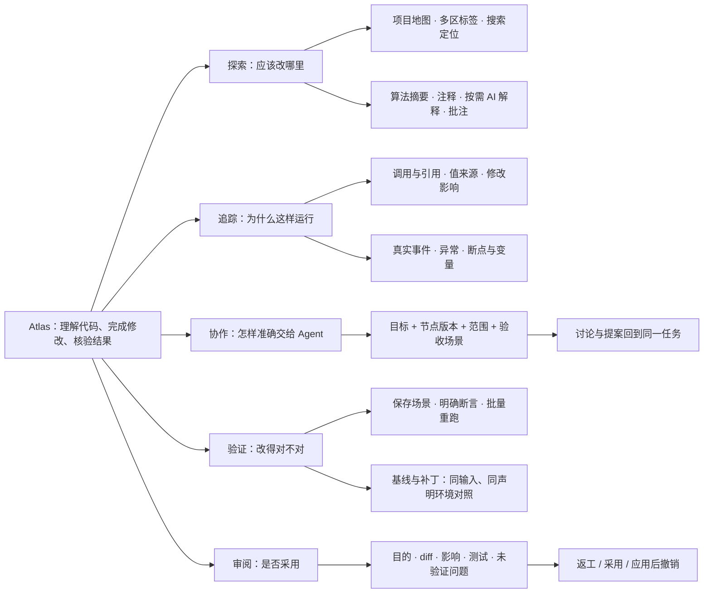
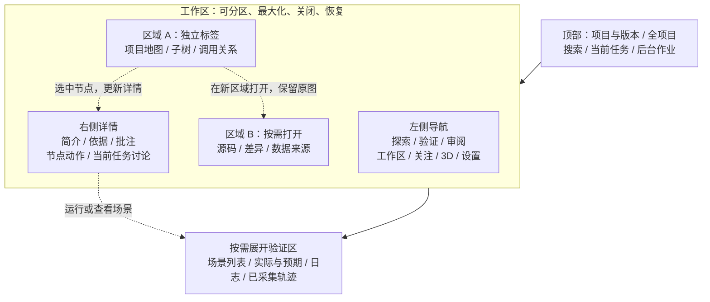
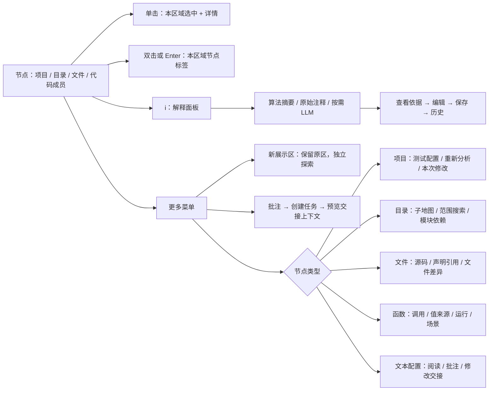
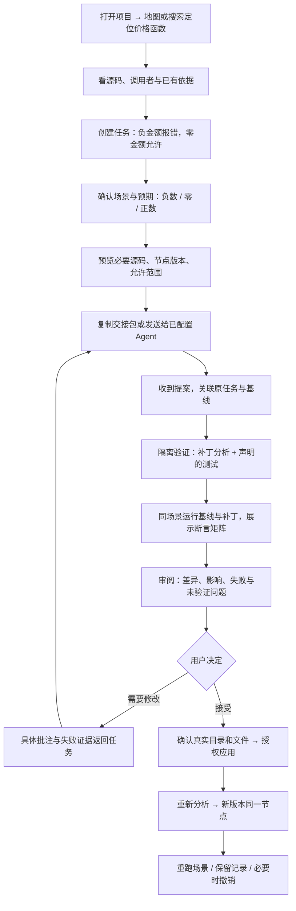
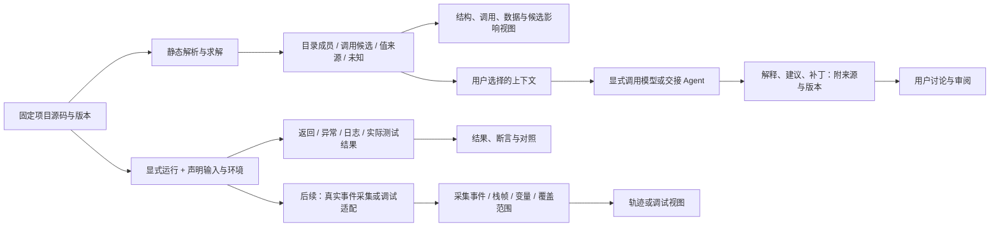
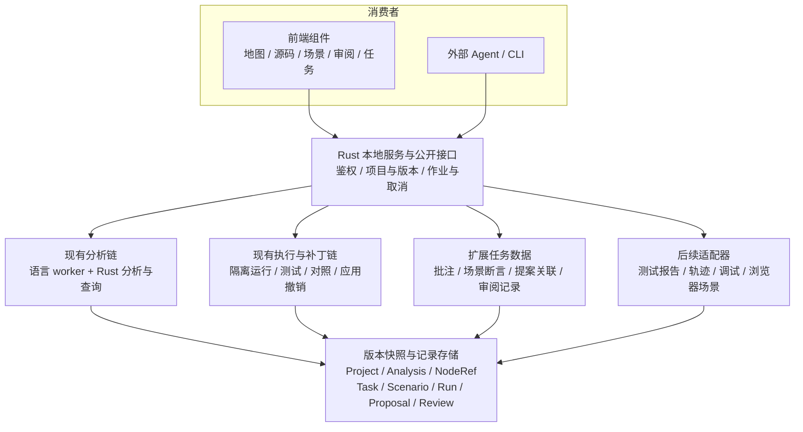
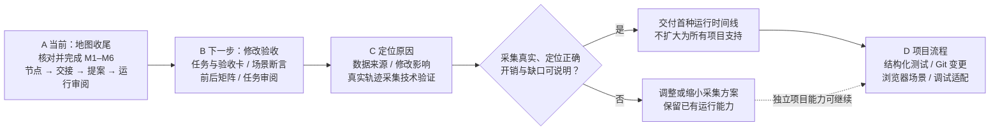
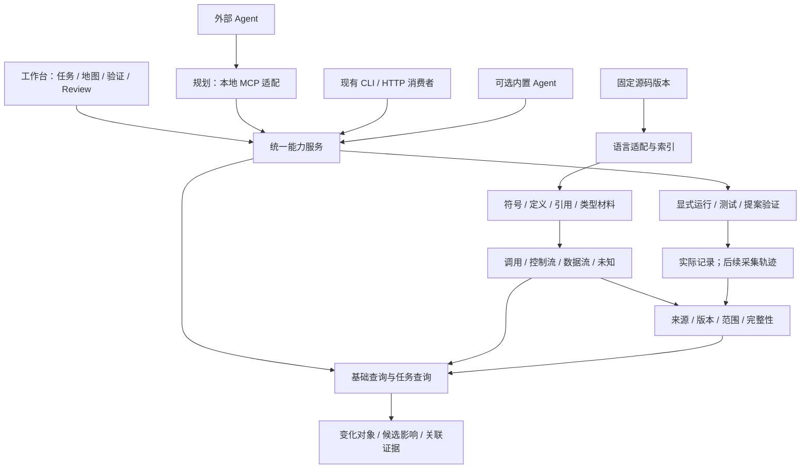
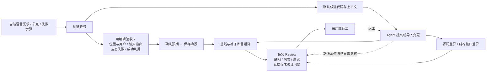

# Atlas 产品开发图谱

这是 [产品设计](../../PRODUCT_DESIGN.md) 的图解，供产品讨论和开发 Agent 交接。开发顺序仍以 [当前任务书](../../DAILY_DEVELOPMENT_WORK_ORDER.md) 为准；探索页像素与交互参考 [可点击原型](../atlas-explore-next/index.html)。图中 B/C/D 为后续设计，不代表已交付。每张图另有同名 `.mmd`，可单独渲染和修改。

## 01 产品全景：每个入口解决什么问题

地图与解释已有新实现入口，需核对当前交付；运行和提案链已有基础。场景集合、完整影响、轨迹及调试的新增部分不能按本图直接宣布完成。

## 02 页面结构：功能放在哪里

这是区域关系图，不规定固定宽度。默认只展示地图与详情，其他区域按操作打开。

区域自己的选区、标签、展开、缩放和请求代次独立；激活区域决定详情上下文。换项目时恢复该项目的工作区，不把同名函数的草稿或结果带过去。

## 03 节点操作：点击什么、出现什么

缺少能力时显示具体原因和下一步。文件不是默认可执行入口；LLM 解释需要真实配置和明确发送范围；旧源码版本的解释保留来源并提示复核。

## 04 核心用户旅程：一次 AI 修改怎样交付

流程中“Agent 声明完成”“测试通过”“用户接受”“写入成功”是不同状态。任何一步失败要显示实际状态并可重试，不自动前进。

## 05 三种依据：关系、运行、AI 解释不能混用

静态关系不能变成运行动画；未采集的值不能由模型补成观测。当前 runner 没有完整行级或调用轨迹。完整轨迹先验证真实采集，暂停调试另外管理会话。

## 06 结构：前端每种结果由谁提供

这是职责图，不是必须新建的服务或数据库表。优先扩展现有模块与记录。

前端图布局、源码与 diff、测试报告及调试优先采用合适的成熟组件。图中的关联对象是产品语义，不要求一次建立通用平台或替换现有栈。

## 07 开发顺序：每一阶段交出什么

A 已有在途实现，先检查，不能照图从零重做。B 的完整金额边界任务比增加装饰和菜单更优先。D 的独立能力不需要等所有轨迹问题解决。

## 给开发 Agent 的交接文字

> 先按仓库 AGENTS.md 读取当前任务书与交接，再读本图谱和 docs/PRODUCT_DESIGN.md。图 01 明确目的，图 02–03 明确页面与点击行为，图 04 是贯穿用户任务，图 05–06 明确真实数据来源，图 07 是阶段顺序；图 08–09 补充语义接入与任务验收。当前完成 A/M1–M6；已经实现的功能直接验证和补缺，不重复建设。A 完成后按产品设计推进 B，不在同一轮扩张到全部轨迹和调试。每个功能交付真实页面行为与数据链，保留项目/版本身份；缺数据时给准确状态。报告实际完成的用户流程、未完成项与证据，不用图上的功能名称当作完成证明。

## 开发对照表

| 图 | 实现时回答的问题 | 最小核对 |
|---|---|---|
| 01 | 功能解决哪个用户问题？ | 用户能说明下一步做什么 |
| 02 | 结果在哪个区域出现？ | 新区不覆盖旧区；重开恢复 |
| 03 | 点每个控件实际发生什么？ | 同一节点/版本进入目标页面 |
| 04 | 跨页能否完成一次修改？ | 目标场景修复，检查回归，应用与撤销字节正确 |
| 05 | 显示的结论来自哪里？ | 可回到源码或实际运行记录，缺失明确 |
| 06 | 数据由谁生产、保存和消费？ | 页面与公开接口读取同一记录 |
| 07 | 本轮完成线在哪里？ | 当前阶段有最终包证据，不冒充后续能力 |

## 08 语义底座与接入：同一事实服务人和 Agent

MCP 为计划中的适配面，当前已有 HTTP 不等于 MCP 已交付。语义底座复用已有代码，按支持范围扩展。节点展开走成员查询，局部解析、预算、查询、渲染失败分别处理。

## 09 Vibe Coding 与 Review：需求可逐条核验

阶段 B 先完成 B1 任务/验收卡、B2 场景/断言、B3 前后矩阵、B4 任务 Review。浏览器元素到源码关联属于后续适配，不能由名称相似直接推断。
